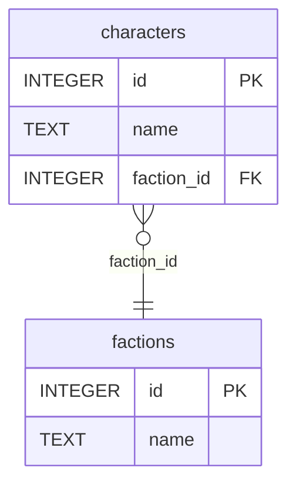
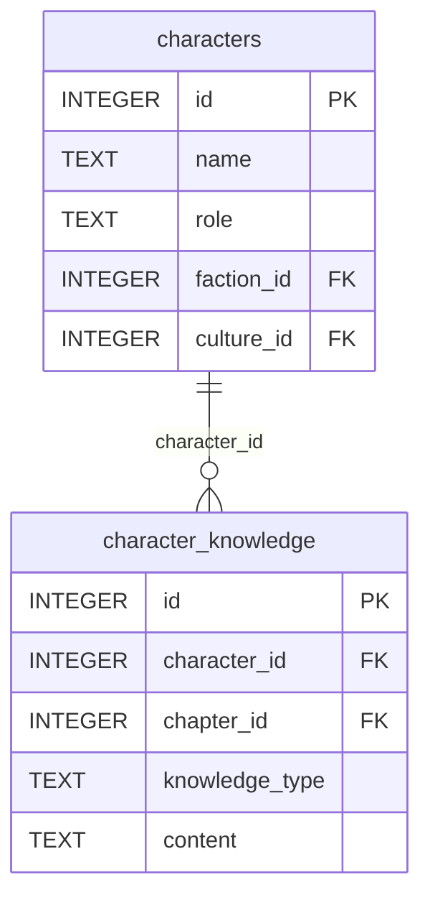

# Phase 12: Schema and MCP System Documentation - Research

**Researched:** 2026-03-09
**Domain:** Technical documentation authoring for SQLite schema and MCP tool API
**Confidence:** HIGH

<user_constraints>
## User Constraints (from CONTEXT.md)

### Locked Decisions

#### Document location and structure
- Live in `docs/` directory at the project root (new directory)
- Three files: `docs/README.md`, `docs/schema.md`, `docs/mcp-tools.md`
- `project-research/database-schema.md` stays as historical design doc; add a note pointing to `docs/` as the authoritative reference
- Do NOT merge or replace the existing design doc

#### Schema documentation (docs/schema.md)
- Organized by domain (not by migration file number), with migration order preserved within each domain section
- Each domain section opens with a Mermaid ER diagram showing tables and FK arrows in that domain
- Each table entry includes:
  1. 1-2 sentence purpose statement
  2. All fields: type + purpose sentence for non-obvious fields; standard fields (id, created_at, updated_at, notes, source_file) annotated briefly or noted as standard
  3. FK relationships in prose (e.g., `character_id → characters.id`)
  4. Cross-domain FK notes inline where they reference another domain's table
  5. "Populated by" lifecycle note (which MCP tools write to it, when in the workflow it's populated)
  6. Gate flag (⚠️ Gate-enforced writes) for tables whose MCP write tools require gate certification
- Top of schema.md has a "System Integration" section — how domains connect, cross-domain dependency map (prose or Mermaid)
- Standard fields annotation style: self-evident fields get type only; business-logic fields get a descriptive sentence; FK fields note what they reference

#### MCP tool documentation (docs/mcp-tools.md)
- Index table at the top: all ~80 tools with tool name, domain, one-line description
- Organized into 14 domain sections (one per tool module), matching the codebase structure
- Each tool entry includes:
  1. Tool name (as callable MCP tool)
  2. Purpose: what it does
  3. Parameters: name + type + required/optional + description per param
  4. Return type: what the tool returns (including error contract responses)
  5. Invocation reason: when and why an agent would call this tool
  6. Gate status: "Gate-free" or "Requires gate certification" with brief note
  7. Tables touched: which DB tables the tool reads from and writes to

#### Relationship representation
- FK relationships: prose inline per table + Mermaid ER diagram per domain section
- Cross-domain FK relationships: noted inline at the table entry + covered in the top-level "System Integration" section of schema.md
- docs/README.md: architecture overview — what the system is, how schema + MCP + CLI connect, where to find what. Links to schema.md and mcp-tools.md.

### Claude's Discretion
- Exact Mermaid diagram style and layout
- Level of prose detail for truly obvious fields (id, timestamps)
- Whether to include a table count summary at the top of each domain section
- Exact formatting of tool parameter tables (markdown table vs definition list)

### Deferred Ideas (OUT OF SCOPE)
None — discussion stayed within phase scope.
</user_constraints>

---

## Summary

Phase 12 produces three markdown documentation files in a new `docs/` directory. These are implementation-accurate reference documents derived directly from the 22 migration SQL files and 18 tool module Python files — not from design documents, which are known to have drifted from actual column names.

The schema spans 71 tables across 22 migrations. The MCP layer provides 103 tools across 18 domain modules. The documentation is not just a reference dump: each schema entry gets lifecycle notes (which tools populate it), each tool entry gets invocation reasoning (when an agent would call it), and the gate enforcement contract must be documented precisely because it affects every non-names tool.

The central authoring challenge is accuracy: migration SQL is ground truth for field names; Python tool signatures are ground truth for parameter names and return types. Planning must ensure tasks read source files first and never rely on design documents or memory.

**Primary recommendation:** Break into three sequential tasks — one per output file — each reading source files before writing any documentation content. Do not rely on project-research/database-schema.md for field names; read the migration SQL files directly.

---

## Actual Implementation Facts

These are the ground-truth facts the planner and implementor must know.

### Schema: 71 Tables Across 22 Migrations

| Migration | File | Tables |
|-----------|------|--------|
| 001 | `001_schema_tracking.sql` | schema_migrations |
| 002 | `002_core_books_eras.sql` | eras, books |
| 003 | `003_acts.sql` | acts |
| 004 | `004_cultures.sql` | cultures |
| 005 | `005_factions.sql` | factions |
| 006 | `006_locations.sql` | locations |
| 007 | `007_characters.sql` | characters |
| 008 | `008_chapters.sql` | chapters |
| 009 | `009_scenes.sql` | scenes |
| 010 | `010_artifacts.sql` | artifacts |
| 011 | `011_magic.sql` | magic_system_elements, supernatural_elements |
| 012 | `012_relationships.sql` | character_relationships, relationship_change_events, perception_profiles |
| 013 | `013_character_state.sql` | character_knowledge, character_beliefs, character_locations, injury_states, title_states |
| 014 | `014_voice.sql` | voice_profiles, voice_drift_log |
| 015 | `015_events_timeline.sql` | events, event_participants, event_artifacts, travel_segments, pov_chronological_position |
| 016 | `016_plot_threads.sql` | plot_threads, chapter_plot_threads, chapter_structural_obligations |
| 017 | `017_arcs_chekhov.sql` | character_arcs, chapter_character_arcs, arc_health_log, chekovs_gun_registry, subplot_touchpoint_log |
| 018 | `018_scene_pacing.sql` | scene_character_goals, pacing_beats, tension_measurements |
| 019 | `019_sessions.sql` | session_logs, agent_run_log |
| 020 | `020_gate_metrics.sql` | architecture_gate, gate_checklist_items, project_metrics_snapshots, pov_balance_snapshots |
| 021 | `021_literary_publishing.sql` | reader_information_states, reader_reveals, dramatic_irony_inventory, reader_experience_notes, canon_facts, continuity_issues, decisions_log, foreshadowing_registry, prophecy_registry, motif_registry, motif_occurrences, thematic_mirrors, opposition_pairs, faction_political_states, object_states, supernatural_voice_guidelines, magic_use_log, practitioner_abilities, name_registry, research_notes, open_questions, documentation_tasks, publishing_assets, submission_tracker |
| 022 | `022_seven_point_structure.sql` | story_structure, arc_seven_point_beats |

**Total: 71 tables** (the design doc stated ~70, actual count is 71).

### MCP Tools: 103 Tools Across 18 Domain Modules

These are the accurate per-domain tool counts from direct inspection of source files:

| Domain Module | Tool Count | Gate-Free? |
|---------------|-----------|------------|
| `characters.py` | 8 | Yes — no check_gate() |
| `relationships.py` | 6 | Yes — no check_gate() |
| `chapters.py` | 5 | Yes — no check_gate() |
| `scenes.py` | 4 | Yes — no check_gate() |
| `world.py` | 6 | Yes — no check_gate() |
| `magic.py` | 4 | Yes — no check_gate() |
| `plot.py` | 3 | Yes — no check_gate() |
| `arcs.py` | 6 | Yes — no check_gate() |
| `gate.py` | 5 | Yes — gate tools themselves are gate-free |
| `names.py` | 4 | Yes — explicitly gate-free by design (worldbuilding phase) |
| `session.py` | 10 | No — all 10 tools call check_gate() |
| `timeline.py` | 8 | No — all 8 tools call check_gate() |
| `canon.py` | 7 | No — all 7 tools call check_gate() |
| `knowledge.py` | 5 | No — all 5 tools call check_gate() |
| `foreshadowing.py` | 8 | No — all 8 tools call check_gate() |
| `voice.py` | 5 | No — all 5 tools call check_gate() |
| `publishing.py` | 5 | No — all 5 tools call check_gate() |
| `structure.py` | 4 | Yes — no check_gate() (structure tools are pre-gate worldbuilding) |
| **TOTAL** | **103** | |

**Note on domain count:** The CONTEXT.md says "14 domain sections" for mcp-tools.md. The actual codebase has 18 tool modules. The planner must decide how to handle this discrepancy. Options: (a) document all 18 modules as 18 sections, (b) group related modules to reach 14 (e.g., chapters+scenes, characters+relationships). Research cannot resolve this — it is a planning decision. Recommend documenting all 18 modules individually for accuracy.

### Error Contract (from models/shared.py)

The three error response types that every tool can return:

```python
class NotFoundResponse(BaseModel):
    not_found_message: str

class ValidationFailure(BaseModel):
    is_valid: bool = False
    errors: list[str]

class GateViolation(BaseModel):
    requires_action: str
```

- `NotFoundResponse`: returned when a record is not found (never raises)
- `ValidationFailure`: returned on validation or DB error (never raises)
- `GateViolation`: returned by any prose-phase tool when `architecture_gate.is_certified = 0`

### Gate Check Pattern (from mcp/gate.py)

Every gated tool follows this pattern:

```python
async with get_connection() as conn:
    violation = await check_gate(conn)
    if violation:
        return violation
    # ... rest of tool logic
```

`check_gate()` queries `SELECT is_certified FROM architecture_gate WHERE id = 1`. Returns `GateViolation` if not certified, `None` if certified.

### Key Structural Notes for Documentation

- `character_relationships` stores pairs in canonical order: `min(a,b)` as `character_a_id`
- `thematic_mirrors.element_a_id/b_id` are plain `INTEGER` — polymorphic references with no SQL FK constraints
- Migration 021 is a single file with 24 tables — the largest migration by far
- `open_questions` uses column `question` (not `question_text`) — a known design-doc/migration drift
- `session_logs.chapters_touched` and `carried_forward` are JSON TEXT arrays
- `scenes.narrative_functions` is a JSON TEXT array
- `story_structure` has `UNIQUE(book_id)` — one row per book
- `arc_seven_point_beats` has `UNIQUE(arc_id, beat_type)` — one beat type per arc
- `voice_profiles` has `UNIQUE(character_id)` — one profile per character
- `character_relationships` has `UNIQUE(character_a_id, character_b_id)` — one row per dyad

---

## Domain Groupings for Documentation

The CONTEXT.md specifies domain-organized sections (not migration-number organized). This is the recommended grouping for `docs/schema.md`:

| Documentation Domain | Tables from Migrations | Migration Files |
|---------------------|----------------------|-----------------|
| Foundation | schema_migrations, eras, books | 001, 002 |
| Structure | acts, story_structure, arc_seven_point_beats | 003, 022 |
| World | cultures, factions, locations, artifacts, magic_system_elements, supernatural_elements, faction_political_states, object_states | 004, 005, 006, 010, 011, 021 (partial) |
| Characters | characters, character_knowledge, character_beliefs, character_locations, injury_states, title_states | 007, 013 |
| Chapters & Scenes | chapters, scenes, scene_character_goals, pacing_beats, tension_measurements, chapter_structural_obligations, chapter_plot_threads | 008, 009, 016 (partial), 018 |
| Relationships | character_relationships, relationship_change_events, perception_profiles | 012 |
| Timeline & Events | events, event_participants, event_artifacts, travel_segments, pov_chronological_position | 015 |
| Plot & Arcs | plot_threads, character_arcs, chapter_character_arcs, arc_health_log, chekovs_gun_registry, subplot_touchpoint_log | 016 (partial), 017 |
| Gate & Metrics | architecture_gate, gate_checklist_items, project_metrics_snapshots, pov_balance_snapshots | 020 |
| Session | session_logs, agent_run_log, open_questions, decisions_log | 019, 021 (partial) |
| Canon & Continuity | canon_facts, continuity_issues | 021 (partial) |
| Knowledge & Reader | reader_information_states, reader_reveals, dramatic_irony_inventory, reader_experience_notes | 021 (partial) |
| Foreshadowing & Literary | foreshadowing_registry, prophecy_registry, motif_registry, motif_occurrences, thematic_mirrors, opposition_pairs | 021 (partial) |
| Voice & Names | voice_profiles, voice_drift_log, supernatural_voice_guidelines, name_registry | 014, 021 (partial) |
| Publishing | publishing_assets, submission_tracker | 021 (partial) |
| Utility | research_notes, documentation_tasks | 021 (partial) |

---

## Architecture Patterns

### Documentation Authoring Pattern

This phase produces documentation, not code. The authoring pattern is:

1. **Read source file** (migration SQL or tool Python)
2. **Extract facts** (field names, types, FK targets, parameters, return types)
3. **Write documentation section** from extracted facts

Never copy from `project-research/database-schema.md` for field names — it is a pre-build design document with known drift from actual column names (confirmed across Phases 02-10).

### Mermaid ER Diagram Pattern

Standard Mermaid ER syntax for this project's use case:



**Relationship cardinality notation:**
- `||--||` — exactly one to exactly one
- `||--o{` — one to zero-or-many
- `}o--||` — zero-or-many to one
- `o|--||` — zero-or-one to one (nullable FK)

For nullable FKs (most FKs in this schema), use `o|--||` or `}o--o|` as appropriate.

**Scope per diagram:** One diagram per domain section, showing only tables in that domain. Cross-domain FKs are shown as prose notes ("FK to characters.id — defined in Characters domain") rather than diagram edges, to avoid unreadable cross-domain spaghetti.

### Tool Documentation Sections

Each tool entry template:

```markdown
#### `tool_name`

**Purpose:** [One sentence — what the tool does]

**Parameters:**
| Name | Type | Required | Description |
|------|------|----------|-------------|
| param | int | Yes | ... |
| param | str \| None | No | Default: "draft" |

**Returns:** `ModelType | NotFoundResponse` — [what each variant means]

**Invocation reason:** [When an agent would call this — the narrative/workflow context]

**Gate status:** Gate-free / Requires gate certification ([brief consequence])

**Tables touched:** Reads `table_a`. Writes `table_b`.
```

---

## Don't Hand-Roll

| Problem | Don't Build | Use Instead | Why |
|---------|-------------|-------------|-----|
| Mermaid diagrams | Custom ASCII diagram format | Standard Mermaid ER syntax | GitHub renders Mermaid natively; Claude Code reads it |
| Table documentation format | Prose-only descriptions | Markdown tables for parameters | Scannable at-a-glance for system admin readers |
| Cross-reference resolution | Runtime link-checking | Prose cross-references ("see Characters domain") | Static markdown has no runtime |

**Key insight:** This is a documentation authoring task, not a code task. The challenge is accuracy (reading source files) and organization (domain grouping), not technical implementation.

---

## Common Pitfalls

### Pitfall 1: Copying from project-research/database-schema.md
**What goes wrong:** Field names in the documentation do not match actual database columns.
**Why it happens:** The design doc was written before implementation and has confirmed drift (e.g., `question_text` vs `question` in open_questions).
**How to avoid:** Read every migration SQL file directly. The migrations are in `src/novel/migrations/`.
**Warning signs:** If documenting a field name that differs from what's in the SQL file, the design doc was used instead of the SQL.

### Pitfall 2: Incorrect tool count or tool names
**What goes wrong:** The index table or domain sections list tools that don't exist, or miss tools that do.
**Why it happens:** Relying on REQUIREMENTS.md or design docs for tool lists rather than reading the Python source.
**How to avoid:** Read each `src/novel/tools/*.py` file and extract tool function names from `@mcp.tool()` decorated functions.
**Warning signs:** The documented tool names don't match the actual `async def` function names in the tool modules.

### Pitfall 3: Wrong gate status on a domain
**What goes wrong:** A domain is documented as gate-free when it's gated, or vice versa.
**Why it happens:** The gate pattern (which modules call `check_gate()`) must be verified per module.
**How to avoid:** Check each tool module for `from novel.mcp.gate import check_gate` import. If present, all tools in that module are gated.
**Warning signs:** Gate-free modules: characters, relationships, chapters, scenes, world, magic, plot, arcs, gate, names, structure. Gated modules: session, timeline, canon, knowledge, foreshadowing, voice, publishing.

### Pitfall 4: Domain section count mismatch
**What goes wrong:** The index table in mcp-tools.md lists 14 domains but the actual module count is 18.
**Why it happens:** CONTEXT.md says "14 domain sections" which may reflect an earlier tool count.
**How to avoid:** Document all 18 actual tool modules. If grouping is needed, group only logically coupled modules (e.g., `chapters.py` + `scenes.py` as "Chapters & Scenes").
**Warning signs:** If the index table has 14 rows but tool count says 103, some tools will be undocumented.

### Pitfall 5: Missing the get_character_state distinction
**What goes wrong:** Documenting `get_character_state` (from REQUIREMENTS.md CHAR-02) when the actual tool is `get_character_location` + `get_character_knowledge` + `get_character_beliefs` + `get_character_injuries` (four separate tools).
**Why it happens:** REQUIREMENTS.md describes intent (`get_character_state`) but implementation split it into discrete state-type queries.
**How to avoid:** Use Python source as the canonical tool list.

---

## Code Examples

### Mermaid ER Cross-Domain Pattern

Source: Migration SQL files (verified structure)

```markdown
## Characters Domain



> Cross-domain FK: `faction_id → factions.id` (World domain). `culture_id → cultures.id` (World domain). `chapter_id → chapters.id` (Chapters domain).
```

### Gate Status Documentation Pattern

Source: `src/novel/mcp/gate.py` and `src/novel/tools/session.py` (verified)

```markdown
**Gate status:** Requires gate certification. If gate is not certified, returns
`GateViolation(requires_action="Architecture gate is not certified. Run
`novel gate check` to see what is missing...")` without executing any DB logic.
```

### Error Contract Documentation Pattern

Source: `src/novel/models/shared.py` (verified)

```markdown
**Returns:**
- `SessionLog` — the current open session log on success
- `NotFoundResponse` — if no open session exists (field: `not_found_message`)
- `GateViolation` — if gate not certified (field: `requires_action`)
```

---

## Implementation Notes for Planning

### Output Files to Create

1. `docs/README.md` — Architecture overview, entry point, links to schema.md and mcp-tools.md
2. `docs/schema.md` — Full schema documentation (71 tables, domain-organized, Mermaid diagrams)
3. `docs/mcp-tools.md` — Full tool documentation (103 tools, 18 domains, tool cards)

Additionally:
4. `project-research/database-schema.md` — Add pointer note at top (not replace)

### Natural Task Breakdown

The work decomposes naturally into three tasks corresponding to three output files. Each task reads source files and writes one documentation file. A fourth task covers the pointer note addition.

**Suggested task sequence:**
1. `docs/README.md` — short, can be authored first as architecture framing
2. `docs/schema.md` — requires reading all 22 migration files; largest single task
3. `docs/mcp-tools.md` — requires reading all 18 tool module files; second largest task
4. Pointer note in `project-research/database-schema.md` — small, can be bundled with task 1 or 3

### Source Files to Read per Task

**For docs/schema.md:**
- All 22 files in `src/novel/migrations/` (ground truth for table structure)
- `src/novel/tools/*.py` (to write "Populated by" lifecycle notes per table)

**For docs/mcp-tools.md:**
- All 18 files in `src/novel/tools/*.py` (ground truth for tool signatures)
- `src/novel/models/shared.py` (error contract types)
- `src/novel/mcp/gate.py` (gate enforcement implementation)

**For docs/README.md:**
- `src/novel/mcp/server.py` (to verify server structure and entry point)
- `src/novel/db/cli.py` or similar (to verify CLI structure)
- `pyproject.toml` (entry points for `novel` and `novel-mcp`)

### docs/ Directory

`docs/` does not yet exist. The first task must create it.

---

## Open Questions

1. **Domain count for mcp-tools.md: 14 or 18?**
   - What we know: CONTEXT.md says 14 domain sections; actual codebase has 18 tool modules
   - What's unclear: Whether to group modules or document all 18 separately
   - Recommendation: Document all 18 modules for maximum accuracy. The "14" from CONTEXT.md may be an approximation. Grouping `chapters.py` + `scenes.py` and `characters.py` + `relationships.py` would yield 16; grouping `arcs.py` into `plot.py` would yield 15. Exact grouping is Claude's Discretion per CONTEXT.md.

2. **Handling tables with no MCP write tools**
   - What we know: Some tables (e.g., `schema_migrations`, `event_participants`, `event_artifacts`, `pacing_beats`, `tension_measurements`, `title_states`, `research_notes`, `documentation_tasks`, `reader_experience_notes`) have no corresponding MCP write tools
   - What's unclear: How to write "Populated by" lifecycle notes for tables that cannot be written via MCP
   - Recommendation: Note "Not writable via MCP — internal use only" or "Populated directly via CLI/migration" as appropriate

3. **The `get_character_state` requirement (CHAR-02)**
   - What we know: REQUIREMENTS.md CHAR-02 says "Claude can retrieve a character's state (location, injuries, beliefs, knowledge) at a given chapter (`get_character_state`)". The actual implementation has four separate tools: `get_character_location`, `get_character_injuries`, `get_character_beliefs`, `get_character_knowledge`.
   - What's unclear: Whether `get_character_state` was intended as a single combined tool that wasn't implemented, or whether the four separate tools fulfill the requirement
   - Recommendation: Document the four actual tools. Note in the characters section that comprehensive character state is retrieved by combining these four calls.

---

## Sources

### Primary (HIGH confidence)
- `src/novel/migrations/001-022.sql` — all migration SQL files read directly; ground truth for table names, field names, types, FK constraints
- `src/novel/tools/*.py` — all 18 tool modules read directly; ground truth for tool names, parameter signatures, return types
- `src/novel/models/shared.py` — error contract types verified directly
- `src/novel/mcp/gate.py` — gate enforcement implementation verified directly
- `12-CONTEXT.md` — user decisions and phase scope verified

### Secondary (MEDIUM confidence)
- `REQUIREMENTS.md` — requirement-to-implementation mapping; some drift from actual implementation confirmed (e.g., CHAR-02 get_character_state)
- `STATE.md` — accumulated decisions context; useful for understanding why certain design choices were made

### Tertiary (LOW confidence)
- `project-research/database-schema.md` — pre-build design doc; confirmed to have drifted from actual field names; useful only as reference for design intent, not for field names

---

## Metadata

**Confidence breakdown:**
- Actual table list and count: HIGH — read from 22 migration SQL files directly
- Actual tool list and count: HIGH — read from 18 tool module files directly
- Gate enforcement per domain: HIGH — verified by checking each module for `check_gate` import
- Domain grouping for docs: MEDIUM — exact grouping is Claude's Discretion; research provides a reasonable starting point
- "14 domain sections" count: LOW — CONTEXT.md says 14, actual code has 18 modules; the number needs a planning decision

**Research date:** 2026-03-09
**Valid until:** Stable — documentation phase; schema and tool code are complete (all 11 prior phases done). No external libraries to track. Valid indefinitely unless further code phases are added.
