# Drafter Database Schema Reference

**Status:** Generated from migration SQL files — implementation-accurate as of Phase 14.

**Quick stats:** 71 tables · 22 migrations · 18 documentation domains · 2 intentionally read-only tables (schema_migrations, architecture_gate)

> **Design doc note:** `project-research/database-schema.md` is the pre-build design document. Field names there may differ from actual columns. This file is the authoritative reference.

---

## Table of Contents

1. [System Integration](#system-integration)
2. [Foundation](#1-foundation)
3. [Structure](#2-structure)
4. [World](#3-world)
5. [Characters](#4-characters)
6. [Chapters & Scenes](#5-chapters--scenes)
7. [Relationships](#6-relationships)
8. [Timeline & Events](#7-timeline--events)
9. [Plot & Arcs](#8-plot--arcs)
10. [Gate & Metrics](#9-gate--metrics)
11. [Session](#10-session)
12. [Canon & Continuity](#11-canon--continuity)
13. [Knowledge & Reader](#12-knowledge--reader)
14. [Foreshadowing & Literary](#13-foreshadowing--literary)
15. [Voice & Names](#14-voice--names)
16. [Publishing](#15-publishing)
17. [Utility](#16-utility)

---

## System Integration

The 18 documentation domains are organized in dependency order. Foundation tables (eras, books) have no dependencies. Most domains depend on Characters and Chapters, which are the two most-referenced tables in the schema.

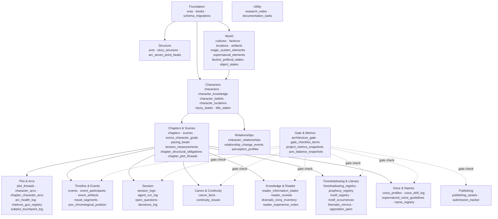

### Cross-Domain FK Summary

| FK Field | From Table | References | Domain Boundary |
|----------|-----------|------------|-----------------|
| `book_id` | `acts` | `books.id` | Structure → Foundation |
| `book_id` | `chapters` | `books.id` | Chapters → Foundation |
| `book_id` | `story_structure` | `books.id` | Structure → Foundation |
| `start_chapter_id` / `end_chapter_id` | `acts` | `chapters.id` | Structure → Chapters (nullable) |
| `culture_id` | `factions` | — | factions has no culture FK |
| `culture_id` | `locations` | `cultures.id` | World (internal) |
| `culture_id` | `characters` | `cultures.id` | Characters → World |
| `faction_id` | `characters` | `factions.id` | Characters → World |
| `home_era_id` | `characters` | `eras.id` | Characters → Foundation |
| `leader_character_id` | `factions` | `characters.id` | World → Characters (nullable) |
| `pov_character_id` | `chapters` | `characters.id` | Chapters → Characters |
| `act_id` | `chapters` | `acts.id` | Chapters → Structure |
| `location_id` | `scenes` | `locations.id` | Chapters → World |
| `current_owner_id` | `artifacts` | `characters.id` | World → Characters |
| `current_location_id` | `artifacts` | `locations.id` | World (internal) |
| `origin_era_id` | `artifacts` | `eras.id` | World → Foundation |
| `introduced_chapter_id` | `magic_system_elements` | `chapters.id` | World → Chapters |
| `introduced_chapter_id` | `supernatural_elements` | `chapters.id` | World → Chapters |
| `chapter_id` | `character_knowledge` | `chapters.id` | Characters → Chapters |
| `chapter_id` | `character_beliefs` | `chapters.id` | Characters → Chapters |
| `chapter_id` | `character_locations` | `chapters.id` | Characters → Chapters |
| `location_id` | `character_locations` | `locations.id` | Characters → World |
| `chapter_id` | `injury_states` | `chapters.id` | Characters → Chapters |
| `chapter_id` | `title_states` | `chapters.id` | Characters → Chapters |
| `chapter_id` | `voice_drift_log` | `chapters.id` | Voice → Chapters |
| `scene_id` | `voice_drift_log` | `scenes.id` | Voice → Chapters |
| `event_id` | `relationship_change_events` | `events.id` | Relationships → Timeline (nullable) |
| `chapter_id` | `relationship_change_events` | `chapters.id` | Relationships → Chapters |
| `chapter_id` | `perception_profiles` | `chapters.id` | Relationships → Chapters |
| `session_id` | `decisions_log` | `session_logs.id` | Canon → Session |
| `source_event_id` | `canon_facts` | `events.id` | Canon → Timeline |

---

## 1. Foundation

The Foundation domain contains the bootstrap tables: the migration tracker, narrative eras, and books. All other domains ultimately reference books (directly or via chapters) and may reference eras for historical grounding.

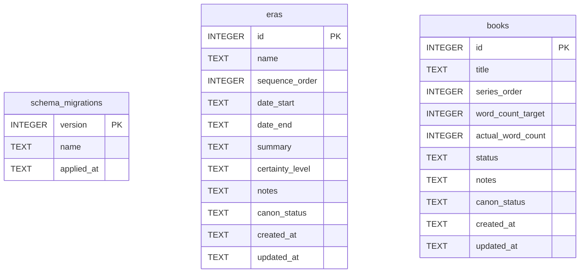

> **Cross-domain FKs:** None — Foundation tables have no FK dependencies on other domains.

### `schema_migrations`

Tracks which SQL migrations have been applied. The migration runner inserts one row per migration file on first run; subsequent runs skip already-applied versions.

| Field | Type | Description |
|-------|------|-------------|
| `version` | INTEGER PK | Migration number (e.g. 1, 2, 3) — also the primary key |
| `name` | TEXT | Migration filename without extension (e.g. `001_schema_tracking`) |
| `applied_at` | TEXT | ISO timestamp when this migration was applied |

**Read-only:** Managed exclusively by the migration runner (`novel db migrate`). Writing outside the runner corrupts migration state and could cause destructive re-runs or skipped migrations. No MCP read or write tool is exposed for this table.

---

### `eras`

Named historical periods that provide temporal grounding for characters, factions, and artifacts. An era can span millennia or a single decade.

| Field | Type | Description |
|-------|------|-------------|
| `id` | INTEGER PK | Primary key |
| `name` | TEXT | Era name (e.g. "The Age of Silence") |
| `sequence_order` | INTEGER | Numeric ordering among eras (optional) |
| `date_start` | TEXT | In-world start date (free-form string) |
| `date_end` | TEXT | In-world end date (free-form string) |
| `summary` | TEXT | Brief narrative description of the era |
| `certainty_level` | TEXT | Epistemic status: `established`, `legendary`, `mythical` (default: `established`) |
| `notes` | TEXT | Standard annotation field |
| `canon_status` | TEXT | Approval status: `draft` or `approved` (default: `draft`) |
| `created_at` | TEXT | Standard audit timestamp |
| `updated_at` | TEXT | Standard audit timestamp |

**Populated by:** `upsert_era` (world.py), `delete_era` (world.py).

---

### `books`

Top-level containers for the narrative. Each book gets its own chapters, acts, and structural plan. The system supports multi-book series.

| Field | Type | Description |
|-------|------|-------------|
| `id` | INTEGER PK | Primary key |
| `title` | TEXT | Book title |
| `series_order` | INTEGER | Position in series (1 = first book) |
| `word_count_target` | INTEGER | Target word count for the book |
| `actual_word_count` | INTEGER | Running total of actual words written (default: 0) |
| `status` | TEXT | Workflow status: `planning`, `drafting`, `revising`, `complete` (default: `planning`) |
| `notes` | TEXT | Standard annotation field |
| `canon_status` | TEXT | Approval status (default: `draft`) |
| `created_at` | TEXT | Standard audit timestamp |
| `updated_at` | TEXT | Standard audit timestamp |

**Populated by:** `upsert_book` (world.py), `delete_book` (world.py).

---

## 2. Structure

The Structure domain maps the high-level narrative skeleton: three-act divisions (`acts`) and the 7-point story structure beats at both book level (`story_structure`) and per-character-arc level (`arc_seven_point_beats`).

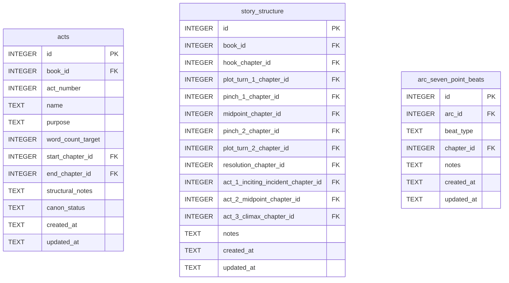

> **Cross-domain FKs:** `acts.book_id → books.id` (Foundation). `acts.start_chapter_id` / `acts.end_chapter_id → chapters.id` (Chapters — nullable, populated after chapters exist). `story_structure.book_id → books.id` (Foundation). All `story_structure.*_chapter_id → chapters.id` (Chapters). `arc_seven_point_beats.arc_id → character_arcs.id` (Plot & Arcs). `arc_seven_point_beats.chapter_id → chapters.id` (Chapters).

### `acts`

Defines the three-act structure for a book. Each act can optionally mark its boundary chapters via nullable FKs — these are left NULL during planning and filled in once chapters exist (avoids circular FK dependency at migration time).

| Field | Type | Description |
|-------|------|-------------|
| `id` | INTEGER PK | Primary key |
| `book_id` | INTEGER FK | References `books.id` — the book this act belongs to |
| `act_number` | INTEGER | Act sequence (1, 2, or 3) |
| `name` | TEXT | Optional act label (e.g. "Setup") |
| `purpose` | TEXT | Narrative purpose of this act |
| `word_count_target` | INTEGER | Target word count for this act |
| `start_chapter_id` | INTEGER FK | References `chapters.id` — first chapter of this act (nullable) |
| `end_chapter_id` | INTEGER FK | References `chapters.id` — last chapter of this act (nullable) |
| `structural_notes` | TEXT | Free-form structural planning notes |
| `canon_status` | TEXT | Approval status (default: `draft`) |
| `created_at` | TEXT | Standard audit timestamp |
| `updated_at` | TEXT | Standard audit timestamp |

**Constraints:** `UNIQUE(book_id, act_number)` — one row per act number per book.

**Populated by:** `upsert_act` (world.py), `delete_act` (world.py).

---

### `story_structure`

Stores the 7-point story structure beat assignments for a book plus the three act-level structural beat chapter references. One row per book — the UNIQUE constraint enforces this.

| Field | Type | Description |
|-------|------|-------------|
| `id` | INTEGER PK | Primary key |
| `book_id` | INTEGER FK | References `books.id` — one row per book |
| `hook_chapter_id` | INTEGER FK | References `chapters.id` — chapter containing the story hook |
| `plot_turn_1_chapter_id` | INTEGER FK | References `chapters.id` — first major plot turn |
| `pinch_1_chapter_id` | INTEGER FK | References `chapters.id` — first pinch point |
| `midpoint_chapter_id` | INTEGER FK | References `chapters.id` — story midpoint |
| `pinch_2_chapter_id` | INTEGER FK | References `chapters.id` — second pinch point |
| `plot_turn_2_chapter_id` | INTEGER FK | References `chapters.id` — second major plot turn |
| `resolution_chapter_id` | INTEGER FK | References `chapters.id` — resolution chapter |
| `act_1_inciting_incident_chapter_id` | INTEGER FK | References `chapters.id` — Act 1 inciting incident |
| `act_2_midpoint_chapter_id` | INTEGER FK | References `chapters.id` — Act 2 midpoint |
| `act_3_climax_chapter_id` | INTEGER FK | References `chapters.id` — Act 3 climax |
| `notes` | TEXT | Standard annotation field |
| `created_at` | TEXT | Standard audit timestamp |
| `updated_at` | TEXT | Standard audit timestamp |

**Constraints:** `UNIQUE(book_id)` — exactly one story structure record per book.

**Populated by:** `upsert_story_structure` (structure domain).

---

### `arc_seven_point_beats`

Maps the 7-point story structure beats to individual character arcs. Each beat type gets exactly one row per arc — the UNIQUE constraint prevents duplicates. Beat types are plain TEXT validated by Python-side enum logic.

| Field | Type | Description |
|-------|------|-------------|
| `id` | INTEGER PK | Primary key |
| `arc_id` | INTEGER FK | References `character_arcs.id` — the arc this beat belongs to |
| `beat_type` | TEXT | Beat label: `hook`, `plot_turn_1`, `pinch_1`, `midpoint`, `pinch_2`, `plot_turn_2`, `resolution` |
| `chapter_id` | INTEGER FK | References `chapters.id` — chapter where this beat occurs (nullable) |
| `notes` | TEXT | Standard annotation field |
| `created_at` | TEXT | Standard audit timestamp |
| `updated_at` | TEXT | Standard audit timestamp |

**Constraints:** `UNIQUE(arc_id, beat_type)` — one beat of each type per arc.

**Populated by:** `upsert_arc_beat` (structure domain).

---

## 3. World

The World domain covers the setting: cultures, factions, locations, physical artifacts, magic systems, and the supernatural. It also includes time-stamped world-state tables for tracking political and object states across chapters.

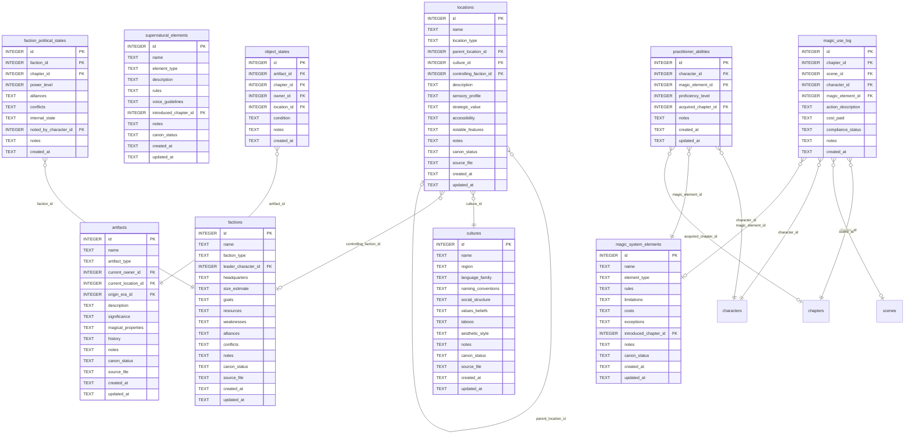

> **Cross-domain FKs:** `factions.leader_character_id → characters.id` (Characters — nullable). `artifacts.current_owner_id → characters.id` (Characters). `artifacts.current_location_id → locations.id` (World — internal). `artifacts.origin_era_id → eras.id` (Foundation). `magic_system_elements.introduced_chapter_id → chapters.id` (Chapters). `supernatural_elements.introduced_chapter_id → chapters.id` (Chapters). `cultures.id` is referenced by `characters.culture_id` (Characters). `faction_political_states.chapter_id → chapters.id` (Chapters). `faction_political_states.noted_by_character_id → characters.id` (Characters). `object_states.chapter_id → chapters.id` (Chapters). `object_states.owner_id → characters.id` (Characters). `object_states.location_id → locations.id` (World — internal). `magic_use_log.chapter_id → chapters.id` (Chapters). `magic_use_log.character_id → characters.id` (Characters). `practitioner_abilities.character_id → characters.id` (Characters). `practitioner_abilities.acquired_chapter_id → chapters.id` (Chapters).

### `cultures`

Named cultural groups that define naming conventions, aesthetics, and social norms. Characters and locations can be associated with a culture.

| Field | Type | Description |
|-------|------|-------------|
| `id` | INTEGER PK | Primary key |
| `name` | TEXT | Culture name — UNIQUE constraint |
| `region` | TEXT | Geographic region associated with this culture |
| `language_family` | TEXT | Linguistic family or language notes |
| `naming_conventions` | TEXT | How names are structured in this culture |
| `social_structure` | TEXT | Hierarchy, roles, class system |
| `values_beliefs` | TEXT | Core values and belief systems |
| `taboos` | TEXT | Prohibited behaviors or subjects |
| `aesthetic_style` | TEXT | Visual and artistic aesthetic |
| `notes` | TEXT | Standard annotation field |
| `canon_status` | TEXT | Approval status (default: `draft`) |
| `source_file` | TEXT | Standard annotation field |
| `created_at` | TEXT | Standard audit timestamp |
| `updated_at` | TEXT | Standard audit timestamp |

**Constraints:** `UNIQUE(name)`.

**Populated by:** `upsert_culture` (world.py), `delete_culture` (world.py).

---

### `factions`

Political, military, or social organizations that characters belong to. The `leader_character_id` is nullable because characters are defined in a later migration.

| Field | Type | Description |
|-------|------|-------------|
| `id` | INTEGER PK | Primary key |
| `name` | TEXT | Faction name — UNIQUE constraint |
| `faction_type` | TEXT | Category: `political`, `military`, `religious`, etc. |
| `leader_character_id` | INTEGER FK | References `characters.id` — current leader (nullable) |
| `headquarters` | TEXT | Description of the faction's base of operations |
| `size_estimate` | TEXT | Estimated membership or scale |
| `goals` | TEXT | What the faction is trying to achieve |
| `resources` | TEXT | Assets and capabilities |
| `weaknesses` | TEXT | Known vulnerabilities |
| `alliances` | TEXT | Current alliance relationships (free-form) |
| `conflicts` | TEXT | Current conflict relationships (free-form) |
| `notes` | TEXT | Standard annotation field |
| `canon_status` | TEXT | Approval status (default: `draft`) |
| `source_file` | TEXT | Standard annotation field |
| `created_at` | TEXT | Standard audit timestamp |
| `updated_at` | TEXT | Standard audit timestamp |

**Constraints:** `UNIQUE(name)`.

**Populated by:** `upsert_faction` (world domain).

---

### `locations`

Physical places in the story world. Supports hierarchical nesting via `parent_location_id` (e.g. a room inside a building inside a city). The `sensory_profile` field stores a JSON object with sensory details.

| Field | Type | Description |
|-------|------|-------------|
| `id` | INTEGER PK | Primary key |
| `name` | TEXT | Location name |
| `location_type` | TEXT | Category: `city`, `wilderness`, `building`, `room`, etc. |
| `parent_location_id` | INTEGER FK | References `locations.id` — parent container location (nullable self-ref) |
| `culture_id` | INTEGER FK | References `cultures.id` — dominant culture at this location (nullable) |
| `controlling_faction_id` | INTEGER FK | References `factions.id` — faction that controls this location (nullable) |
| `description` | TEXT | Narrative description |
| `sensory_profile` | TEXT | JSON object: `{sight, sound, smell, touch, taste}` — sensory atmosphere notes |
| `strategic_value` | TEXT | Why this location matters strategically |
| `accessibility` | TEXT | How easy or difficult it is to reach |
| `notable_features` | TEXT | Distinctive features |
| `notes` | TEXT | Standard annotation field |
| `canon_status` | TEXT | Approval status (default: `draft`) |
| `source_file` | TEXT | Standard annotation field |
| `created_at` | TEXT | Standard audit timestamp |
| `updated_at` | TEXT | Standard audit timestamp |

**Populated by:** `upsert_location` (world domain).

---

### `artifacts`

Physical objects with narrative significance — weapons, relics, MacGuffins, etc. Current ownership and location are tracked at the artifact row level; historical state changes are tracked in `object_states`.

| Field | Type | Description |
|-------|------|-------------|
| `id` | INTEGER PK | Primary key |
| `name` | TEXT | Artifact name |
| `artifact_type` | TEXT | Category: `weapon`, `relic`, `document`, etc. |
| `current_owner_id` | INTEGER FK | References `characters.id` — who currently holds it (nullable) |
| `current_location_id` | INTEGER FK | References `locations.id` — where it currently is (nullable) |
| `origin_era_id` | INTEGER FK | References `eras.id` — when it was created (nullable) |
| `description` | TEXT | Physical description |
| `significance` | TEXT | Narrative importance |
| `magical_properties` | TEXT | Any magical or supernatural attributes |
| `history` | TEXT | Provenance and history |
| `notes` | TEXT | Standard annotation field |
| `canon_status` | TEXT | Approval status (default: `draft`) |
| `source_file` | TEXT | Standard annotation field |
| `created_at` | TEXT | Standard audit timestamp |
| `updated_at` | TEXT | Standard audit timestamp |

**Populated by:** `upsert_artifact` (world.py), `delete_artifact` (world.py).

---

### `magic_system_elements`

Defines elements of the magic system: abilities, spells, schools of magic. Rules, limitations, and costs are stored as free-text for flexibility.

| Field | Type | Description |
|-------|------|-------------|
| `id` | INTEGER PK | Primary key |
| `name` | TEXT | Element name |
| `element_type` | TEXT | Category: `ability`, `spell`, `school`, etc. (default: `ability`) |
| `rules` | TEXT | The rules governing this element |
| `limitations` | TEXT | What the element cannot do |
| `costs` | TEXT | What using this element costs the practitioner |
| `exceptions` | TEXT | Known exceptions to the rules |
| `introduced_chapter_id` | INTEGER FK | References `chapters.id` — when this element first appears (nullable) |
| `notes` | TEXT | Standard annotation field |
| `canon_status` | TEXT | Approval status (default: `draft`) |
| `created_at` | TEXT | Standard audit timestamp |
| `updated_at` | TEXT | Standard audit timestamp |

**Populated by:** `upsert_magic_element` (magic.py), `delete_magic_element` (magic.py).

---

### `supernatural_elements`

Creatures, entities, or phenomena that are supernatural but distinct from the magic system. Has its own `voice_guidelines` field for how to write about this element in prose.

| Field | Type | Description |
|-------|------|-------------|
| `id` | INTEGER PK | Primary key |
| `name` | TEXT | Element name |
| `element_type` | TEXT | Category: `creature`, `spirit`, `phenomenon` (default: `creature`) |
| `description` | TEXT | What this element is |
| `rules` | TEXT | How this element behaves |
| `voice_guidelines` | TEXT | How to write about this element in prose |
| `introduced_chapter_id` | INTEGER FK | References `chapters.id` — when first introduced (nullable) |
| `notes` | TEXT | Standard annotation field |
| `canon_status` | TEXT | Approval status (default: `draft`) |
| `created_at` | TEXT | Standard audit timestamp |
| `updated_at` | TEXT | Standard audit timestamp |

**Populated by:** `upsert_supernatural_element` (magic.py), `delete_supernatural_element` (magic.py).

---

### `faction_political_states`

Time-stamped log of a faction's political state at a specific chapter. Append-oriented: each chapter can have one record per faction (`UNIQUE(faction_id, chapter_id)`).

| Field | Type | Description |
|-------|------|-------------|
| `id` | INTEGER PK | Primary key |
| `faction_id` | INTEGER FK | References `factions.id` — the faction being described |
| `chapter_id` | INTEGER FK | References `chapters.id` — the chapter at which this state applies |
| `power_level` | INTEGER | Relative power on a numeric scale (default: 5) |
| `alliances` | TEXT | Current alliance relationships at this point in the story |
| `conflicts` | TEXT | Active conflicts at this chapter |
| `internal_state` | TEXT | Internal faction dynamics |
| `noted_by_character_id` | INTEGER FK | References `characters.id` — character who observed this state (nullable) |
| `notes` | TEXT | Standard annotation field |
| `created_at` | TEXT | Standard audit timestamp |

**Constraints:** `UNIQUE(faction_id, chapter_id)` — one political state record per faction per chapter.

**Populated by:** `log_faction_political_state` (world.py), `delete_faction_political_state` (world.py). Read via `get_faction_political_state`.

---

### `object_states`

Time-stamped log of an artifact's state at a specific chapter. Tracks ownership and location changes over story time.

| Field | Type | Description |
|-------|------|-------------|
| `id` | INTEGER PK | Primary key |
| `artifact_id` | INTEGER FK | References `artifacts.id` — the artifact being tracked |
| `chapter_id` | INTEGER FK | References `chapters.id` — the chapter at which this state applies |
| `owner_id` | INTEGER FK | References `characters.id` — who owns it at this chapter (nullable) |
| `location_id` | INTEGER FK | References `locations.id` — where it is at this chapter (nullable) |
| `condition` | TEXT | Physical condition: `intact`, `damaged`, `destroyed`, etc. (default: `intact`) |
| `notes` | TEXT | Standard annotation field |
| `created_at` | TEXT | Standard audit timestamp |

**Constraints:** `UNIQUE(artifact_id, chapter_id)` — one object state record per artifact per chapter.

**Populated by:** `log_object_state` (world.py), `delete_object_state` (world.py).

---

### `magic_use_log`

Append-only audit trail of every magic use event during the story. Records who used magic, which element, what it cost, and whether it was compliant with the magic system rules. Each row is an immutable event — no upsert semantics.

| Field | Type | Description |
|-------|------|-------------|
| `id` | INTEGER PK | Primary key |
| `chapter_id` | INTEGER FK | References `chapters.id` — chapter in which the magic was used |
| `scene_id` | INTEGER FK | References `scenes.id` — scene context (nullable) |
| `character_id` | INTEGER FK | References `characters.id` — character who used magic |
| `magic_element_id` | INTEGER FK | References `magic_system_elements.id` — element invoked (nullable) |
| `action_description` | TEXT | Description of the magic action performed |
| `cost_paid` | TEXT | Cost paid by the character (nullable — may not apply to all elements) |
| `compliance_status` | TEXT | Whether use was compliant with magic rules (default: `compliant`) |
| `notes` | TEXT | Standard annotation field |
| `created_at` | TEXT | Standard audit timestamp |

**Populated by:** `log_magic_use` (world domain). Append-only — each row is a permanent record.

---

### `practitioner_abilities`

Tracks which magic system elements a character has the ability to use, and at what proficiency level. One row per character-element pair; the unique constraint prevents duplicate capability records.

| Field | Type | Description |
|-------|------|-------------|
| `id` | INTEGER PK | Primary key |
| `character_id` | INTEGER FK | References `characters.id` — the practitioner |
| `magic_element_id` | INTEGER FK | References `magic_system_elements.id` — the element the character can use |
| `proficiency_level` | INTEGER | Skill level (default: 1; higher = more proficient) |
| `acquired_chapter_id` | INTEGER FK | References `chapters.id` — chapter when ability was acquired (nullable) |
| `notes` | TEXT | Standard annotation field |
| `created_at` | TEXT | Standard audit timestamp |
| `updated_at` | TEXT | Standard audit timestamp |

**Constraints:** `UNIQUE(character_id, magic_element_id)` — one ability record per character per magic element.

**Populated by:** `upsert_practitioner_ability` (magic.py), `delete_practitioner_ability` (magic.py). Read via `get_practitioner_abilities`.

---

## 4. Characters

The Characters domain stores the cast and all per-chapter character state: knowledge acquired, beliefs held, locations visited, injuries sustained, and titles gained. The `characters` table is the most widely referenced table in the schema.

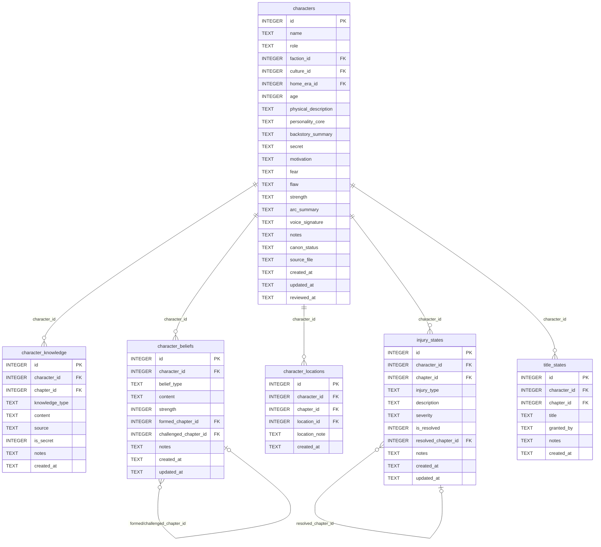

> **Cross-domain FKs:** `characters.faction_id → factions.id` (World). `characters.culture_id → cultures.id` (World). `characters.home_era_id → eras.id` (Foundation). `character_knowledge.chapter_id → chapters.id` (Chapters). `character_beliefs.formed_chapter_id` / `challenged_chapter_id → chapters.id` (Chapters). `character_locations.chapter_id → chapters.id` (Chapters). `character_locations.location_id → locations.id` (World). `injury_states.chapter_id` / `resolved_chapter_id → chapters.id` (Chapters). `title_states.chapter_id → chapters.id` (Chapters).

### `characters`

The central character record. Every other domain that tracks character involvement will FK to this table. The `role` field determines the character's narrative function.

| Field | Type | Description |
|-------|------|-------------|
| `id` | INTEGER PK | Primary key |
| `name` | TEXT | Character's full name |
| `role` | TEXT | Narrative role: `protagonist`, `antagonist`, `supporting`, etc. (default: `supporting`) |
| `faction_id` | INTEGER FK | References `factions.id` — faction affiliation (nullable) |
| `culture_id` | INTEGER FK | References `cultures.id` — cultural background (nullable) |
| `home_era_id` | INTEGER FK | References `eras.id` — era the character originates from (nullable) |
| `age` | INTEGER | Character age in story-time (nullable) |
| `physical_description` | TEXT | Appearance notes |
| `personality_core` | TEXT | Core personality summary |
| `backstory_summary` | TEXT | Condensed backstory |
| `secret` | TEXT | Hidden information — what the character conceals |
| `motivation` | TEXT | What drives the character's actions |
| `fear` | TEXT | The character's deepest fear |
| `flaw` | TEXT | Primary character flaw |
| `strength` | TEXT | Primary character strength |
| `arc_summary` | TEXT | High-level arc trajectory summary |
| `voice_signature` | TEXT | Distinctive speech patterns for consistency |
| `notes` | TEXT | Standard annotation field |
| `canon_status` | TEXT | Approval status (default: `draft`) |
| `source_file` | TEXT | Standard annotation field |
| `created_at` | TEXT | Standard audit timestamp |
| `updated_at` | TEXT | Standard audit timestamp |
| `reviewed_at` | TEXT | Timestamp of last editorial review (nullable) |

**Populated by:** `upsert_character` (characters domain).

---

### `character_knowledge`

Append-only log of information a character acquires at a specific chapter. Each row represents one piece of knowledge gained. Cumulative queries use `chapter_id <= ?` to build a character's total knowledge picture at any story point.

| Field | Type | Description |
|-------|------|-------------|
| `id` | INTEGER PK | Primary key |
| `character_id` | INTEGER FK | References `characters.id` — the character who knows this |
| `chapter_id` | INTEGER FK | References `chapters.id` — when the knowledge was acquired |
| `knowledge_type` | TEXT | Type: `fact`, `rumor`, `secret`, `skill`, etc. (default: `fact`) |
| `content` | TEXT | The knowledge content |
| `source` | TEXT | Where or how the character learned this (nullable) |
| `is_secret` | INTEGER | Boolean (0/1) — whether this knowledge is hidden from others |
| `notes` | TEXT | Standard annotation field |
| `created_at` | TEXT | Standard audit timestamp |

**Populated by:** `log_character_knowledge` (characters domain).

---

### `character_beliefs`

Records a character's held beliefs with optional chapter markers for when beliefs formed and when they were challenged. Unlike knowledge, beliefs can evolve — the same conceptual belief may have multiple rows tracking its development.

| Field | Type | Description |
|-------|------|-------------|
| `id` | INTEGER PK | Primary key |
| `character_id` | INTEGER FK | References `characters.id` — the character who holds this belief |
| `belief_type` | TEXT | Category: `worldview`, `moral`, `about_other`, etc. (default: `worldview`) |
| `content` | TEXT | The belief statement |
| `strength` | INTEGER | Conviction strength 1–10 (default: 5) |
| `formed_chapter_id` | INTEGER FK | References `chapters.id` — when this belief formed (nullable) |
| `challenged_chapter_id` | INTEGER FK | References `chapters.id` — when this belief was tested (nullable) |
| `notes` | TEXT | Standard annotation field |
| `created_at` | TEXT | Standard audit timestamp |
| `updated_at` | TEXT | Standard audit timestamp |

**Populated by:** `log_character_belief` (characters.py), `delete_character_belief` (characters.py).

---

### `character_locations`

Append-only log of a character's chapter-by-chapter location. Multiple rows per character are expected as they move through the story.

| Field | Type | Description |
|-------|------|-------------|
| `id` | INTEGER PK | Primary key |
| `character_id` | INTEGER FK | References `characters.id` — the character |
| `chapter_id` | INTEGER FK | References `chapters.id` — the chapter at which this location applies |
| `location_id` | INTEGER FK | References `locations.id` — the location (nullable — character may be at an unnamed place) |
| `location_note` | TEXT | Free-form location description when no location record exists |
| `created_at` | TEXT | Standard audit timestamp |

**Populated by:** `log_character_location` (characters.py), `delete_character_location` (characters.py). Read via `get_character_location`.

---

### `injury_states`

Records injuries a character sustains, the chapter when injured, severity, and optionally when resolved. Each injury is a distinct row allowing multiple concurrent injuries.

| Field | Type | Description |
|-------|------|-------------|
| `id` | INTEGER PK | Primary key |
| `character_id` | INTEGER FK | References `characters.id` — the injured character |
| `chapter_id` | INTEGER FK | References `chapters.id` — chapter when injury was sustained |
| `injury_type` | TEXT | Type: `wound`, `illness`, `curse`, etc. (default: `wound`) |
| `description` | TEXT | Description of the injury |
| `severity` | TEXT | Severity level: `minor`, `moderate`, `severe`, `critical` (default: `minor`) |
| `is_resolved` | INTEGER | Boolean (0/1) — whether the injury has healed |
| `resolved_chapter_id` | INTEGER FK | References `chapters.id` — when the injury resolved (nullable) |
| `notes` | TEXT | Standard annotation field |
| `created_at` | TEXT | Standard audit timestamp |
| `updated_at` | TEXT | Standard audit timestamp |

**Populated by:** `log_injury_state` (characters.py), `delete_injury_state` (characters.py). Read via `get_character_injuries`.

---

### `title_states`

Append-only log of titles and honors a character holds at a given chapter. Titles are additive — gaining a new title adds a row rather than updating an existing one.

| Field | Type | Description |
|-------|------|-------------|
| `id` | INTEGER PK | Primary key |
| `character_id` | INTEGER FK | References `characters.id` — the titled character |
| `chapter_id` | INTEGER FK | References `chapters.id` — chapter when the title was granted |
| `title` | TEXT | The title or honorific |
| `granted_by` | TEXT | Who or what granted this title (free-form) |
| `notes` | TEXT | Standard annotation field |
| `created_at` | TEXT | Standard audit timestamp |

**Populated by:** `log_title_state` (characters.py), `delete_title_state` (characters.py).

---

## 5. Chapters & Scenes

The Chapters & Scenes domain is the operational core of the writing workflow. Chapters provide the structural containers; scenes break each chapter into dramatized units. Junction tables in this domain link chapters to plot threads and structural obligations.

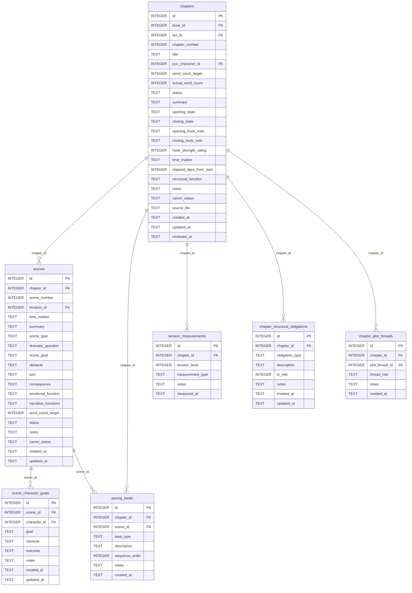

> **Cross-domain FKs:** `chapters.book_id → books.id` (Foundation). `chapters.act_id → acts.id` (Structure). `chapters.pov_character_id → characters.id` (Characters). `scenes.location_id → locations.id` (World). `scene_character_goals.character_id → characters.id` (Characters). `chapter_plot_threads.plot_thread_id → plot_threads.id` (Plot & Arcs).

### `chapters`

The primary structural unit of the narrative. Each chapter belongs to a book, optionally to an act, and has a POV character. The `actual_word_count` is updated as writing progresses.

| Field | Type | Description |
|-------|------|-------------|
| `id` | INTEGER PK | Primary key |
| `book_id` | INTEGER FK | References `books.id` — the book this chapter belongs to |
| `act_id` | INTEGER FK | References `acts.id` — the act this chapter is in (nullable) |
| `chapter_number` | INTEGER | Chapter sequence number within the book |
| `title` | TEXT | Chapter title (nullable) |
| `pov_character_id` | INTEGER FK | References `characters.id` — POV character for this chapter (nullable) |
| `word_count_target` | INTEGER | Target word count (nullable) |
| `actual_word_count` | INTEGER | Actual words written (default: 0) |
| `status` | TEXT | Workflow status: `planned`, `drafted`, `revised`, `final` (default: `planned`) |
| `summary` | TEXT | Brief plot summary |
| `opening_state` | TEXT | Story-world state at chapter open |
| `closing_state` | TEXT | Story-world state at chapter close |
| `opening_hook_note` | TEXT | Notes on the opening hook |
| `closing_hook_note` | TEXT | Notes on the closing hook |
| `hook_strength_rating` | INTEGER | Rating 1–10 for hook effectiveness (nullable) |
| `time_marker` | TEXT | Narrative time label (e.g. "Three days later") |
| `elapsed_days_from_start` | INTEGER | Absolute story-day position (nullable) |
| `structural_function` | TEXT | Narrative role of this chapter |
| `notes` | TEXT | Standard annotation field |
| `canon_status` | TEXT | Approval status (default: `draft`) |
| `source_file` | TEXT | Standard annotation field |
| `created_at` | TEXT | Standard audit timestamp |
| `updated_at` | TEXT | Standard audit timestamp |
| `reviewed_at` | TEXT | Timestamp of last editorial review (nullable) |

**Constraints:** `UNIQUE(book_id, chapter_number)` — one chapter per number per book.

**Populated by:** `upsert_chapter` (chapters domain).

---

### `scenes`

Dramatized units within a chapter. Scenes use the Scene Structure Model: dramatic question, goal, obstacle, turn, consequence. The `narrative_functions` field is a JSON TEXT array listing the narrative roles this scene serves.

| Field | Type | Description |
|-------|------|-------------|
| `id` | INTEGER PK | Primary key |
| `chapter_id` | INTEGER FK | References `chapters.id` — the chapter this scene belongs to |
| `scene_number` | INTEGER | Scene sequence within the chapter |
| `location_id` | INTEGER FK | References `locations.id` — where the scene takes place (nullable) |
| `time_marker` | TEXT | Narrative time label within the chapter |
| `summary` | TEXT | Brief description of scene events |
| `scene_type` | TEXT | Type: `action`, `dialogue`, `transition`, `reflection` (default: `action`) |
| `dramatic_question` | TEXT | The central tension this scene answers |
| `scene_goal` | TEXT | What the POV character wants in this scene |
| `obstacle` | TEXT | What stands in the way of the scene goal |
| `turn` | TEXT | How the scene pivots or resolves |
| `consequence` | TEXT | Aftermath of the scene turn |
| `emotional_function` | TEXT | The emotional beat this scene serves |
| `narrative_functions` | TEXT | JSON TEXT array of narrative roles, e.g. `["setup", "payoff"]` |
| `word_count_target` | INTEGER | Target word count for this scene (nullable) |
| `status` | TEXT | Status: `planned`, `drafted`, `revised` (default: `planned`) |
| `notes` | TEXT | Standard annotation field |
| `canon_status` | TEXT | Approval status (default: `draft`) |
| `created_at` | TEXT | Standard audit timestamp |
| `updated_at` | TEXT | Standard audit timestamp |

**Constraints:** `UNIQUE(chapter_id, scene_number)`.

**Populated by:** `upsert_scene` (scenes domain).

---

### `scene_character_goals`

Per-character goal records for a scene. One row per (scene, character) pair — the UNIQUE constraint prevents duplicates. Tracks what each character wants in a scene, the obstacle they face, and the outcome.

| Field | Type | Description |
|-------|------|-------------|
| `id` | INTEGER PK | Primary key |
| `scene_id` | INTEGER FK | References `scenes.id` — the scene |
| `character_id` | INTEGER FK | References `characters.id` — the character |
| `goal` | TEXT | What this character wants in the scene |
| `obstacle` | TEXT | What prevents achievement of the goal (nullable) |
| `outcome` | TEXT | How the goal attempt resolved (nullable) |
| `notes` | TEXT | Standard annotation field |
| `created_at` | TEXT | Standard audit timestamp |
| `updated_at` | TEXT | Standard audit timestamp |

**Constraints:** `UNIQUE(scene_id, character_id)`.

**Populated by:** `upsert_scene_goal` (scenes domain).

---

### `pacing_beats`

Ordered sequence of beats within a chapter or scene for pacing analysis. Each beat has a type and description. Used for structural analysis, not for story tracking.

| Field | Type | Description |
|-------|------|-------------|
| `id` | INTEGER PK | Primary key |
| `chapter_id` | INTEGER FK | References `chapters.id` |
| `scene_id` | INTEGER FK | References `scenes.id` — optional scene-level scoping (nullable) |
| `beat_type` | TEXT | Beat category: `action`, `reaction`, `dialogue`, `introspection` (default: `action`) |
| `description` | TEXT | Description of what happens in this beat |
| `sequence_order` | INTEGER | Position within the chapter's beat sequence (default: 0) |
| `notes` | TEXT | Standard annotation field |
| `created_at` | TEXT | Standard audit timestamp |

**Populated by:** `log_pacing_beat` (scenes.py), `delete_pacing_beat` (scenes.py).

---

### `tension_measurements`

Spot measurements of tension level at a chapter. Multiple measurements per chapter are allowed (e.g. overall + subplot tension). Used for arc tension analysis.

| Field | Type | Description |
|-------|------|-------------|
| `id` | INTEGER PK | Primary key |
| `chapter_id` | INTEGER FK | References `chapters.id` |
| `tension_level` | INTEGER | Tension score 1–10 (default: 5) |
| `measurement_type` | TEXT | What is being measured: `overall`, `romantic`, `conflict`, etc. (default: `overall`) |
| `notes` | TEXT | Standard annotation field |
| `measured_at` | TEXT | Timestamp of the measurement |

**Populated by:** `log_tension_measurement` (scenes.py), `delete_tension_measurement` (scenes.py).

---

### `chapter_structural_obligations`

Tracks structural obligations a chapter must fulfill (setups, payoffs, foreshadowing deliveries, etc.) and whether each has been met. Helps ensure structural completeness during revision.

| Field | Type | Description |
|-------|------|-------------|
| `id` | INTEGER PK | Primary key |
| `chapter_id` | INTEGER FK | References `chapters.id` |
| `obligation_type` | TEXT | Type: `setup`, `payoff`, `callback`, `foreshadow`, etc. (default: `setup`) |
| `description` | TEXT | Description of the obligation |
| `is_met` | INTEGER | Boolean (0/1) — whether the obligation has been fulfilled (default: 0) |
| `notes` | TEXT | Standard annotation field |
| `created_at` | TEXT | Standard audit timestamp |
| `updated_at` | TEXT | Standard audit timestamp |

**Populated by:** `upsert_chapter_obligation` (chapters.py), `delete_chapter_obligation` (chapters.py). Read via `get_chapter_obligations`.

---

### `chapter_plot_threads`

Junction table linking chapters to the plot threads active in them. Tracks the role each thread plays in a given chapter.

| Field | Type | Description |
|-------|------|-------------|
| `id` | INTEGER PK | Primary key |
| `chapter_id` | INTEGER FK | References `chapters.id` |
| `plot_thread_id` | INTEGER FK | References `plot_threads.id` (Plot & Arcs domain) |
| `thread_role` | TEXT | How the thread appears in this chapter: `advance`, `introduce`, `resolve`, `cameo` (default: `advance`) |
| `notes` | TEXT | Standard annotation field |
| `created_at` | TEXT | Standard audit timestamp |

**Constraints:** `UNIQUE(chapter_id, plot_thread_id)`.

**Populated by:** Managed via chapter tools (junction entries created alongside chapter upserts).

---

## 6. Relationships

The Relationships domain models the social network between characters: the canonical dyad relationship, a log of change events, and per-directional perception profiles.

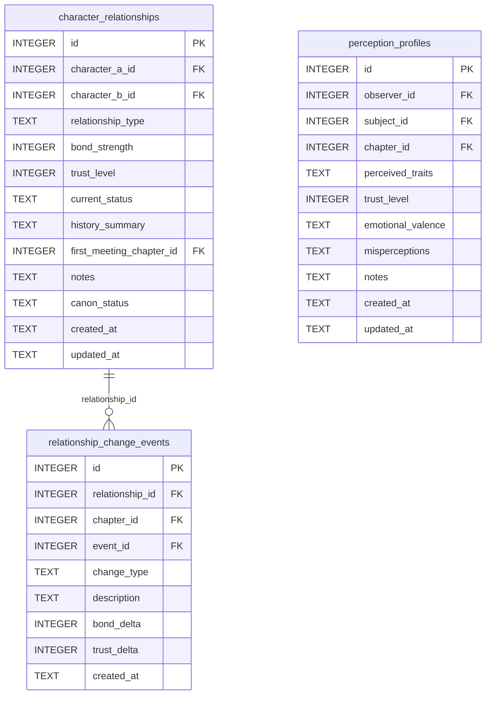

> **Cross-domain FKs:** `character_relationships.character_a_id` / `character_b_id → characters.id` (Characters). `character_relationships.first_meeting_chapter_id → chapters.id` (Chapters). `relationship_change_events.chapter_id → chapters.id` (Chapters). `relationship_change_events.event_id → events.id` (Timeline — nullable). `perception_profiles.observer_id` / `subject_id → characters.id` (Characters). `perception_profiles.chapter_id → chapters.id` (Chapters).

### `character_relationships`

The canonical dyad relationship record between two characters. Pairs are stored in canonical order: `min(a,b)` as `character_a_id`, `max(a,b)` as `character_b_id`. The UNIQUE constraint on the pair prevents duplicate dyad rows. The `get_relationship` tool queries both orderings so callers never need to know canonical order.

| Field | Type | Description |
|-------|------|-------------|
| `id` | INTEGER PK | Primary key |
| `character_a_id` | INTEGER FK | References `characters.id` — lower-ID character in the pair |
| `character_b_id` | INTEGER FK | References `characters.id` — higher-ID character in the pair |
| `relationship_type` | TEXT | Type label: `ally`, `rival`, `enemy`, `acquaintance`, etc. (default: `acquaintance`) |
| `bond_strength` | INTEGER | Bond intensity (positive = strong bond, negative = animosity; default: 0) |
| `trust_level` | INTEGER | Trust score (positive = high trust; default: 0) |
| `current_status` | TEXT | Current state of the relationship (default: `neutral`) |
| `history_summary` | TEXT | Free-text relationship history (nullable) |
| `first_meeting_chapter_id` | INTEGER FK | References `chapters.id` — where they first met (nullable) |
| `notes` | TEXT | Standard annotation field |
| `canon_status` | TEXT | Approval status (default: `draft`) |
| `created_at` | TEXT | Standard audit timestamp |
| `updated_at` | TEXT | Standard audit timestamp |

**Constraints:** `UNIQUE(character_a_id, character_b_id)` — one row per dyad.

**Populated by:** `upsert_relationship` (relationships domain).

---

### `relationship_change_events`

Append-only log of significant changes to a relationship. Each row captures what changed (bond/trust deltas), when it happened (chapter or event), and why. Multiple change events per relationship over the story arc are expected.

| Field | Type | Description |
|-------|------|-------------|
| `id` | INTEGER PK | Primary key |
| `relationship_id` | INTEGER FK | References `character_relationships.id` — the relationship that changed |
| `chapter_id` | INTEGER FK | References `chapters.id` — when the change occurred (nullable) |
| `event_id` | INTEGER FK | References `events.id` — story event that triggered the change (nullable) |
| `change_type` | TEXT | Nature of change: `shift`, `breakthrough`, `rupture`, `reconciliation` (default: `shift`) |
| `description` | TEXT | Human-readable description of what changed |
| `bond_delta` | INTEGER | Change in bond strength (positive = strengthened; default: 0) |
| `trust_delta` | INTEGER | Change in trust level (positive = more trust; default: 0) |
| `created_at` | TEXT | Standard audit timestamp |

**Populated by:** `log_relationship_change` (relationships domain).

---

### `perception_profiles`

Directional perception records: how one character perceives another. Unlike `character_relationships` (which is symmetric), perception profiles are asymmetric — A's view of B is a different row from B's view of A.

| Field | Type | Description |
|-------|------|-------------|
| `id` | INTEGER PK | Primary key |
| `observer_id` | INTEGER FK | References `characters.id` — the character doing the perceiving |
| `subject_id` | INTEGER FK | References `characters.id` — the character being perceived |
| `chapter_id` | INTEGER FK | References `chapters.id` — chapter snapshot this perception applies to (nullable) |
| `perceived_traits` | TEXT | Free-text description of how the observer perceives the subject's traits |
| `trust_level` | INTEGER | Observer's trust of the subject (default: 0) |
| `emotional_valence` | TEXT | Observer's emotional orientation: `neutral`, `trusting`, `wary`, `hostile` (default: `neutral`) |
| `misperceptions` | TEXT | Known misperceptions the observer holds about the subject |
| `notes` | TEXT | Standard annotation field |
| `created_at` | TEXT | Standard audit timestamp |
| `updated_at` | TEXT | Standard audit timestamp |

**Constraints:** `UNIQUE(observer_id, subject_id)` — one perception profile per directed pair.

**Populated by:** `upsert_perception_profile` (relationships domain).

---

## 7. Timeline & Events

The Timeline & Events domain tracks story events, character participation in events, artifact involvement, character travel between locations, and POV character chronological positions.

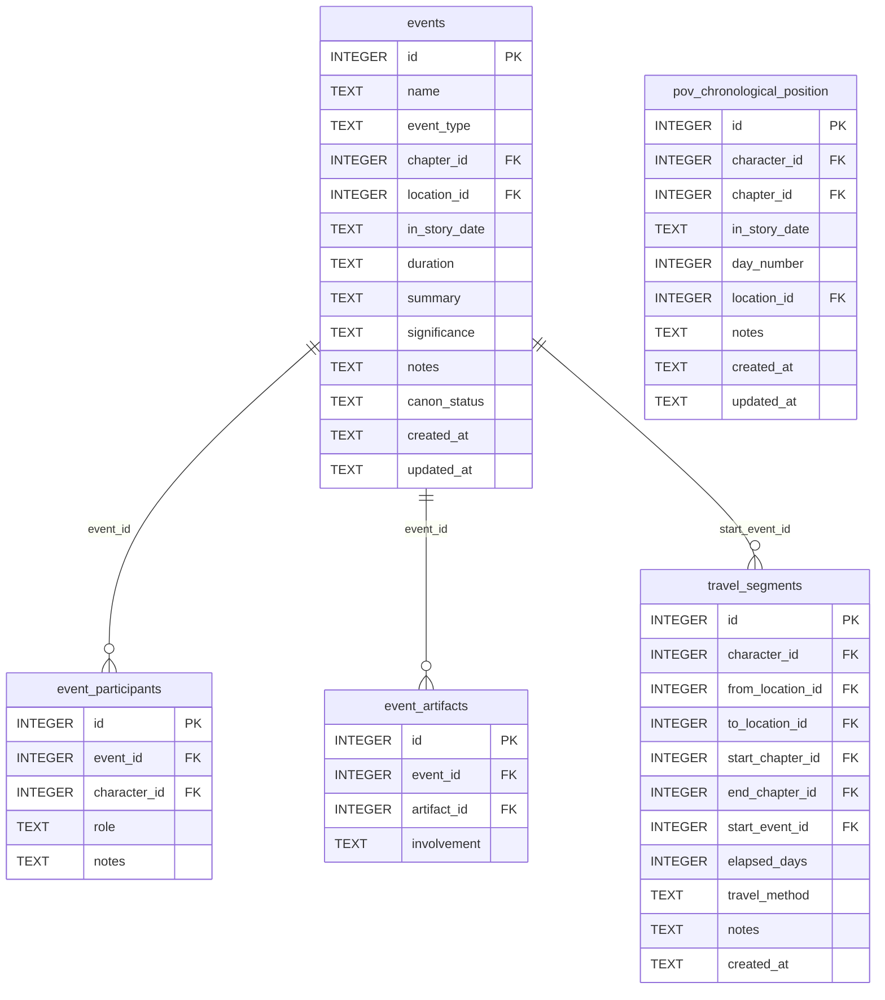

> **Cross-domain FKs:** `events.chapter_id → chapters.id` (Chapters). `events.location_id → locations.id` (World). `event_participants.character_id → characters.id` (Characters). `event_artifacts.artifact_id → artifacts.id` (World). `travel_segments.character_id → characters.id` (Characters). `travel_segments.from_location_id` / `to_location_id → locations.id` (World). `travel_segments.start_chapter_id` / `end_chapter_id → chapters.id` (Chapters). `pov_chronological_position.character_id → characters.id` (Characters). `pov_chronological_position.chapter_id → chapters.id` (Chapters). `pov_chronological_position.location_id → locations.id` (World).

**Gate flag:** All timeline tools require gate certification before writing. See Gate & Metrics domain.

> ⚠️ **Gate-enforced writes** — MCP write tools require gate certification.

### `events`

Named story events with type, location, in-story date, and narrative significance. Events are referenced by relationship change events and canon facts to anchor them in the narrative timeline.

| Field | Type | Description |
|-------|------|-------------|
| `id` | INTEGER PK | Primary key |
| `name` | TEXT | Event name |
| `event_type` | TEXT | Type: `plot`, `conflict`, `revelation`, `travel`, `social` (default: `plot`) |
| `chapter_id` | INTEGER FK | References `chapters.id` — chapter where this event occurs (nullable) |
| `location_id` | INTEGER FK | References `locations.id` — where this event takes place (nullable) |
| `in_story_date` | TEXT | In-world date string (free-form) |
| `duration` | TEXT | How long the event lasts (e.g. "3 days") |
| `summary` | TEXT | Brief description of what happens |
| `significance` | TEXT | Narrative importance notes |
| `notes` | TEXT | Standard annotation field |
| `canon_status` | TEXT | Approval status (default: `draft`) |
| `created_at` | TEXT | Standard audit timestamp |
| `updated_at` | TEXT | Standard audit timestamp |

**Populated by:** `upsert_event` (timeline domain). Gate-enforced write.

---

### `event_participants`

Junction table linking characters to events with a role description. The UNIQUE constraint on `(event_id, character_id)` ensures each character appears once per event.

| Field | Type | Description |
|-------|------|-------------|
| `id` | INTEGER PK | Primary key |
| `event_id` | INTEGER FK | References `events.id` |
| `character_id` | INTEGER FK | References `characters.id` — participating character |
| `role` | TEXT | Character's role in the event: `participant`, `observer`, `instigator` (default: `participant`) |
| `notes` | TEXT | Standard annotation field |

**Constraints:** `UNIQUE(event_id, character_id)`.

**Populated by:** `add_event_participant` (timeline.py), `remove_event_participant` (timeline.py).

---

### `event_artifacts`

Junction table linking artifacts to events. Records which artifacts were involved in which events.

| Field | Type | Description |
|-------|------|-------------|
| `id` | INTEGER PK | Primary key |
| `event_id` | INTEGER FK | References `events.id` |
| `artifact_id` | INTEGER FK | References `artifacts.id` — artifact involved in the event |
| `involvement` | TEXT | Description of how the artifact was involved (nullable) |

**Constraints:** `UNIQUE(event_id, artifact_id)`.

**Populated by:** `add_event_artifact` (timeline.py), `remove_event_artifact` (timeline.py).

---

### `travel_segments`

Records individual travel legs between locations. Each segment captures the character, origin, destination, timing (chapters and elapsed story-days), and travel method. Used by `validate_travel_realism` to check temporal plausibility.

| Field | Type | Description |
|-------|------|-------------|
| `id` | INTEGER PK | Primary key |
| `character_id` | INTEGER FK | References `characters.id` — the traveling character |
| `from_location_id` | INTEGER FK | References `locations.id` — departure location (nullable) |
| `to_location_id` | INTEGER FK | References `locations.id` — arrival location (nullable) |
| `start_chapter_id` | INTEGER FK | References `chapters.id` — chapter travel began (nullable) |
| `end_chapter_id` | INTEGER FK | References `chapters.id` — chapter travel ended (nullable) |
| `start_event_id` | INTEGER FK | References `events.id` — event that triggered the travel (nullable) |
| `elapsed_days` | INTEGER | In-story days the journey took (nullable) |
| `travel_method` | TEXT | How the character traveled: `walking`, `horse`, `ship`, etc. (nullable) |
| `notes` | TEXT | Standard annotation field |
| `created_at` | TEXT | Standard audit timestamp |

**Populated by:** `log_travel_segment` (timeline.py), `delete_travel_segment` (timeline.py). Read via `get_travel_segments`.

---

### `pov_chronological_position`

Records where each POV character is in the story timeline at each chapter — their in-story date and day number. The UNIQUE constraint on `(character_id, chapter_id)` means only one position record per character per chapter.

| Field | Type | Description |
|-------|------|-------------|
| `id` | INTEGER PK | Primary key |
| `character_id` | INTEGER FK | References `characters.id` — the POV character |
| `chapter_id` | INTEGER FK | References `chapters.id` — the chapter |
| `in_story_date` | TEXT | In-world date at this chapter (free-form) |
| `day_number` | INTEGER | Absolute story-day number (nullable) |
| `location_id` | INTEGER FK | References `locations.id` — where the character is at this chapter (nullable) |
| `notes` | TEXT | Standard annotation field |
| `created_at` | TEXT | Standard audit timestamp |
| `updated_at` | TEXT | Standard audit timestamp |

**Constraints:** `UNIQUE(character_id, chapter_id)`.

**Populated by:** `upsert_pov_position` (timeline domain). Gate-enforced write.

---

## 8. Plot & Arcs

The Plot & Arcs domain manages the narrative machinery: plot threads with their chapter-level coverage, character arcs with health tracking, and Chekhov's guns. Junction tables link threads and arcs into the chapter-level structure.

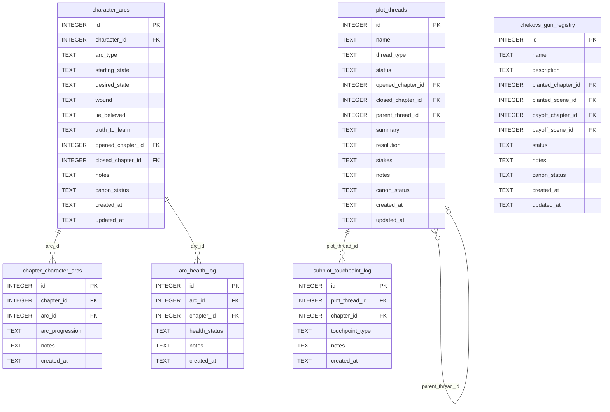

> **Cross-domain FKs:** `plot_threads.opened_chapter_id` / `closed_chapter_id → chapters.id` (Chapters). `character_arcs.character_id → characters.id` (Characters). `character_arcs.opened_chapter_id` / `closed_chapter_id → chapters.id` (Chapters). `chapter_character_arcs.chapter_id → chapters.id` (Chapters). `arc_health_log.chapter_id → chapters.id` (Chapters). `chekovs_gun_registry.planted_chapter_id` / `payoff_chapter_id → chapters.id` (Chapters). `chekovs_gun_registry.planted_scene_id` / `payoff_scene_id → scenes.id` (Chapters). `subplot_touchpoint_log.chapter_id → chapters.id` (Chapters).

### `plot_threads`

Named narrative threads with type, status, open/close chapters, and optional parent thread for subplot nesting. The self-referential `parent_thread_id` allows subplots to reference their parent thread.

| Field | Type | Description |
|-------|------|-------------|
| `id` | INTEGER PK | Primary key |
| `name` | TEXT | Thread name |
| `thread_type` | TEXT | Type: `main`, `subplot`, `backstory`, `mystery` (default: `main`) |
| `status` | TEXT | Status: `active`, `resolved`, `dormant`, `abandoned` (default: `active`) |
| `opened_chapter_id` | INTEGER FK | References `chapters.id` — chapter where thread opens (nullable) |
| `closed_chapter_id` | INTEGER FK | References `chapters.id` — chapter where thread closes (nullable) |
| `parent_thread_id` | INTEGER FK | References `plot_threads.id` — parent thread for subplots (nullable self-ref) |
| `summary` | TEXT | Narrative summary of the thread |
| `resolution` | TEXT | How the thread resolves |
| `stakes` | TEXT | What is at stake in this thread |
| `notes` | TEXT | Standard annotation field |
| `canon_status` | TEXT | Approval status (default: `draft`) |
| `created_at` | TEXT | Standard audit timestamp |
| `updated_at` | TEXT | Standard audit timestamp |

**Populated by:** `upsert_plot_thread` (plot domain).

---

### `character_arcs`

One arc per character per story arc (a character may have multiple arcs across a book or series). Captures the story-structure elements: starting wound, lie believed, truth to learn, and the desired endpoint.

| Field | Type | Description |
|-------|------|-------------|
| `id` | INTEGER PK | Primary key |
| `character_id` | INTEGER FK | References `characters.id` — whose arc this is |
| `arc_type` | TEXT | Type: `growth`, `fall`, `redemption`, `flat`, etc. (default: `growth`) |
| `starting_state` | TEXT | Where the character starts psychologically |
| `desired_state` | TEXT | Where they are trying to reach |
| `wound` | TEXT | The formative wound driving the arc |
| `lie_believed` | TEXT | The false belief the character holds at the start |
| `truth_to_learn` | TEXT | The truth that will complete the arc |
| `opened_chapter_id` | INTEGER FK | References `chapters.id` — where the arc begins (nullable) |
| `closed_chapter_id` | INTEGER FK | References `chapters.id` — where the arc resolves (nullable) |
| `notes` | TEXT | Standard annotation field |
| `canon_status` | TEXT | Approval status (default: `draft`) |
| `created_at` | TEXT | Standard audit timestamp |
| `updated_at` | TEXT | Standard audit timestamp |

**Populated by:** `upsert_arc` (arcs.py), `delete_arc` (arcs.py). Read via `get_arc`.

---

### `chapter_character_arcs`

Junction table tracking arc progression per chapter. Each chapter records the arc's current stage (stasis, progression, setback, etc.) for that character.

| Field | Type | Description |
|-------|------|-------------|
| `id` | INTEGER PK | Primary key |
| `chapter_id` | INTEGER FK | References `chapters.id` |
| `arc_id` | INTEGER FK | References `character_arcs.id` |
| `arc_progression` | TEXT | Stage of arc in this chapter: `stasis`, `progression`, `setback`, `breakthrough`, `resolution` (default: `stasis`) |
| `notes` | TEXT | Standard annotation field |
| `created_at` | TEXT | Standard audit timestamp |

**Constraints:** `UNIQUE(chapter_id, arc_id)`.

**Populated by:** `link_chapter_to_arc` (arcs.py), `unlink_chapter_from_arc` (arcs.py).

---

### `arc_health_log`

Append-only health assessment log for a character arc at a chapter. Multiple health assessments per arc/chapter are valid. Used by `get_arc_health` to surface at-risk arcs.

| Field | Type | Description |
|-------|------|-------------|
| `id` | INTEGER PK | Primary key |
| `arc_id` | INTEGER FK | References `character_arcs.id` — the arc being assessed |
| `chapter_id` | INTEGER FK | References `chapters.id` — the chapter of assessment |
| `health_status` | TEXT | Status: `on-track`, `at-risk`, `derailed` (default: `on-track`) |
| `notes` | TEXT | Standard annotation field |
| `created_at` | TEXT | Standard audit timestamp |

**Populated by:** `log_arc_health` (arcs domain).

---

### `chekovs_gun_registry`

Registry of planted narrative elements that must pay off later. Tracks the plant location (chapter + scene) and payoff location, plus status. The `get_chekovs_guns(unresolved_only=True)` query surfaces guns that lack a payoff assignment.

| Field | Type | Description |
|-------|------|-------------|
| `id` | INTEGER PK | Primary key |
| `name` | TEXT | Label for the Chekhov's gun element |
| `description` | TEXT | Description of what was planted |
| `planted_chapter_id` | INTEGER FK | References `chapters.id` — chapter where planted (nullable) |
| `planted_scene_id` | INTEGER FK | References `scenes.id` — scene where planted (nullable) |
| `payoff_chapter_id` | INTEGER FK | References `chapters.id` — chapter where it pays off (nullable) |
| `payoff_scene_id` | INTEGER FK | References `scenes.id` — scene where it pays off (nullable) |
| `status` | TEXT | Status: `planted`, `fired`, `cut` (default: `planted`) |
| `notes` | TEXT | Standard annotation field |
| `canon_status` | TEXT | Approval status (default: `draft`) |
| `created_at` | TEXT | Standard audit timestamp |
| `updated_at` | TEXT | Standard audit timestamp |

**Populated by:** `upsert_chekov` (arcs domain).

---

### `subplot_touchpoint_log`

Append-only log of subplot appearance in chapters. Used by `get_subplot_touchpoint_gaps` to surface subplots that have gone too many chapters without a touchpoint.

| Field | Type | Description |
|-------|------|-------------|
| `id` | INTEGER PK | Primary key |
| `plot_thread_id` | INTEGER FK | References `plot_threads.id` — the subplot |
| `chapter_id` | INTEGER FK | References `chapters.id` — chapter of this touchpoint |
| `touchpoint_type` | TEXT | Type: `advance`, `mention`, `callback` (default: `advance`) |
| `notes` | TEXT | Standard annotation field |
| `created_at` | TEXT | Standard audit timestamp |

**Populated by:** `log_subplot_touchpoint` (arcs.py), `delete_subplot_touchpoint` (arcs.py).

---

## 9. Gate & Metrics

The Gate & Metrics domain enforces the architecture gate — the quality checkpoint that must be passed before prose-phase tools can write to the database. It also stores project metrics snapshots and POV balance measurements.

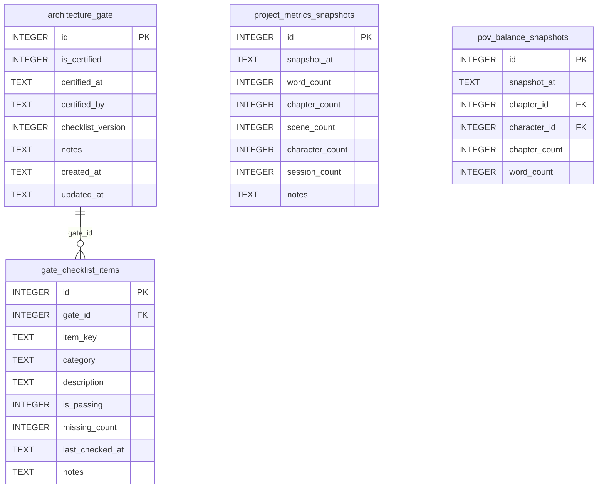

> **Cross-domain FKs:** `pov_balance_snapshots.chapter_id → chapters.id` (Chapters). `pov_balance_snapshots.character_id → characters.id` (Characters).

### `architecture_gate`

Single-row table (id=1) that acts as the global gate certification record. All gated MCP tools query `SELECT is_certified FROM architecture_gate WHERE id = 1` at the top of every write operation.

| Field | Type | Description |
|-------|------|-------------|
| `id` | INTEGER PK | Primary key — always 1 |
| `is_certified` | INTEGER | Boolean (0/1) — whether the gate is currently certified (default: 0) |
| `certified_at` | TEXT | Timestamp of most recent certification (nullable) |
| `certified_by` | TEXT | Agent or user who certified (nullable) |
| `checklist_version` | INTEGER | Version of the checklist used for this certification (default: 1) |
| `notes` | TEXT | Standard annotation field |
| `created_at` | TEXT | Standard audit timestamp |
| `updated_at` | TEXT | Standard audit timestamp |

**Populated by:** `certify_gate` (gate domain).

**Read-only:** Managed exclusively through the `certify_gate` tool flow. Exposing a direct write tool would bypass the gate enforcement mechanism. Note: the child table `gate_checklist_items` does have write coverage via `delete_gate_checklist_item`.

---

### `gate_checklist_items`

One row per gate check item. The gate has 36 items across multiple categories (characters, world, chapters, plot, structure, etc.). Each item tracks whether it currently passes and how many required elements are missing.

| Field | Type | Description |
|-------|------|-------------|
| `id` | INTEGER PK | Primary key |
| `gate_id` | INTEGER FK | References `architecture_gate.id` — always 1 |
| `item_key` | TEXT | Unique key for this checklist item (e.g. `min_characters`, `struct_story_beats`) |
| `category` | TEXT | Grouping category for display (e.g. `characters`, `world`, `structure`) |
| `description` | TEXT | Human-readable description of what this item checks |
| `is_passing` | INTEGER | Boolean (0/1) — whether this item currently passes |
| `missing_count` | INTEGER | Number of missing elements (0 = all present) |
| `last_checked_at` | TEXT | Timestamp of most recent audit run (nullable) |
| `notes` | TEXT | Standard annotation field |

**Constraints:** `UNIQUE(gate_id, item_key)`.

**Populated by:** `run_gate_audit` (gate domain) updates existing rows; seed data inserts the initial 36 items.

---

### `project_metrics_snapshots`

Historical record of project size metrics. Each row is a point-in-time snapshot created by `log_project_snapshot`. The `get_project_metrics` tool returns live-computed values without inserting rows.

| Field | Type | Description |
|-------|------|-------------|
| `id` | INTEGER PK | Primary key |
| `snapshot_at` | TEXT | Timestamp of the snapshot |
| `word_count` | INTEGER | Total actual word count across all chapters (default: 0) |
| `chapter_count` | INTEGER | Number of chapters in the database (default: 0) |
| `scene_count` | INTEGER | Number of scenes in the database (default: 0) |
| `character_count` | INTEGER | Number of characters in the database (default: 0) |
| `session_count` | INTEGER | Number of session log entries (default: 0) |
| `notes` | TEXT | Standard annotation field |

**Populated by:** `log_project_snapshot` (session domain). Gate-enforced write.

---

### `pov_balance_snapshots`

Historical POV balance measurements showing chapter and word count by POV character. The `get_pov_balance` tool returns live-computed values; this table stores persisted snapshots.

| Field | Type | Description |
|-------|------|-------------|
| `id` | INTEGER PK | Primary key |
| `snapshot_at` | TEXT | Timestamp of the snapshot |
| `chapter_id` | INTEGER FK | References `chapters.id` — a chapter in this snapshot (nullable) |
| `character_id` | INTEGER FK | References `characters.id` — the POV character (nullable) |
| `chapter_count` | INTEGER | Number of chapters with this POV character (default: 0) |
| `word_count` | INTEGER | Total word count for this POV character (default: 0) |

**Populated by:** `log_pov_balance_snapshot` (session.py), `delete_pov_balance_snapshot` (session.py).

---

## 10. Session

The Session domain records each writing session, the agent actions within it, open questions raised during it, and decisions made. All session tools require gate certification.

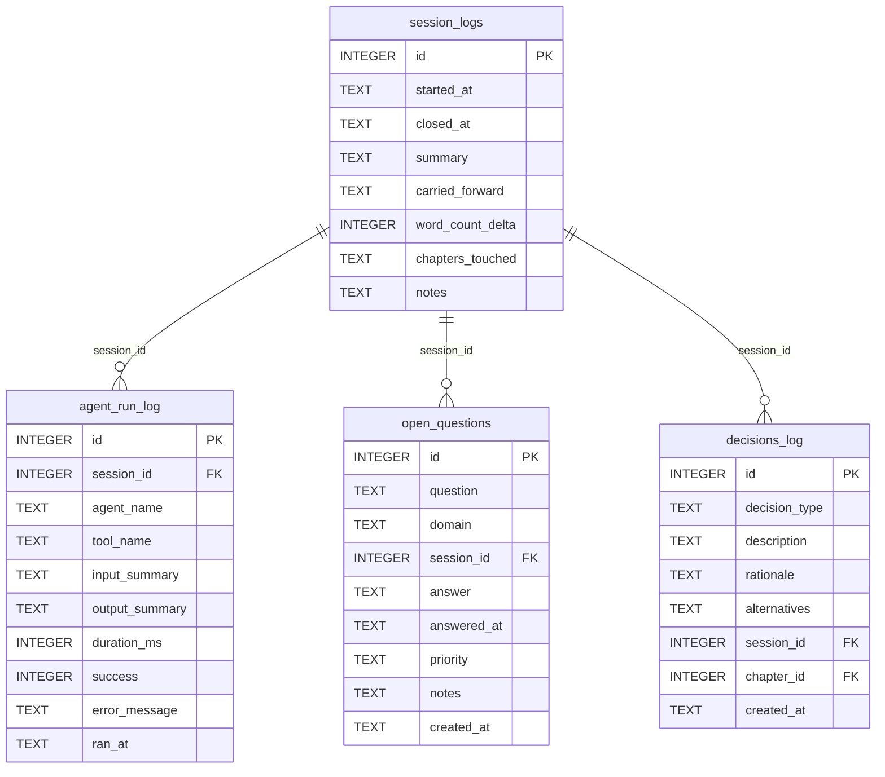

> **Cross-domain FKs:** `decisions_log.chapter_id → chapters.id` (Chapters).

> ⚠️ **Gate-enforced writes** — MCP write tools require gate certification.

### `session_logs`

One row per writing session. The `started_at` column auto-populates on INSERT. `closed_at` is NULL for the currently open session. `chapters_touched` is a JSON TEXT array of chapter IDs worked on. `carried_forward` is a JSON TEXT array of unanswered open questions auto-collected at session close.

| Field | Type | Description |
|-------|------|-------------|
| `id` | INTEGER PK | Primary key |
| `started_at` | TEXT | Session start timestamp (auto-populated) |
| `closed_at` | TEXT | Session close timestamp — NULL if session is open (nullable) |
| `summary` | TEXT | Summary of work done this session (nullable) |
| `carried_forward` | TEXT | JSON TEXT array of unanswered questions carried to next session |
| `word_count_delta` | INTEGER | Net word count change this session (default: 0) |
| `chapters_touched` | TEXT | JSON TEXT array of chapter IDs worked on |
| `notes` | TEXT | Standard annotation field |

**Populated by:** `start_session`, `close_session` (session domain). Gate-enforced writes.

---

### `agent_run_log`

Append-only audit trail of individual agent tool calls within a session. Each row records one tool invocation: which agent, which tool, timing, and success/failure.

| Field | Type | Description |
|-------|------|-------------|
| `id` | INTEGER PK | Primary key |
| `session_id` | INTEGER FK | References `session_logs.id` — the session this run belongs to (nullable) |
| `agent_name` | TEXT | Name of the agent that ran (e.g. `planner`, `writer`) |
| `tool_name` | TEXT | Name of the MCP tool called |
| `input_summary` | TEXT | Brief description of the tool input (nullable) |
| `output_summary` | TEXT | Brief description of the tool output (nullable) |
| `duration_ms` | INTEGER | Duration in milliseconds (nullable) |
| `success` | INTEGER | Boolean (0/1) — whether the run succeeded (default: 1) |
| `error_message` | TEXT | Error description if `success=0` (nullable) |
| `ran_at` | TEXT | Timestamp of the run (auto-populated) |

**Populated by:** `log_agent_run` (session domain). Gate-enforced write.

---

### `open_questions`

Log of questions raised during writing sessions that need resolution. Questions are filtered by `answered_at IS NULL` to surface unanswered ones. The `question` column name is the actual migration column (design doc had `question_text` — this is a known drift).

| Field | Type | Description |
|-------|------|-------------|
| `id` | INTEGER PK | Primary key |
| `question` | TEXT | The question text |
| `domain` | TEXT | Domain classification: `plot`, `character`, `world`, `general`, etc. (default: `general`) |
| `session_id` | INTEGER FK | References `session_logs.id` — session where raised (nullable) |
| `answer` | TEXT | The answer when resolved (nullable) |
| `answered_at` | TEXT | Timestamp when answered — NULL if still open (nullable) |
| `priority` | TEXT | Priority level: `high`, `normal`, `low` (default: `normal`) |
| `notes` | TEXT | Standard annotation field |
| `created_at` | TEXT | Standard audit timestamp |

**Populated by:** `log_open_question`, `answer_open_question` (session domain). Gate-enforced writes.

---

### `decisions_log`

Append-only record of decisions made during writing — plot choices, character decisions, world-building choices. Each row is immutable once inserted.

| Field | Type | Description |
|-------|------|-------------|
| `id` | INTEGER PK | Primary key |
| `decision_type` | TEXT | Type: `plot`, `character`, `world`, `structural` (default: `plot`) |
| `description` | TEXT | What was decided |
| `rationale` | TEXT | Why this decision was made (nullable) |
| `alternatives` | TEXT | Other options that were considered (nullable) |
| `session_id` | INTEGER FK | References `session_logs.id` — session where decided (nullable) |
| `chapter_id` | INTEGER FK | References `chapters.id` — chapter this decision affects (nullable) |
| `created_at` | TEXT | Standard audit timestamp |

**Populated by:** `log_decision` (canon domain). Gate-enforced write.

---

## 11. Canon & Continuity

The Canon & Continuity domain stores approved facts about the story world and tracks continuity errors for resolution.

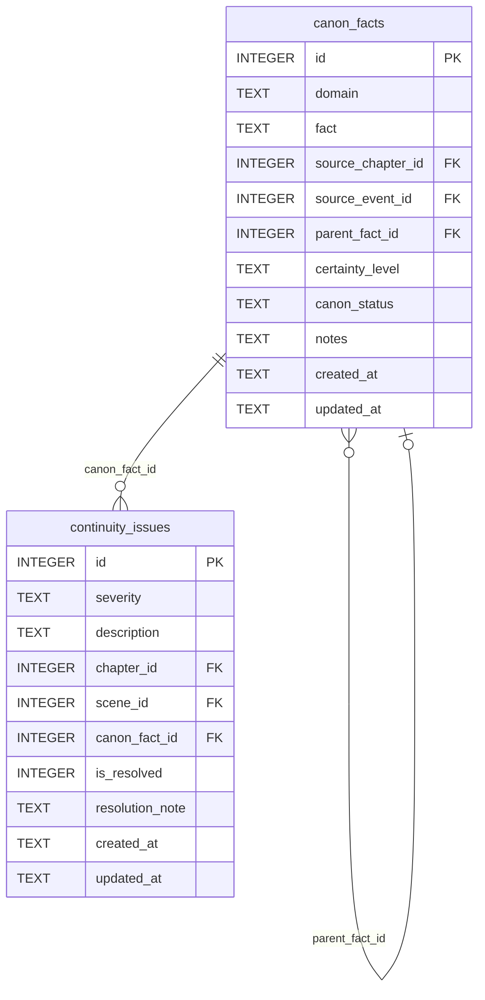

> **Cross-domain FKs:** `canon_facts.source_chapter_id → chapters.id` (Chapters). `canon_facts.source_event_id → events.id` (Timeline). `continuity_issues.chapter_id → chapters.id` (Chapters). `continuity_issues.scene_id → scenes.id` (Chapters).

> ⚠️ **Gate-enforced writes** — MCP write tools require gate certification.

### `canon_facts`

Approved facts about the story world. Facts can be chained via `parent_fact_id` (a derived fact references the parent fact it was inferred from). Canon facts are append-only — each fact is a permanent record.

| Field | Type | Description |
|-------|------|-------------|
| `id` | INTEGER PK | Primary key |
| `domain` | TEXT | Subject area: `world`, `character`, `plot`, `history`, etc. (default: `general`) |
| `fact` | TEXT | The canonical fact statement |
| `source_chapter_id` | INTEGER FK | References `chapters.id` — where this fact was established (nullable) |
| `source_event_id` | INTEGER FK | References `events.id` — event that established this fact (nullable) |
| `parent_fact_id` | INTEGER FK | References `canon_facts.id` — parent fact for derived facts (nullable self-ref) |
| `certainty_level` | TEXT | Epistemic status: `established`, `probable`, `speculative` (default: `established`) |
| `canon_status` | TEXT | Approval status (default: `approved`) |
| `notes` | TEXT | Standard annotation field |
| `created_at` | TEXT | Standard audit timestamp |
| `updated_at` | TEXT | Standard audit timestamp |

**Populated by:** `log_canon_fact` (canon domain). Gate-enforced write.

---

### `continuity_issues`

Records continuity errors found during writing or revision. Each issue can be linked to a specific chapter, scene, and the canon fact it contradicts. Resolved issues retain their record with a resolution note.

| Field | Type | Description |
|-------|------|-------------|
| `id` | INTEGER PK | Primary key |
| `severity` | TEXT | Severity level: `minor`, `moderate`, `major`, `critical` (default: `minor`) |
| `description` | TEXT | Description of the continuity error |
| `chapter_id` | INTEGER FK | References `chapters.id` — chapter where the issue occurs (nullable) |
| `scene_id` | INTEGER FK | References `scenes.id` — scene where the issue occurs (nullable) |
| `canon_fact_id` | INTEGER FK | References `canon_facts.id` — the canon fact this contradicts (nullable) |
| `is_resolved` | INTEGER | Boolean (0/1) — whether the issue has been fixed (default: 0) |
| `resolution_note` | TEXT | How the issue was resolved (nullable) |
| `created_at` | TEXT | Standard audit timestamp |
| `updated_at` | TEXT | Standard audit timestamp |

**Populated by:** `log_continuity_issue`, `resolve_continuity_issue` (canon domain). Gate-enforced writes.

---

## 12. Knowledge & Reader

The Knowledge & Reader domain models the reader's evolving information state — what they know at each chapter, revelations delivered, dramatic irony instances, and reader experience notes.

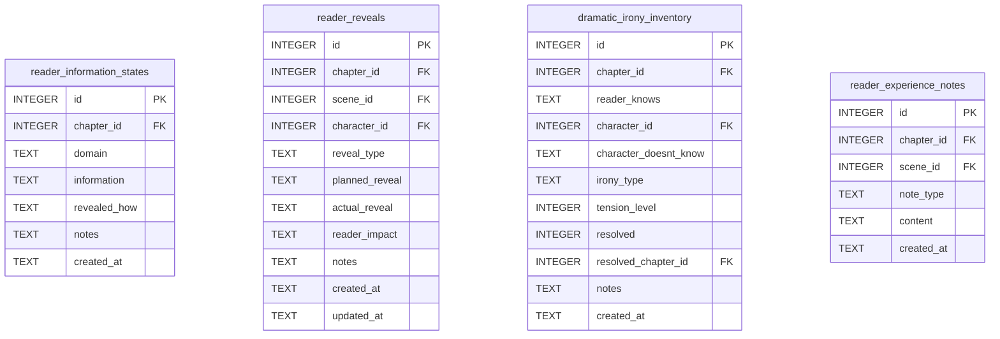

> **Cross-domain FKs:** All `chapter_id` fields → `chapters.id` (Chapters). All `scene_id` fields → `scenes.id` (Chapters). `reader_reveals.character_id` → `characters.id` (Characters). `dramatic_irony_inventory.character_id` → `characters.id` (Characters — the character who doesn't know). `dramatic_irony_inventory.resolved_chapter_id → chapters.id` (Chapters).

> ⚠️ **Gate-enforced writes** — MCP write tools require gate certification.

### `reader_information_states`

Cumulative record of what the reader knows at each chapter, organized by domain. The UNIQUE constraint on `(chapter_id, domain)` means one knowledge state per domain per chapter.

| Field | Type | Description |
|-------|------|-------------|
| `id` | INTEGER PK | Primary key |
| `chapter_id` | INTEGER FK | References `chapters.id` — the chapter at which this state applies |
| `domain` | TEXT | Knowledge category: `plot`, `character`, `world`, `magic`, etc. (default: `general`) |
| `information` | TEXT | Description of what the reader knows in this domain at this chapter |
| `revealed_how` | TEXT | How this information was revealed to the reader (nullable) |
| `notes` | TEXT | Standard annotation field |
| `created_at` | TEXT | Standard audit timestamp |

**Constraints:** `UNIQUE(chapter_id, domain)`.

**Populated by:** `log_reader_state` (knowledge domain). Gate-enforced write.

---

### `reader_reveals`

Records individual reveal moments — when the narrative delivers information to the reader. Distinguishes between planned and actual reveals for revision analysis.

| Field | Type | Description |
|-------|------|-------------|
| `id` | INTEGER PK | Primary key |
| `chapter_id` | INTEGER FK | References `chapters.id` — chapter of the reveal (nullable) |
| `scene_id` | INTEGER FK | References `scenes.id` — scene of the reveal (nullable) |
| `character_id` | INTEGER FK | References `characters.id` — character through whom the reveal happens (nullable) |
| `reveal_type` | TEXT | Type: `exposition`, `dialogue`, `action`, `internal`, `dramatic_irony` (default: `exposition`) |
| `planned_reveal` | TEXT | What was planned to be revealed (nullable) |
| `actual_reveal` | TEXT | What was actually revealed in the text (nullable) |
| `reader_impact` | TEXT | Expected reader emotional/cognitive impact (nullable) |
| `notes` | TEXT | Standard annotation field |
| `created_at` | TEXT | Standard audit timestamp |
| `updated_at` | TEXT | Standard audit timestamp |

**Populated by:** `log_reader_reveal` (knowledge domain). Gate-enforced write.

---

### `dramatic_irony_inventory`

Tracks instances where the reader knows something that a character does not. Each row represents one irony gap: what the reader knows, which character doesn't know it, and whether it has been resolved.

| Field | Type | Description |
|-------|------|-------------|
| `id` | INTEGER PK | Primary key |
| `chapter_id` | INTEGER FK | References `chapters.id` — chapter where the irony gap exists |
| `reader_knows` | TEXT | What the reader knows |
| `character_id` | INTEGER FK | References `characters.id` — the character who doesn't know this (nullable) |
| `character_doesnt_know` | TEXT | Description of what the character is unaware of |
| `irony_type` | TEXT | Type: `situational`, `tragic`, `dramatic` (default: `situational`) |
| `tension_level` | INTEGER | Tension score 1–10 (default: 5) |
| `resolved` | INTEGER | Boolean (0/1) — whether the irony gap has closed (default: 0) |
| `resolved_chapter_id` | INTEGER FK | References `chapters.id` — when it was resolved (nullable) |
| `notes` | TEXT | Standard annotation field |
| `created_at` | TEXT | Standard audit timestamp |

**Populated by:** `log_dramatic_irony` (knowledge domain). Gate-enforced write.

---

### `reader_experience_notes`

Freeform notes about reader experience at specific chapters or scenes — pacing observations, emotional beat effectiveness, tension curve notes.

| Field | Type | Description |
|-------|------|-------------|
| `id` | INTEGER PK | Primary key |
| `chapter_id` | INTEGER FK | References `chapters.id` — chapter this note applies to (nullable) |
| `scene_id` | INTEGER FK | References `scenes.id` — scene this note applies to (nullable) |
| `note_type` | TEXT | Note category: `pacing`, `emotion`, `tension`, `clarity` (default: `pacing`) |
| `content` | TEXT | The note content |
| `created_at` | TEXT | Standard audit timestamp |

**Populated by:** `log_reader_experience_note` (knowledge.py), `delete_reader_experience_note` (knowledge.py).

---

## 13. Foreshadowing & Literary

The Foreshadowing & Literary domain tracks literary devices: planted foreshadowing with payoff tracking, prophecies, recurring motifs, thematic mirrors, and opposition pairs.

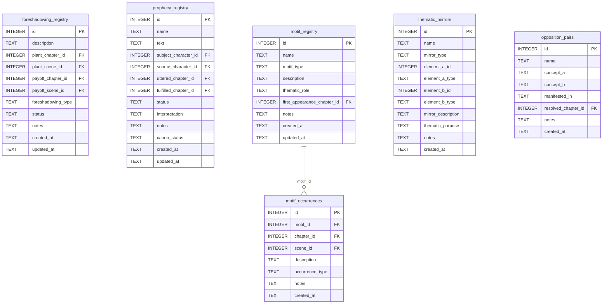

> **Cross-domain FKs:** `foreshadowing_registry.plant_chapter_id` / `payoff_chapter_id → chapters.id` (Chapters). `foreshadowing_registry.plant_scene_id` / `payoff_scene_id → scenes.id` (Chapters). `prophecy_registry.subject_character_id` / `source_character_id → characters.id` (Characters). `prophecy_registry.uttered_chapter_id` / `fulfilled_chapter_id → chapters.id` (Chapters). `motif_registry.first_appearance_chapter_id → chapters.id` (Chapters). `motif_occurrences.chapter_id → chapters.id` (Chapters). `motif_occurrences.scene_id → scenes.id` (Chapters). `opposition_pairs.resolved_chapter_id → chapters.id` (Chapters). `thematic_mirrors.element_a_id` / `element_b_id` — plain INTEGER, no SQL FK (polymorphic references).

> ⚠️ **Gate-enforced writes** — MCP write tools require gate certification.

### `foreshadowing_registry`

Tracks planted foreshadowing elements with their payoff locations. The `log_foreshadowing` tool uses a two-branch upsert: a new plant inserts a row, and later when the payoff is written, the same row is updated with the payoff chapter/scene.

| Field | Type | Description |
|-------|------|-------------|
| `id` | INTEGER PK | Primary key |
| `description` | TEXT | Description of the foreshadowing element |
| `plant_chapter_id` | INTEGER FK | References `chapters.id` — where the element was planted (required) |
| `plant_scene_id` | INTEGER FK | References `scenes.id` — scene where planted (nullable) |
| `payoff_chapter_id` | INTEGER FK | References `chapters.id` — where the element pays off (nullable) |
| `payoff_scene_id` | INTEGER FK | References `scenes.id` — scene of payoff (nullable) |
| `foreshadowing_type` | TEXT | Type: `direct`, `symbolic`, `ironic`, `red_herring` (default: `direct`) |
| `status` | TEXT | Status: `planted`, `paid_off`, `cut` (default: `planted`) |
| `notes` | TEXT | Standard annotation field |
| `created_at` | TEXT | Standard audit timestamp |
| `updated_at` | TEXT | Standard audit timestamp |

**Populated by:** `log_foreshadowing` (foreshadowing domain). Gate-enforced write.

---

### `prophecy_registry`

Tracks narrative prophecies: what was said, by whom, about whom, where it was uttered, and whether it has been fulfilled. Interpretation allows tracking competing readings.

| Field | Type | Description |
|-------|------|-------------|
| `id` | INTEGER PK | Primary key |
| `name` | TEXT | Prophecy label |
| `text` | TEXT | The prophecy text |
| `subject_character_id` | INTEGER FK | References `characters.id` — who the prophecy concerns (nullable) |
| `source_character_id` | INTEGER FK | References `characters.id` — who uttered it (nullable) |
| `uttered_chapter_id` | INTEGER FK | References `chapters.id` — when it was delivered (nullable) |
| `fulfilled_chapter_id` | INTEGER FK | References `chapters.id` — when it was fulfilled (nullable) |
| `status` | TEXT | Status: `active`, `fulfilled`, `broken`, `ambiguous` (default: `active`) |
| `interpretation` | TEXT | Current interpretation of the prophecy's meaning (nullable) |
| `notes` | TEXT | Standard annotation field |
| `canon_status` | TEXT | Approval status (default: `draft`) |
| `created_at` | TEXT | Standard audit timestamp |
| `updated_at` | TEXT | Standard audit timestamp |

**Populated by:** `upsert_prophecy` (foreshadowing domain). Gate-enforced write.

---

### `motif_registry`

Named recurring motifs in the narrative. Each motif has a type, description, and thematic role. Individual appearances are tracked in `motif_occurrences`.

| Field | Type | Description |
|-------|------|-------------|
| `id` | INTEGER PK | Primary key |
| `name` | TEXT | Motif name — UNIQUE constraint |
| `motif_type` | TEXT | Type: `symbol`, `image`, `phrase`, `action` (default: `symbol`) |
| `description` | TEXT | What this motif is |
| `thematic_role` | TEXT | How this motif functions thematically (nullable) |
| `first_appearance_chapter_id` | INTEGER FK | References `chapters.id` — when the motif first appears (nullable) |
| `notes` | TEXT | Standard annotation field |
| `created_at` | TEXT | Standard audit timestamp |
| `updated_at` | TEXT | Standard audit timestamp |

**Constraints:** `UNIQUE(name)`.

**Populated by:** `upsert_motif` (foreshadowing domain). Gate-enforced write.

---

### `motif_occurrences`

Append-only log of each appearance of a motif in the text. Multiple occurrences per motif across many chapters are expected and valid.

| Field | Type | Description |
|-------|------|-------------|
| `id` | INTEGER PK | Primary key |
| `motif_id` | INTEGER FK | References `motif_registry.id` — the motif |
| `chapter_id` | INTEGER FK | References `chapters.id` — chapter of occurrence |
| `scene_id` | INTEGER FK | References `scenes.id` — scene of occurrence (nullable) |
| `description` | TEXT | How the motif appears here (nullable) |
| `occurrence_type` | TEXT | Type: `direct`, `symbolic`, `inverted`, `echo` (default: `direct`) |
| `notes` | TEXT | Standard annotation field |
| `created_at` | TEXT | Standard audit timestamp |

**Populated by:** `log_motif_occurrence` (foreshadowing domain). Gate-enforced write.

---

### `thematic_mirrors`

Records thematic mirror relationships between narrative elements — characters, events, or concepts that reflect or contrast each other. The `element_a_id` and `element_b_id` fields are plain INTEGER with no SQL FK constraints because they can reference any table (polymorphic). The `element_a_type` and `element_b_type` fields specify what type each ID refers to.

| Field | Type | Description |
|-------|------|-------------|
| `id` | INTEGER PK | Primary key |
| `name` | TEXT | Name of this mirror relationship |
| `mirror_type` | TEXT | Type: `character`, `event`, `concept`, `symbol` (default: `character`) |
| `element_a_id` | INTEGER | ID of the first element — plain INTEGER, no SQL FK (polymorphic) |
| `element_a_type` | TEXT | Type of element A: `character`, `event`, `chapter`, etc. (default: `character`) |
| `element_b_id` | INTEGER | ID of the second element — plain INTEGER, no SQL FK (polymorphic) |
| `element_b_type` | TEXT | Type of element B (default: `character`) |
| `mirror_description` | TEXT | How these elements mirror each other (nullable) |
| `thematic_purpose` | TEXT | Why this mirror relationship matters thematically (nullable) |
| `notes` | TEXT | Standard annotation field |
| `created_at` | TEXT | Standard audit timestamp |

**Populated by:** `upsert_thematic_mirror` (foreshadowing domain). Gate-enforced write.

---

### `opposition_pairs`

Tracks thematic oppositions — the central tensions between ideas, values, or forces in the narrative (e.g. freedom vs. control, loyalty vs. survival). Each pair can be resolved at a specific chapter.

| Field | Type | Description |
|-------|------|-------------|
| `id` | INTEGER PK | Primary key |
| `name` | TEXT | Name of this opposition |
| `concept_a` | TEXT | The first concept or pole |
| `concept_b` | TEXT | The opposing concept or pole |
| `manifested_in` | TEXT | How this opposition appears in the narrative (nullable) |
| `resolved_chapter_id` | INTEGER FK | References `chapters.id` — chapter where the tension resolves (nullable) |
| `notes` | TEXT | Standard annotation field |
| `created_at` | TEXT | Standard audit timestamp |

**Populated by:** `upsert_opposition` (foreshadowing domain). Gate-enforced write.

---

## 14. Voice & Names

The Voice & Names domain manages character voice consistency and the name registry. Voice profiles store the distinctive speech characteristics of each character; drift events are logged when a character's voice strays off-profile. The name registry tracks every proper noun used to prevent duplicate or culturally inconsistent naming.

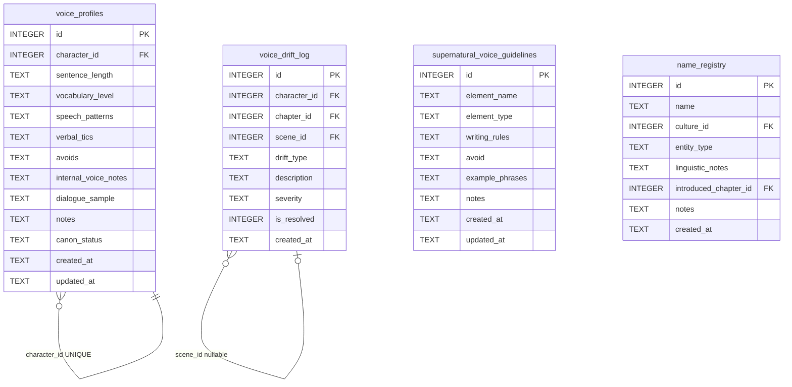

> **Cross-domain FKs:** `voice_profiles.character_id → characters.id` (Characters). `voice_drift_log.character_id → characters.id` (Characters). `voice_drift_log.chapter_id → chapters.id` (Chapters). `voice_drift_log.scene_id → scenes.id` (Chapters). `name_registry.culture_id → cultures.id` (World). `name_registry.introduced_chapter_id → chapters.id` (Chapters).

> ⚠️ **Gate-enforced writes** — MCP write tools in the voice domain require gate certification. Name domain tools are gate-free (name tools must work during worldbuilding).

### `voice_profiles`

One voice profile per character — the UNIQUE constraint on `character_id` enforces this. Stores the characteristic speech attributes used to keep a character's voice consistent across chapters.

| Field | Type | Description |
|-------|------|-------------|
| `id` | INTEGER PK | Primary key |
| `character_id` | INTEGER FK | References `characters.id` — one profile per character (UNIQUE) |
| `sentence_length` | TEXT | Typical sentence length pattern: `short`, `varied`, `long` (nullable) |
| `vocabulary_level` | TEXT | Vocabulary register: `simple`, `educated`, `archaic`, etc. (nullable) |
| `speech_patterns` | TEXT | Distinctive patterns: rhetorical questions, sentence fragments, etc. (nullable) |
| `verbal_tics` | TEXT | Recurring words, phrases, or habits (nullable) |
| `avoids` | TEXT | Words or constructions this character never uses (nullable) |
| `internal_voice_notes` | TEXT | Notes on internal monologue style (nullable) |
| `dialogue_sample` | TEXT | Sample of characteristic dialogue (nullable) |
| `notes` | TEXT | Standard annotation field |
| `canon_status` | TEXT | Approval status (default: `draft`) |
| `created_at` | TEXT | Standard audit timestamp |
| `updated_at` | TEXT | Standard audit timestamp |

**Constraints:** `UNIQUE(character_id)` — one voice profile per character.

**Populated by:** `upsert_voice_profile` (voice domain). Gate-enforced write.

---

### `voice_drift_log`

Append-only log of voice drift events — instances where a character's writing strayed from their established voice profile. Each row records the drift type, severity, and whether it has been corrected.

| Field | Type | Description |
|-------|------|-------------|
| `id` | INTEGER PK | Primary key |
| `character_id` | INTEGER FK | References `characters.id` — the character whose voice drifted |
| `chapter_id` | INTEGER FK | References `chapters.id` — chapter where drift occurred (nullable) |
| `scene_id` | INTEGER FK | References `scenes.id` — scene where drift occurred (nullable) |
| `drift_type` | TEXT | Type of drift: `vocabulary`, `rhythm`, `tone`, `tic_missing` (default: `vocabulary`) |
| `description` | TEXT | Description of the drift |
| `severity` | TEXT | Severity: `minor`, `moderate`, `severe` (default: `minor`) |
| `is_resolved` | INTEGER | Boolean (0/1) — whether this drift has been corrected (default: 0) |
| `created_at` | TEXT | Standard audit timestamp |

**Populated by:** `log_voice_drift` (voice domain). Gate-enforced write.

---

### `supernatural_voice_guidelines`

Writing guidelines for supernatural entities — creatures, spirits, and phenomena that require special handling in prose. The `element_name` is UNIQUE (one guideline set per supernatural type).

| Field | Type | Description |
|-------|------|-------------|
| `id` | INTEGER PK | Primary key |
| `element_name` | TEXT | Name of the supernatural element — UNIQUE |
| `element_type` | TEXT | Type: `creature`, `spirit`, `phenomenon` (default: `creature`) |
| `writing_rules` | TEXT | Required rules for writing about this element |
| `avoid` | TEXT | What to avoid when writing about this element (nullable) |
| `example_phrases` | TEXT | Example phrases or passages that capture the correct style (nullable) |
| `notes` | TEXT | Standard annotation field |
| `created_at` | TEXT | Standard audit timestamp |
| `updated_at` | TEXT | Standard audit timestamp |

**Constraints:** `UNIQUE(element_name)`.

**Populated by:** `upsert_supernatural_voice_guideline` (voice.py), `delete_supernatural_voice_guideline` (voice.py). Gate-enforced writes.

---

### `name_registry`

Registry of every proper noun (character names, place names, object names) used in the novel. Used to check for duplicates and cultural consistency before committing to a name. The `name` column is UNIQUE.

| Field | Type | Description |
|-------|------|-------------|
| `id` | INTEGER PK | Primary key |
| `name` | TEXT | The registered name — UNIQUE |
| `entity_type` | TEXT | Type of entity: `character`, `location`, `artifact`, `faction`, etc. (default: `character`) |
| `culture_id` | INTEGER FK | References `cultures.id` — which culture this name belongs to (nullable) |
| `linguistic_notes` | TEXT | Pronunciation, etymology, or linguistic notes (nullable) |
| `introduced_chapter_id` | INTEGER FK | References `chapters.id` — when this name first appears (nullable) |
| `notes` | TEXT | Standard annotation field |
| `created_at` | TEXT | Standard audit timestamp |

**Constraints:** `UNIQUE(name)`.

**Populated by:** `register_name` (names domain). Gate-free — name tools work during the worldbuilding phase without requiring gate certification.

---

## 15. Publishing

The Publishing domain tracks publishing assets (query letters, synopses, manuscripts) and the submission tracker for tracking agency and publisher submissions.

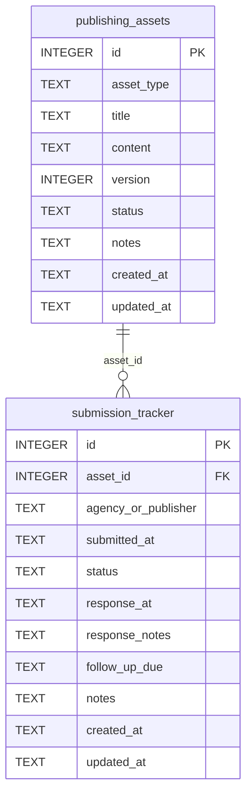

> **Cross-domain FKs:** None within publishing. `submission_tracker.asset_id → publishing_assets.id` (Publishing — internal).

> ⚠️ **Gate-enforced writes** — MCP write tools require gate certification.

### `publishing_assets`

Versioned documents required for submission: query letters, synopses, loglines, first pages. Each asset type can have multiple version rows.

| Field | Type | Description |
|-------|------|-------------|
| `id` | INTEGER PK | Primary key |
| `asset_type` | TEXT | Type: `query_letter`, `synopsis`, `logline`, `first_pages`, `bio` (default: `query_letter`) |
| `title` | TEXT | Asset title or label |
| `content` | TEXT | Full text content of the asset |
| `version` | INTEGER | Version number (default: 1) |
| `status` | TEXT | Status: `draft`, `ready`, `submitted`, `archived` (default: `draft`) |
| `notes` | TEXT | Standard annotation field |
| `created_at` | TEXT | Standard audit timestamp |
| `updated_at` | TEXT | Standard audit timestamp |

**Populated by:** `upsert_publishing_asset` (publishing domain). Gate-enforced write.

---

### `submission_tracker`

Log of individual submissions to agencies or publishers. Each row tracks one submission: what was sent, to whom, when, and the current status. Response information is filled in when it arrives.

| Field | Type | Description |
|-------|------|-------------|
| `id` | INTEGER PK | Primary key |
| `asset_id` | INTEGER FK | References `publishing_assets.id` — which asset was submitted (nullable) |
| `agency_or_publisher` | TEXT | Name of the agency or publisher |
| `submitted_at` | TEXT | Timestamp or date of submission |
| `status` | TEXT | Status: `pending`, `responded`, `rejected`, `partial_request`, `full_request`, `offer` (default: `pending`) |
| `response_at` | TEXT | When a response was received (nullable) |
| `response_notes` | TEXT | Notes on the response content (nullable) |
| `follow_up_due` | TEXT | Date when a follow-up is appropriate (nullable) |
| `notes` | TEXT | Standard annotation field |
| `created_at` | TEXT | Standard audit timestamp |
| `updated_at` | TEXT | Standard audit timestamp |

**Populated by:** `upsert_publishing_asset` creates the asset; `update_submission` updates submission status (publishing domain). Gate-enforced writes.

---

## 16. Utility

The Utility domain contains two research and documentation support tables. Both have full MCP write coverage added in Phase 14: research notes are managed by publishing.py and documentation tasks are tracked and updated via publishing.py tools.

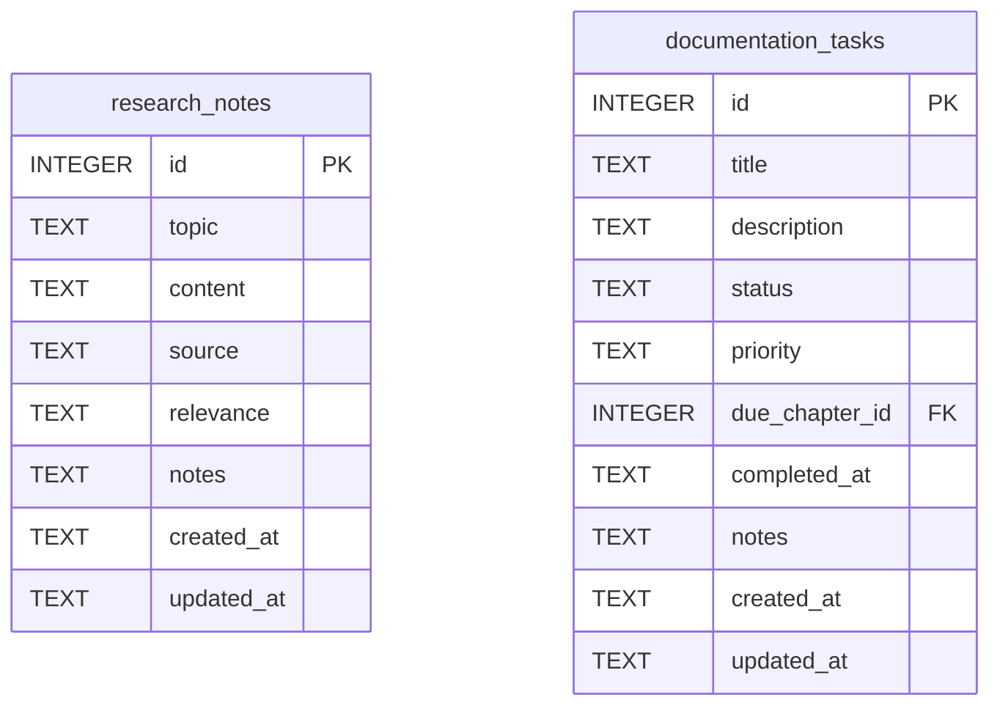

> **Cross-domain FKs:** `documentation_tasks.due_chapter_id → chapters.id` (Chapters).

### `research_notes`

Free-form notes on research topics relevant to the novel — historical facts, technical details, cultural information gathered during writing.

| Field | Type | Description |
|-------|------|-------------|
| `id` | INTEGER PK | Primary key |
| `topic` | TEXT | Research topic label |
| `content` | TEXT | The research content |
| `source` | TEXT | Source of the research (nullable) |
| `relevance` | TEXT | How this research relates to the novel (nullable) |
| `notes` | TEXT | Standard annotation field |
| `created_at` | TEXT | Standard audit timestamp |
| `updated_at` | TEXT | Standard audit timestamp |

**Populated by:** `upsert_research_note` (publishing.py), `get_research_notes` (publishing.py), `delete_research_note` (publishing.py).

---

### `documentation_tasks`

Tracks documentation and continuity tasks that need to be completed at or before a given chapter — notes to update, facts to verify, passages to research.

| Field | Type | Description |
|-------|------|-------------|
| `id` | INTEGER PK | Primary key |
| `title` | TEXT | Task title |
| `description` | TEXT | Task description (nullable) |
| `status` | TEXT | Status: `pending`, `in_progress`, `complete`, `cancelled` (default: `pending`) |
| `priority` | TEXT | Priority: `high`, `normal`, `low` (default: `normal`) |
| `due_chapter_id` | INTEGER FK | References `chapters.id` — chapter by which this must be done (nullable) |
| `completed_at` | TEXT | Timestamp of completion (nullable) |
| `notes` | TEXT | Standard annotation field |
| `created_at` | TEXT | Standard audit timestamp |
| `updated_at` | TEXT | Standard audit timestamp |

**Populated by:** `upsert_documentation_task` (publishing.py), `get_documentation_tasks` (publishing.py), `delete_documentation_task` (publishing.py).

---

*End of schema reference. For tool documentation see `docs/mcp-tools.md`. For architecture overview see `docs/README.md`.*
