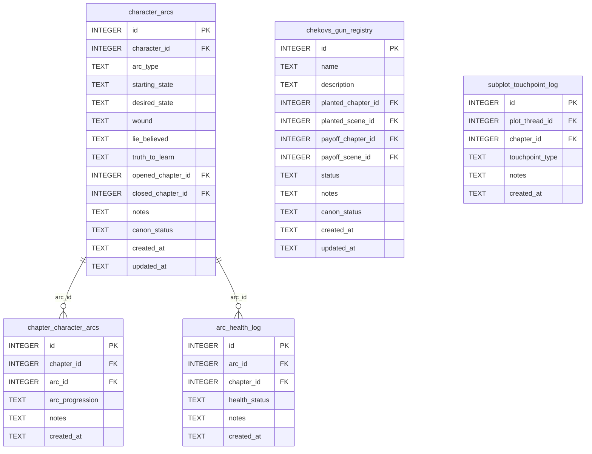

[← Documentation Index](../README.md)

# Arcs Schema

The Arcs domain manages character arcs with health tracking, Chekhov's gun registry, and subplot touchpoints. The `chapter_character_arcs` junction table lives here (not in chapters.md) because character arcs are the primary entity being tracked across chapters. All arcs tools are gate-free.

> **Cross-domain FKs:** `character_arcs.character_id → characters.id` (Characters). `character_arcs.opened_chapter_id` / `closed_chapter_id → chapters.id` (Chapters). `chapter_character_arcs.chapter_id → chapters.id` (Chapters). `arc_health_log.chapter_id → chapters.id` (Chapters). `chekovs_gun_registry.planted_chapter_id` / `payoff_chapter_id → chapters.id` (Chapters). `chekovs_gun_registry.planted_scene_id` / `payoff_scene_id → scenes.id` (Chapters). `subplot_touchpoint_log.plot_thread_id → plot_threads.id` (Plot). `subplot_touchpoint_log.chapter_id → chapters.id` (Chapters).

## `character_arcs`

One arc per character per story arc (a character may have multiple arcs across a book or series). Captures the story-structure elements: starting wound, lie believed, truth to learn, and the desired endpoint.

| Field | Type | Description |
|-------|------|-------------|
| `id` | INTEGER PK | Primary key |
| `character_id` | INTEGER FK | References `characters.id` — whose arc this is |
| `arc_type` | TEXT | Type: `growth`, `fall`, `redemption`, `flat`, etc. (default: `growth`) |
| `starting_state` | TEXT | Where the character starts psychologically |
| `desired_state` | TEXT | Where they are trying to reach |
| `wound` | TEXT | The formative wound driving the arc |
| `lie_believed` | TEXT | The false belief the character holds at the start |
| `truth_to_learn` | TEXT | The truth that will complete the arc |
| `opened_chapter_id` | INTEGER FK | References `chapters.id` — where the arc begins (nullable) |
| `closed_chapter_id` | INTEGER FK | References `chapters.id` — where the arc resolves (nullable) |
| `notes` | TEXT | Standard annotation field |
| `canon_status` | TEXT | Approval status (default: `draft`) |
| `created_at` | TEXT | Standard audit timestamp |
| `updated_at` | TEXT | Standard audit timestamp |

**Populated by:** `upsert_arc` (arcs.py), `delete_arc` (arcs.py). Read via `get_arc`.

---

## `chapter_character_arcs`

Junction table tracking arc progression per chapter. Each chapter records the arc's current stage (stasis, progression, setback, etc.) for that character. Junction table — relates character arcs to the chapters they appear in.

| Field | Type | Description |
|-------|------|-------------|
| `id` | INTEGER PK | Primary key |
| `chapter_id` | INTEGER FK | References `chapters.id` |
| `arc_id` | INTEGER FK | References `character_arcs.id` |
| `arc_progression` | TEXT | Stage of arc in this chapter: `stasis`, `progression`, `setback`, `breakthrough`, `resolution` (default: `stasis`) |
| `notes` | TEXT | Standard annotation field |
| `created_at` | TEXT | Standard audit timestamp |

**Constraints:** `UNIQUE(chapter_id, arc_id)`.

**Populated by:** `link_chapter_to_arc` (arcs.py), `unlink_chapter_from_arc` (arcs.py).

---

## `arc_health_log`

Append-only health assessment log for a character arc at a chapter. Multiple health assessments per arc/chapter are valid. Used by `get_arc_health` to surface at-risk arcs.

| Field | Type | Description |
|-------|------|-------------|
| `id` | INTEGER PK | Primary key |
| `arc_id` | INTEGER FK | References `character_arcs.id` — the arc being assessed |
| `chapter_id` | INTEGER FK | References `chapters.id` — the chapter of assessment |
| `health_status` | TEXT | Status: `on-track`, `at-risk`, `derailed` (default: `on-track`) |
| `notes` | TEXT | Standard annotation field |
| `created_at` | TEXT | Standard audit timestamp |

**Populated by:** `log_arc_health` (arcs domain).

---

## `chekovs_gun_registry`

Registry of planted narrative elements that must pay off later. Tracks the plant location (chapter + scene) and payoff location, plus status. The `get_chekovs_guns(unresolved_only=True)` query surfaces guns that lack a payoff assignment.

| Field | Type | Description |
|-------|------|-------------|
| `id` | INTEGER PK | Primary key |
| `name` | TEXT | Label for the Chekhov's gun element |
| `description` | TEXT | Description of what was planted |
| `planted_chapter_id` | INTEGER FK | References `chapters.id` — chapter where planted (nullable) |
| `planted_scene_id` | INTEGER FK | References `scenes.id` — scene where planted (nullable) |
| `payoff_chapter_id` | INTEGER FK | References `chapters.id` — chapter where it pays off (nullable) |
| `payoff_scene_id` | INTEGER FK | References `scenes.id` — scene where it pays off (nullable) |
| `status` | TEXT | Status: `planted`, `fired`, `cut` (default: `planted`) |
| `notes` | TEXT | Standard annotation field |
| `canon_status` | TEXT | Approval status (default: `draft`) |
| `created_at` | TEXT | Standard audit timestamp |
| `updated_at` | TEXT | Standard audit timestamp |

**Populated by:** `upsert_chekov` (arcs domain).

---

## `subplot_touchpoint_log`

Append-only log of subplot appearance in chapters. Used by `get_subplot_touchpoint_gaps` to surface subplots that have gone too many chapters without a touchpoint.

| Field | Type | Description |
|-------|------|-------------|
| `id` | INTEGER PK | Primary key |
| `plot_thread_id` | INTEGER FK | References `plot_threads.id` — the subplot |
| `chapter_id` | INTEGER FK | References `chapters.id` — chapter of this touchpoint |
| `touchpoint_type` | TEXT | Type: `advance`, `mention`, `callback` (default: `advance`) |
| `notes` | TEXT | Standard annotation field |
| `created_at` | TEXT | Standard audit timestamp |

**Populated by:** `log_subplot_touchpoint` (arcs.py), `delete_subplot_touchpoint` (arcs.py).

---
