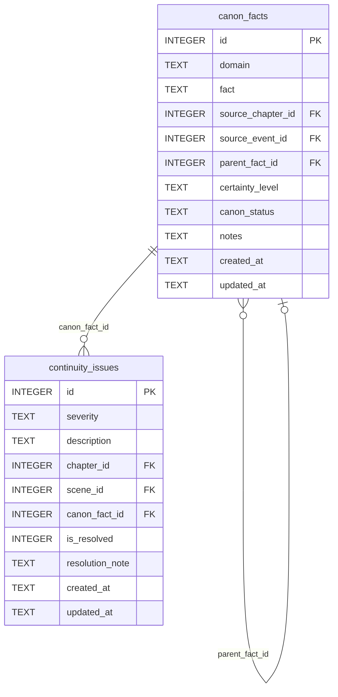

[← Documentation Index](../README.md)

# Canon Schema

The Canon & Continuity domain stores approved facts about the story world and tracks continuity errors for resolution. All write tools require gate certification.

> **Cross-domain FKs:** `canon_facts.source_chapter_id → chapters.id` (Chapters). `canon_facts.source_event_id → events.id` (Timeline). `continuity_issues.chapter_id → chapters.id` (Chapters). `continuity_issues.scene_id → scenes.id` (Chapters).

> Gate-enforced writes — all MCP write tools require gate certification.

## `canon_facts`

Approved facts about the story world. Facts can be chained via `parent_fact_id` (a derived fact references the parent fact it was inferred from). Canon facts are append-only — each fact is a permanent record.

| Field | Type | Description |
|-------|------|-------------|
| `id` | INTEGER PK | Primary key |
| `domain` | TEXT | Subject area: `world`, `character`, `plot`, `history`, etc. (default: `general`) |
| `fact` | TEXT | The canonical fact statement |
| `source_chapter_id` | INTEGER FK | References `chapters.id` — where this fact was established (nullable) |
| `source_event_id` | INTEGER FK | References `events.id` — event that established this fact (nullable) |
| `parent_fact_id` | INTEGER FK | References `canon_facts.id` — parent fact for derived facts (nullable self-ref) |
| `certainty_level` | TEXT | Epistemic status: `established`, `probable`, `speculative` (default: `established`) |
| `canon_status` | TEXT | Approval status (default: `approved`) |
| `notes` | TEXT | Standard annotation field |
| `created_at` | TEXT | Standard audit timestamp |
| `updated_at` | TEXT | Standard audit timestamp |

**Populated by:** `log_canon_fact` (canon domain). Gate-enforced write.

---

## `continuity_issues`

Records continuity errors found during writing or revision. Each issue can be linked to a specific chapter, scene, and the canon fact it contradicts. Resolved issues retain their record with a resolution note.

| Field | Type | Description |
|-------|------|-------------|
| `id` | INTEGER PK | Primary key |
| `severity` | TEXT | Severity level: `minor`, `moderate`, `major`, `critical` (default: `minor`) |
| `description` | TEXT | Description of the continuity error |
| `chapter_id` | INTEGER FK | References `chapters.id` — chapter where the issue occurs (nullable) |
| `scene_id` | INTEGER FK | References `scenes.id` — scene where the issue occurs (nullable) |
| `canon_fact_id` | INTEGER FK | References `canon_facts.id` — the canon fact this contradicts (nullable) |
| `is_resolved` | INTEGER | Boolean (0/1) — whether the issue has been fixed (default: 0) |
| `resolution_note` | TEXT | How the issue was resolved (nullable) |
| `created_at` | TEXT | Standard audit timestamp |
| `updated_at` | TEXT | Standard audit timestamp |

**Populated by:** `log_continuity_issue`, `resolve_continuity_issue` (canon domain). Gate-enforced writes.

---
