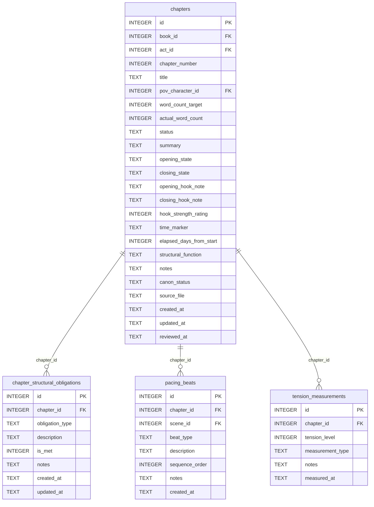

[← Documentation Index](../README.md)

# Chapters Schema

The Chapters domain provides the structural containers for the narrative: chapters, their structural obligations, and pacing/tension measurements. Note: `chapter_plot_threads` (the junction linking chapters to plot threads) is documented in [plot.md](plot.md) because the plot module owns those tools. `chapter_character_arcs` (the junction linking chapters to character arcs) is documented in [arcs.md](arcs.md).

> **Cross-domain FKs:** `chapters.book_id → books.id` (Structure). `chapters.act_id → acts.id` (Structure). `chapters.pov_character_id → characters.id` (Characters). `pacing_beats.scene_id → scenes.id` (Scenes). Note: `chapter_plot_threads` and `chapter_character_arcs` are junction tables documented in [plot.md](plot.md) and [arcs.md](arcs.md) respectively.

## `chapters`

The primary structural unit of the narrative. Each chapter belongs to a book, optionally to an act, and has a POV character. The `actual_word_count` is updated as writing progresses.

| Field | Type | Description |
|-------|------|-------------|
| `id` | INTEGER PK | Primary key |
| `book_id` | INTEGER FK | References `books.id` — the book this chapter belongs to |
| `act_id` | INTEGER FK | References `acts.id` — the act this chapter is in (nullable) |
| `chapter_number` | INTEGER | Chapter sequence number within the book |
| `title` | TEXT | Chapter title (nullable) |
| `pov_character_id` | INTEGER FK | References `characters.id` — POV character for this chapter (nullable) |
| `word_count_target` | INTEGER | Target word count (nullable) |
| `actual_word_count` | INTEGER | Actual words written (default: 0) |
| `status` | TEXT | Workflow status: `planned`, `drafted`, `revised`, `final` (default: `planned`) |
| `summary` | TEXT | Brief plot summary |
| `opening_state` | TEXT | Story-world state at chapter open |
| `closing_state` | TEXT | Story-world state at chapter close |
| `opening_hook_note` | TEXT | Notes on the opening hook |
| `closing_hook_note` | TEXT | Notes on the closing hook |
| `hook_strength_rating` | INTEGER | Rating 1–10 for hook effectiveness (nullable) |
| `time_marker` | TEXT | Narrative time label (e.g. "Three days later") |
| `elapsed_days_from_start` | INTEGER | Absolute story-day position (nullable) |
| `structural_function` | TEXT | Narrative role of this chapter |
| `notes` | TEXT | Standard annotation field |
| `canon_status` | TEXT | Approval status (default: `draft`) |
| `source_file` | TEXT | Standard annotation field |
| `created_at` | TEXT | Standard audit timestamp |
| `updated_at` | TEXT | Standard audit timestamp |
| `reviewed_at` | TEXT | Timestamp of last editorial review (nullable) |

**Constraints:** `UNIQUE(book_id, chapter_number)` — one chapter per number per book.

**Populated by:** `upsert_chapter` (chapters domain).

---

## `chapter_structural_obligations`

Tracks structural obligations a chapter must fulfill (setups, payoffs, foreshadowing deliveries, etc.) and whether each has been met. Helps ensure structural completeness during revision.

| Field | Type | Description |
|-------|------|-------------|
| `id` | INTEGER PK | Primary key |
| `chapter_id` | INTEGER FK | References `chapters.id` |
| `obligation_type` | TEXT | Type: `setup`, `payoff`, `callback`, `foreshadow`, etc. (default: `setup`) |
| `description` | TEXT | Description of the obligation |
| `is_met` | INTEGER | Boolean (0/1) — whether the obligation has been fulfilled (default: 0) |
| `notes` | TEXT | Standard annotation field |
| `created_at` | TEXT | Standard audit timestamp |
| `updated_at` | TEXT | Standard audit timestamp |

**Populated by:** `upsert_chapter_obligation` (chapters.py), `delete_chapter_obligation` (chapters.py). Read via `get_chapter_obligations`.

---

## `pacing_beats`

Ordered sequence of beats within a chapter or scene for pacing analysis. Each beat has a type and description. Used for structural analysis, not for story tracking.

| Field | Type | Description |
|-------|------|-------------|
| `id` | INTEGER PK | Primary key |
| `chapter_id` | INTEGER FK | References `chapters.id` |
| `scene_id` | INTEGER FK | References `scenes.id` — optional scene-level scoping (nullable) |
| `beat_type` | TEXT | Beat category: `action`, `reaction`, `dialogue`, `introspection` (default: `action`) |
| `description` | TEXT | Description of what happens in this beat |
| `sequence_order` | INTEGER | Position within the chapter's beat sequence (default: 0) |
| `notes` | TEXT | Standard annotation field |
| `created_at` | TEXT | Standard audit timestamp |

**Populated by:** `log_pacing_beat` (scenes.py), `delete_pacing_beat` (scenes.py).

---

## `tension_measurements`

Spot measurements of tension level at a chapter. Multiple measurements per chapter are allowed (e.g. overall + subplot tension). Used for arc tension analysis.

| Field | Type | Description |
|-------|------|-------------|
| `id` | INTEGER PK | Primary key |
| `chapter_id` | INTEGER FK | References `chapters.id` |
| `tension_level` | INTEGER | Tension score 1–10 (default: 5) |
| `measurement_type` | TEXT | What is being measured: `overall`, `romantic`, `conflict`, etc. (default: `overall`) |
| `notes` | TEXT | Standard annotation field |
| `measured_at` | TEXT | Timestamp of the measurement |

**Populated by:** `log_tension_measurement` (scenes.py), `delete_tension_measurement` (scenes.py).

---
