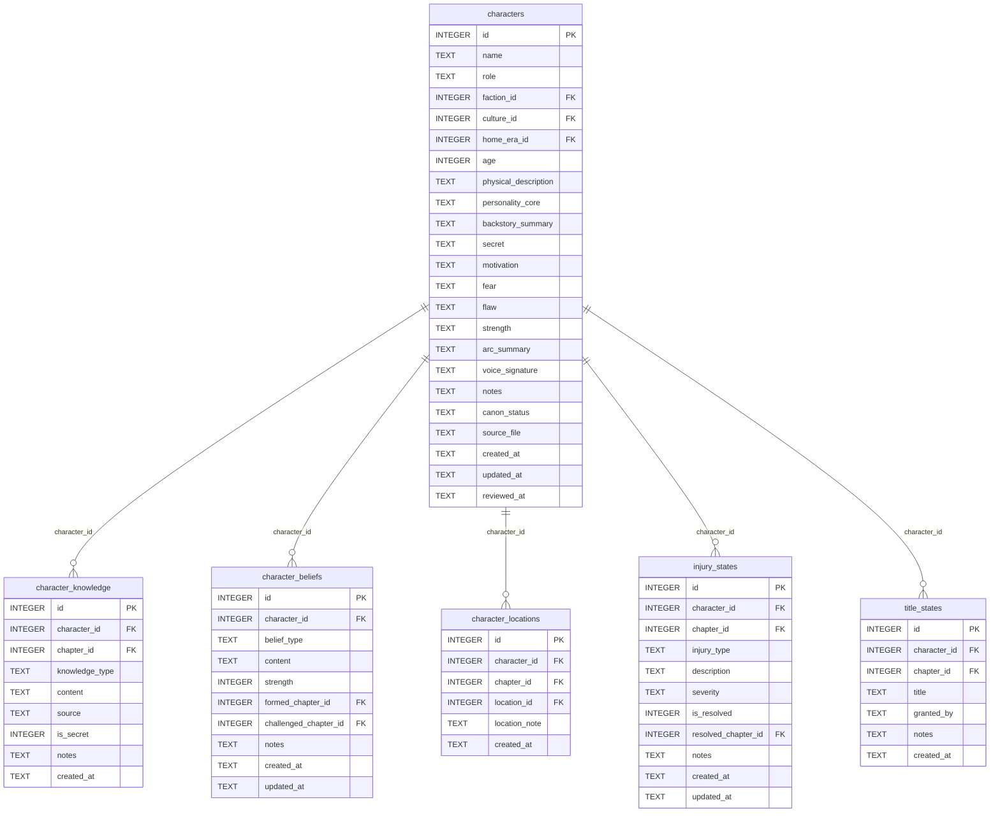

[← Documentation Index](../README.md)

# Characters Schema

The Characters domain stores the cast and all per-chapter character state: knowledge acquired, beliefs held, locations visited, injuries sustained, and titles gained. The `characters` table is the most widely referenced table in the schema — virtually every other domain FKs back to it.

> **Cross-domain FKs:** `characters.faction_id → factions.id` (World). `characters.culture_id → cultures.id` (World). `characters.home_era_id → eras.id` (Structure). `character_knowledge.chapter_id → chapters.id` (Chapters). `character_beliefs.formed_chapter_id` / `challenged_chapter_id → chapters.id` (Chapters). `character_locations.chapter_id → chapters.id` (Chapters). `character_locations.location_id → locations.id` (World). `injury_states.chapter_id` / `resolved_chapter_id → chapters.id` (Chapters). `title_states.chapter_id → chapters.id` (Chapters).

## `characters`

The central character record. Every other domain that tracks character involvement will FK to this table. The `role` field determines the character's narrative function.

| Field | Type | Description |
|-------|------|-------------|
| `id` | INTEGER PK | Primary key |
| `name` | TEXT | Character's full name |
| `role` | TEXT | Narrative role: `protagonist`, `antagonist`, `supporting`, etc. (default: `supporting`) |
| `faction_id` | INTEGER FK | References `factions.id` — faction affiliation (nullable) |
| `culture_id` | INTEGER FK | References `cultures.id` — cultural background (nullable) |
| `home_era_id` | INTEGER FK | References `eras.id` — era the character originates from (nullable) |
| `age` | INTEGER | Character age in story-time (nullable) |
| `physical_description` | TEXT | Appearance notes |
| `personality_core` | TEXT | Core personality summary |
| `backstory_summary` | TEXT | Condensed backstory |
| `secret` | TEXT | Hidden information — what the character conceals |
| `motivation` | TEXT | What drives the character's actions |
| `fear` | TEXT | The character's deepest fear |
| `flaw` | TEXT | Primary character flaw |
| `strength` | TEXT | Primary character strength |
| `arc_summary` | TEXT | High-level arc trajectory summary |
| `voice_signature` | TEXT | Distinctive speech patterns for consistency |
| `notes` | TEXT | Standard annotation field |
| `canon_status` | TEXT | Approval status (default: `draft`) |
| `source_file` | TEXT | Standard annotation field |
| `created_at` | TEXT | Standard audit timestamp |
| `updated_at` | TEXT | Standard audit timestamp |
| `reviewed_at` | TEXT | Timestamp of last editorial review (nullable) |

**Populated by:** `upsert_character` (characters domain).

---

## `character_knowledge`

Append-only log of information a character acquires at a specific chapter. Each row represents one piece of knowledge gained. Cumulative queries use `chapter_id <= ?` to build a character's total knowledge picture at any story point.

| Field | Type | Description |
|-------|------|-------------|
| `id` | INTEGER PK | Primary key |
| `character_id` | INTEGER FK | References `characters.id` — the character who knows this |
| `chapter_id` | INTEGER FK | References `chapters.id` — when the knowledge was acquired |
| `knowledge_type` | TEXT | Type: `fact`, `rumor`, `secret`, `skill`, etc. (default: `fact`) |
| `content` | TEXT | The knowledge content |
| `source` | TEXT | Where or how the character learned this (nullable) |
| `is_secret` | INTEGER | Boolean (0/1) — whether this knowledge is hidden from others |
| `notes` | TEXT | Standard annotation field |
| `created_at` | TEXT | Standard audit timestamp |

**Populated by:** `log_character_knowledge` (characters domain).

---

## `character_beliefs`

Records a character's held beliefs with optional chapter markers for when beliefs formed and when they were challenged. Unlike knowledge, beliefs can evolve — the same conceptual belief may have multiple rows tracking its development.

| Field | Type | Description |
|-------|------|-------------|
| `id` | INTEGER PK | Primary key |
| `character_id` | INTEGER FK | References `characters.id` — the character who holds this belief |
| `belief_type` | TEXT | Category: `worldview`, `moral`, `about_other`, etc. (default: `worldview`) |
| `content` | TEXT | The belief statement |
| `strength` | INTEGER | Conviction strength 1–10 (default: 5) |
| `formed_chapter_id` | INTEGER FK | References `chapters.id` — when this belief formed (nullable) |
| `challenged_chapter_id` | INTEGER FK | References `chapters.id` — when this belief was tested (nullable) |
| `notes` | TEXT | Standard annotation field |
| `created_at` | TEXT | Standard audit timestamp |
| `updated_at` | TEXT | Standard audit timestamp |

**Populated by:** `log_character_belief` (characters.py), `delete_character_belief` (characters.py).

---

## `character_locations`

Append-only log of a character's chapter-by-chapter location. Multiple rows per character are expected as they move through the story.

| Field | Type | Description |
|-------|------|-------------|
| `id` | INTEGER PK | Primary key |
| `character_id` | INTEGER FK | References `characters.id` — the character |
| `chapter_id` | INTEGER FK | References `chapters.id` — the chapter at which this location applies |
| `location_id` | INTEGER FK | References `locations.id` — the location (nullable — character may be at an unnamed place) |
| `location_note` | TEXT | Free-form location description when no location record exists |
| `created_at` | TEXT | Standard audit timestamp |

**Populated by:** `log_character_location` (characters.py), `delete_character_location` (characters.py). Read via `get_character_location`.

---

## `injury_states`

Records injuries a character sustains, the chapter when injured, severity, and optionally when resolved. Each injury is a distinct row allowing multiple concurrent injuries.

| Field | Type | Description |
|-------|------|-------------|
| `id` | INTEGER PK | Primary key |
| `character_id` | INTEGER FK | References `characters.id` — the injured character |
| `chapter_id` | INTEGER FK | References `chapters.id` — chapter when injury was sustained |
| `injury_type` | TEXT | Type: `wound`, `illness`, `curse`, etc. (default: `wound`) |
| `description` | TEXT | Description of the injury |
| `severity` | TEXT | Severity level: `minor`, `moderate`, `severe`, `critical` (default: `minor`) |
| `is_resolved` | INTEGER | Boolean (0/1) — whether the injury has healed |
| `resolved_chapter_id` | INTEGER FK | References `chapters.id` — when the injury resolved (nullable) |
| `notes` | TEXT | Standard annotation field |
| `created_at` | TEXT | Standard audit timestamp |
| `updated_at` | TEXT | Standard audit timestamp |

**Populated by:** `log_injury_state` (characters.py), `delete_injury_state` (characters.py). Read via `get_character_injuries`.

---

## `title_states`

Append-only log of titles and honors a character holds at a given chapter. Titles are additive — gaining a new title adds a row rather than updating an existing one.

| Field | Type | Description |
|-------|------|-------------|
| `id` | INTEGER PK | Primary key |
| `character_id` | INTEGER FK | References `characters.id` — the titled character |
| `chapter_id` | INTEGER FK | References `chapters.id` — chapter when the title was granted |
| `title` | TEXT | The title or honorific |
| `granted_by` | TEXT | Who or what granted this title (free-form) |
| `notes` | TEXT | Standard annotation field |
| `created_at` | TEXT | Standard audit timestamp |

**Populated by:** `log_title_state` (characters.py), `delete_title_state` (characters.py).

---
