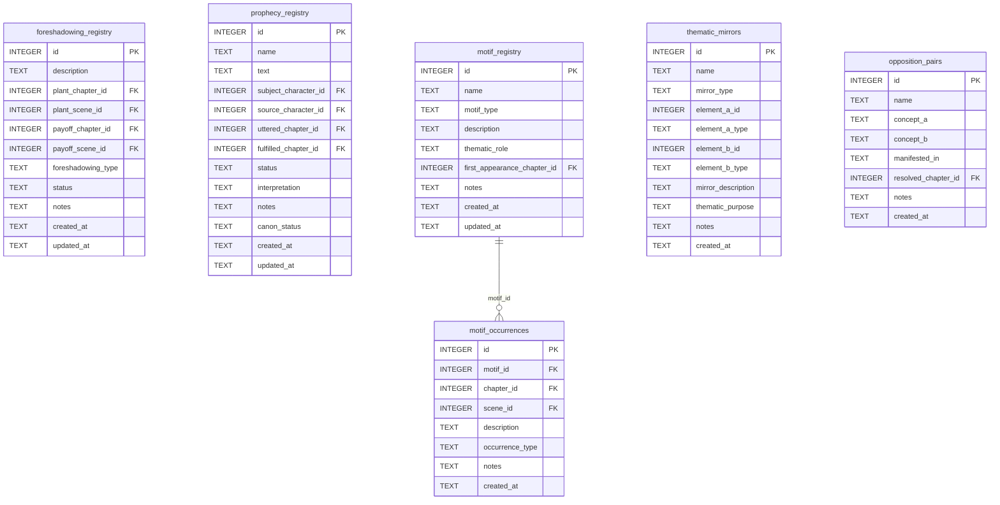

[← Documentation Index](../README.md)

# Foreshadowing Schema

The Foreshadowing & Literary domain tracks literary devices: planted foreshadowing with payoff tracking, prophecies, recurring motifs, thematic mirrors, and opposition pairs. All write tools require gate certification.

> **Cross-domain FKs:** `foreshadowing_registry.plant_chapter_id` / `payoff_chapter_id → chapters.id` (Chapters). `foreshadowing_registry.plant_scene_id` / `payoff_scene_id → scenes.id` (Chapters). `prophecy_registry.subject_character_id` / `source_character_id → characters.id` (Characters). `prophecy_registry.uttered_chapter_id` / `fulfilled_chapter_id → chapters.id` (Chapters). `motif_registry.first_appearance_chapter_id → chapters.id` (Chapters). `motif_occurrences.chapter_id → chapters.id` (Chapters). `motif_occurrences.scene_id → scenes.id` (Chapters). `opposition_pairs.resolved_chapter_id → chapters.id` (Chapters). `thematic_mirrors.element_a_id` / `element_b_id` — plain INTEGER, no SQL FK (polymorphic references).

> Gate-enforced writes — all MCP write tools require gate certification.

## `foreshadowing_registry`

Tracks planted foreshadowing elements with their payoff locations. The `log_foreshadowing` tool uses a two-branch upsert: a new plant inserts a row, and later when the payoff is written, the same row is updated with the payoff chapter/scene.

| Field | Type | Description |
|-------|------|-------------|
| `id` | INTEGER PK | Primary key |
| `description` | TEXT | Description of the foreshadowing element |
| `plant_chapter_id` | INTEGER FK | References `chapters.id` — where the element was planted (required) |
| `plant_scene_id` | INTEGER FK | References `scenes.id` — scene where planted (nullable) |
| `payoff_chapter_id` | INTEGER FK | References `chapters.id` — where the element pays off (nullable) |
| `payoff_scene_id` | INTEGER FK | References `scenes.id` — scene of payoff (nullable) |
| `foreshadowing_type` | TEXT | Type: `direct`, `symbolic`, `ironic`, `red_herring` (default: `direct`) |
| `status` | TEXT | Status: `planted`, `paid_off`, `cut` (default: `planted`) |
| `notes` | TEXT | Standard annotation field |
| `created_at` | TEXT | Standard audit timestamp |
| `updated_at` | TEXT | Standard audit timestamp |

**Populated by:** `log_foreshadowing` (foreshadowing domain). Gate-enforced write.

---

## `prophecy_registry`

Tracks narrative prophecies: what was said, by whom, about whom, where it was uttered, and whether it has been fulfilled. Interpretation allows tracking competing readings.

| Field | Type | Description |
|-------|------|-------------|
| `id` | INTEGER PK | Primary key |
| `name` | TEXT | Prophecy label |
| `text` | TEXT | The prophecy text |
| `subject_character_id` | INTEGER FK | References `characters.id` — who the prophecy concerns (nullable) |
| `source_character_id` | INTEGER FK | References `characters.id` — who uttered it (nullable) |
| `uttered_chapter_id` | INTEGER FK | References `chapters.id` — when it was delivered (nullable) |
| `fulfilled_chapter_id` | INTEGER FK | References `chapters.id` — when it was fulfilled (nullable) |
| `status` | TEXT | Status: `active`, `fulfilled`, `broken`, `ambiguous` (default: `active`) |
| `interpretation` | TEXT | Current interpretation of the prophecy's meaning (nullable) |
| `notes` | TEXT | Standard annotation field |
| `canon_status` | TEXT | Approval status (default: `draft`) |
| `created_at` | TEXT | Standard audit timestamp |
| `updated_at` | TEXT | Standard audit timestamp |

**Populated by:** `upsert_prophecy` (foreshadowing domain). Gate-enforced write.

---

## `motif_registry`

Named recurring motifs in the narrative. Each motif has a type, description, and thematic role. Individual appearances are tracked in `motif_occurrences`.

| Field | Type | Description |
|-------|------|-------------|
| `id` | INTEGER PK | Primary key |
| `name` | TEXT | Motif name — UNIQUE constraint |
| `motif_type` | TEXT | Type: `symbol`, `image`, `phrase`, `action` (default: `symbol`) |
| `description` | TEXT | What this motif is |
| `thematic_role` | TEXT | How this motif functions thematically (nullable) |
| `first_appearance_chapter_id` | INTEGER FK | References `chapters.id` — when the motif first appears (nullable) |
| `notes` | TEXT | Standard annotation field |
| `created_at` | TEXT | Standard audit timestamp |
| `updated_at` | TEXT | Standard audit timestamp |

**Constraints:** `UNIQUE(name)`.

**Populated by:** `upsert_motif` (foreshadowing domain). Gate-enforced write.

---

## `motif_occurrences`

Append-only log of each appearance of a motif in the text. Multiple occurrences per motif across many chapters are expected and valid.

| Field | Type | Description |
|-------|------|-------------|
| `id` | INTEGER PK | Primary key |
| `motif_id` | INTEGER FK | References `motif_registry.id` — the motif |
| `chapter_id` | INTEGER FK | References `chapters.id` — chapter of occurrence |
| `scene_id` | INTEGER FK | References `scenes.id` — scene of occurrence (nullable) |
| `description` | TEXT | How the motif appears here (nullable) |
| `occurrence_type` | TEXT | Type: `direct`, `symbolic`, `inverted`, `echo` (default: `direct`) |
| `notes` | TEXT | Standard annotation field |
| `created_at` | TEXT | Standard audit timestamp |

**Populated by:** `log_motif_occurrence` (foreshadowing domain). Gate-enforced write.

---

## `thematic_mirrors`

Records thematic mirror relationships between narrative elements — characters, events, or concepts that reflect or contrast each other. The `element_a_id` and `element_b_id` fields are plain INTEGER with no SQL FK constraints because they can reference any table (polymorphic). The `element_a_type` and `element_b_type` fields specify what type each ID refers to.

| Field | Type | Description |
|-------|------|-------------|
| `id` | INTEGER PK | Primary key |
| `name` | TEXT | Name of this mirror relationship |
| `mirror_type` | TEXT | Type: `character`, `event`, `concept`, `symbol` (default: `character`) |
| `element_a_id` | INTEGER | ID of the first element — plain INTEGER, no SQL FK (polymorphic) |
| `element_a_type` | TEXT | Type of element A: `character`, `event`, `chapter`, etc. (default: `character`) |
| `element_b_id` | INTEGER | ID of the second element — plain INTEGER, no SQL FK (polymorphic) |
| `element_b_type` | TEXT | Type of element B (default: `character`) |
| `mirror_description` | TEXT | How these elements mirror each other (nullable) |
| `thematic_purpose` | TEXT | Why this mirror relationship matters thematically (nullable) |
| `notes` | TEXT | Standard annotation field |
| `created_at` | TEXT | Standard audit timestamp |

**Populated by:** `upsert_thematic_mirror` (foreshadowing domain). Gate-enforced write.

---

## `opposition_pairs`

Tracks thematic oppositions — the central tensions between ideas, values, or forces in the narrative (e.g. freedom vs. control, loyalty vs. survival). Each pair can be resolved at a specific chapter.

| Field | Type | Description |
|-------|------|-------------|
| `id` | INTEGER PK | Primary key |
| `name` | TEXT | Name of this opposition |
| `concept_a` | TEXT | The first concept or pole |
| `concept_b` | TEXT | The opposing concept or pole |
| `manifested_in` | TEXT | How this opposition appears in the narrative (nullable) |
| `resolved_chapter_id` | INTEGER FK | References `chapters.id` — chapter where the tension resolves (nullable) |
| `notes` | TEXT | Standard annotation field |
| `created_at` | TEXT | Standard audit timestamp |

**Populated by:** `upsert_opposition` (foreshadowing domain). Gate-enforced write.

---
