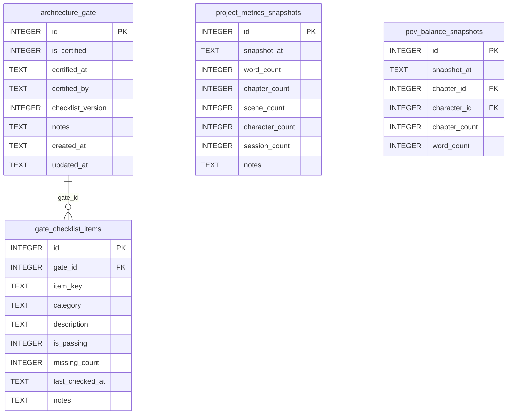

[← Documentation Index](../README.md)

# Gate Schema

The Gate & Metrics domain enforces the architecture gate — the quality checkpoint that must be passed before prose-phase tools can write to the database. It also stores project metrics snapshots and POV balance measurements. The `architecture_gate` table is intentionally read-only through direct MCP tools; all gate management flows through the `certify_gate` tool.

> **Cross-domain FKs:** `pov_balance_snapshots.chapter_id → chapters.id` (Chapters). `pov_balance_snapshots.character_id → characters.id` (Characters).

## `architecture_gate`

Single-row table (id=1) that acts as the global gate certification record. All gated MCP tools query `SELECT is_certified FROM architecture_gate WHERE id = 1` at the top of every write operation.

| Field | Type | Description |
|-------|------|-------------|
| `id` | INTEGER PK | Primary key — always 1 |
| `is_certified` | INTEGER | Boolean (0/1) — whether the gate is currently certified (default: 0) |
| `certified_at` | TEXT | Timestamp of most recent certification (nullable) |
| `certified_by` | TEXT | Agent or user who certified (nullable) |
| `checklist_version` | INTEGER | Version of the checklist used for this certification (default: 1) |
| `notes` | TEXT | Standard annotation field |
| `created_at` | TEXT | Standard audit timestamp |
| `updated_at` | TEXT | Standard audit timestamp |

**Populated by:** `certify_gate` (gate domain).

**Read-only:** Managed exclusively through the `certify_gate` tool flow. Exposing a direct write tool would bypass the gate enforcement mechanism. Note: the child table `gate_checklist_items` does have write coverage via `delete_gate_checklist_item`.

---

## `gate_checklist_items`

One row per gate check item. The gate has 36 items across multiple categories (characters, world, chapters, plot, structure, etc.). Each item tracks whether it currently passes and how many required elements are missing.

| Field | Type | Description |
|-------|------|-------------|
| `id` | INTEGER PK | Primary key |
| `gate_id` | INTEGER FK | References `architecture_gate.id` — always 1 |
| `item_key` | TEXT | Unique key for this checklist item (e.g. `min_characters`, `struct_story_beats`) |
| `category` | TEXT | Grouping category for display (e.g. `characters`, `world`, `structure`) |
| `description` | TEXT | Human-readable description of what this item checks |
| `is_passing` | INTEGER | Boolean (0/1) — whether this item currently passes |
| `missing_count` | INTEGER | Number of missing elements (0 = all present) |
| `last_checked_at` | TEXT | Timestamp of most recent audit run (nullable) |
| `notes` | TEXT | Standard annotation field |

**Constraints:** `UNIQUE(gate_id, item_key)`.

**Populated by:** `run_gate_audit` (gate domain) updates existing rows; seed data inserts the initial 36 items.

---

## `project_metrics_snapshots`

Historical record of project size metrics. Each row is a point-in-time snapshot created by `log_project_snapshot`. The `get_project_metrics` tool returns live-computed values without inserting rows.

| Field | Type | Description |
|-------|------|-------------|
| `id` | INTEGER PK | Primary key |
| `snapshot_at` | TEXT | Timestamp of the snapshot |
| `word_count` | INTEGER | Total actual word count across all chapters (default: 0) |
| `chapter_count` | INTEGER | Number of chapters in the database (default: 0) |
| `scene_count` | INTEGER | Number of scenes in the database (default: 0) |
| `character_count` | INTEGER | Number of characters in the database (default: 0) |
| `session_count` | INTEGER | Number of session log entries (default: 0) |
| `notes` | TEXT | Standard annotation field |

**Populated by:** `log_project_snapshot` (session domain). Gate-enforced write.

---

## `pov_balance_snapshots`

Historical POV balance measurements showing chapter and word count by POV character. The `get_pov_balance` tool returns live-computed values; this table stores persisted snapshots.

| Field | Type | Description |
|-------|------|-------------|
| `id` | INTEGER PK | Primary key |
| `snapshot_at` | TEXT | Timestamp of the snapshot |
| `chapter_id` | INTEGER FK | References `chapters.id` — a chapter in this snapshot (nullable) |
| `character_id` | INTEGER FK | References `characters.id` — the POV character (nullable) |
| `chapter_count` | INTEGER | Number of chapters with this POV character (default: 0) |
| `word_count` | INTEGER | Total word count for this POV character (default: 0) |

**Populated by:** `log_pov_balance_snapshot` (session.py), `delete_pov_balance_snapshot` (session.py).

---
