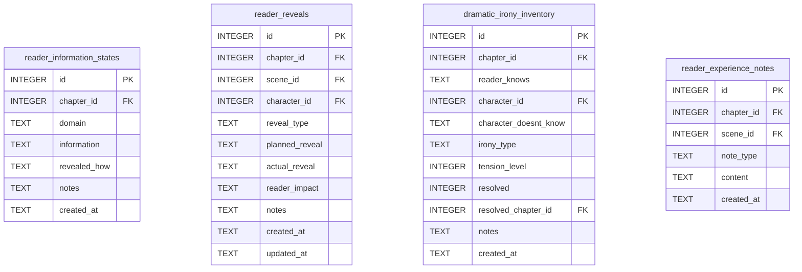

[← Documentation Index](../README.md)

# Knowledge Schema

The Knowledge & Reader domain models the reader's evolving information state — what they know at each chapter, revelations delivered, dramatic irony instances, and reader experience notes. All write tools require gate certification.

> **Cross-domain FKs:** All `chapter_id` fields → `chapters.id` (Chapters). All `scene_id` fields → `scenes.id` (Chapters). `reader_reveals.character_id → characters.id` (Characters). `dramatic_irony_inventory.character_id → characters.id` (Characters — the character who doesn't know). `dramatic_irony_inventory.resolved_chapter_id → chapters.id` (Chapters).

> Gate-enforced writes — all MCP write tools require gate certification.

## `reader_information_states`

Cumulative record of what the reader knows at each chapter, organized by domain. The UNIQUE constraint on `(chapter_id, domain)` means one knowledge state per domain per chapter.

| Field | Type | Description |
|-------|------|-------------|
| `id` | INTEGER PK | Primary key |
| `chapter_id` | INTEGER FK | References `chapters.id` — the chapter at which this state applies |
| `domain` | TEXT | Knowledge category: `plot`, `character`, `world`, `magic`, etc. (default: `general`) |
| `information` | TEXT | Description of what the reader knows in this domain at this chapter |
| `revealed_how` | TEXT | How this information was revealed to the reader (nullable) |
| `notes` | TEXT | Standard annotation field |
| `created_at` | TEXT | Standard audit timestamp |

**Constraints:** `UNIQUE(chapter_id, domain)`.

**Populated by:** `log_reader_state` (knowledge domain). Gate-enforced write.

---

## `reader_reveals`

Records individual reveal moments — when the narrative delivers information to the reader. Distinguishes between planned and actual reveals for revision analysis.

| Field | Type | Description |
|-------|------|-------------|
| `id` | INTEGER PK | Primary key |
| `chapter_id` | INTEGER FK | References `chapters.id` — chapter of the reveal (nullable) |
| `scene_id` | INTEGER FK | References `scenes.id` — scene of the reveal (nullable) |
| `character_id` | INTEGER FK | References `characters.id` — character through whom the reveal happens (nullable) |
| `reveal_type` | TEXT | Type: `exposition`, `dialogue`, `action`, `internal`, `dramatic_irony` (default: `exposition`) |
| `planned_reveal` | TEXT | What was planned to be revealed (nullable) |
| `actual_reveal` | TEXT | What was actually revealed in the text (nullable) |
| `reader_impact` | TEXT | Expected reader emotional/cognitive impact (nullable) |
| `notes` | TEXT | Standard annotation field |
| `created_at` | TEXT | Standard audit timestamp |
| `updated_at` | TEXT | Standard audit timestamp |

**Populated by:** `log_reader_reveal` (knowledge domain), `delete_reader_reveal` (knowledge.py). Gate-enforced write for log.

---

## `dramatic_irony_inventory`

Tracks instances where the reader knows something that a character does not. Each row represents one irony gap: what the reader knows, which character doesn't know it, and whether it has been resolved.

| Field | Type | Description |
|-------|------|-------------|
| `id` | INTEGER PK | Primary key |
| `chapter_id` | INTEGER FK | References `chapters.id` — chapter where the irony gap exists |
| `reader_knows` | TEXT | What the reader knows |
| `character_id` | INTEGER FK | References `characters.id` — the character who doesn't know this (nullable) |
| `character_doesnt_know` | TEXT | Description of what the character is unaware of |
| `irony_type` | TEXT | Type: `situational`, `tragic`, `dramatic` (default: `situational`) |
| `tension_level` | INTEGER | Tension score 1–10 (default: 5) |
| `resolved` | INTEGER | Boolean (0/1) — whether the irony gap has closed (default: 0) |
| `resolved_chapter_id` | INTEGER FK | References `chapters.id` — when it was resolved (nullable) |
| `notes` | TEXT | Standard annotation field |
| `created_at` | TEXT | Standard audit timestamp |

**Populated by:** `log_dramatic_irony` (knowledge domain). Gate-enforced write.

---

## `reader_experience_notes`

Freeform notes about reader experience at specific chapters or scenes — pacing observations, emotional beat effectiveness, tension curve notes.

| Field | Type | Description |
|-------|------|-------------|
| `id` | INTEGER PK | Primary key |
| `chapter_id` | INTEGER FK | References `chapters.id` — chapter this note applies to (nullable) |
| `scene_id` | INTEGER FK | References `scenes.id` — scene this note applies to (nullable) |
| `note_type` | TEXT | Note category: `pacing`, `emotion`, `tension`, `clarity` (default: `pacing`) |
| `content` | TEXT | The note content |
| `created_at` | TEXT | Standard audit timestamp |

**Populated by:** `log_reader_experience_note` (knowledge.py), `delete_reader_experience_note` (knowledge.py).

---
