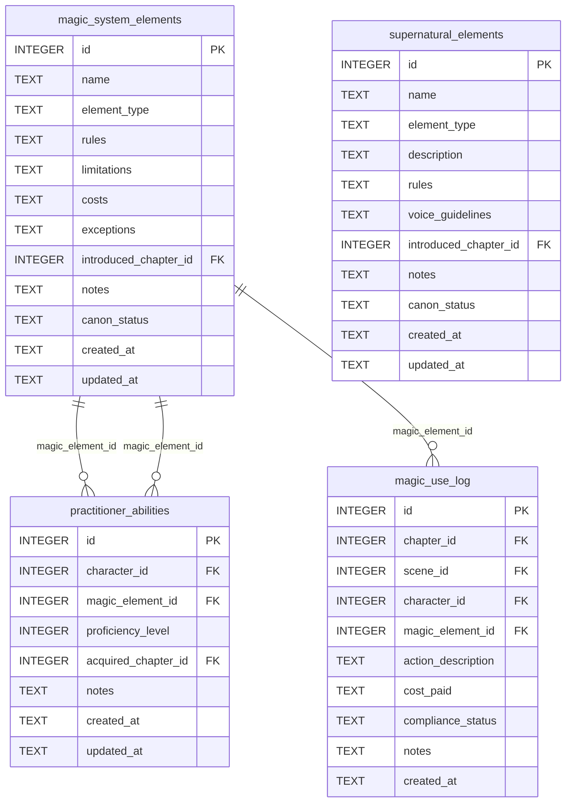

[← Documentation Index](../README.md)

# Magic Schema

The Magic domain covers the magic system elements, supernatural entities, practitioner abilities, and the magic use audit log. All magic tools are gate-free — magic system definition is part of worldbuilding. Note: `supernatural_elements` lives here (not in world.md) because magic.py owns all their MCP tools.

> **Cross-domain FKs:** `magic_system_elements.introduced_chapter_id → chapters.id` (Chapters). `supernatural_elements.introduced_chapter_id → chapters.id` (Chapters). `practitioner_abilities.character_id → characters.id` (Characters). `practitioner_abilities.acquired_chapter_id → chapters.id` (Chapters). `magic_use_log.chapter_id → chapters.id` (Chapters). `magic_use_log.scene_id → scenes.id` (Chapters). `magic_use_log.character_id → characters.id` (Characters).

## `magic_system_elements`

Defines elements of the magic system: abilities, spells, schools of magic. Rules, limitations, and costs are stored as free-text for flexibility.

| Field | Type | Description |
|-------|------|-------------|
| `id` | INTEGER PK | Primary key |
| `name` | TEXT | Element name |
| `element_type` | TEXT | Category: `ability`, `spell`, `school`, etc. (default: `ability`) |
| `rules` | TEXT | The rules governing this element |
| `limitations` | TEXT | What the element cannot do |
| `costs` | TEXT | What using this element costs the practitioner |
| `exceptions` | TEXT | Known exceptions to the rules |
| `introduced_chapter_id` | INTEGER FK | References `chapters.id` — when this element first appears (nullable) |
| `notes` | TEXT | Standard annotation field |
| `canon_status` | TEXT | Approval status (default: `draft`) |
| `created_at` | TEXT | Standard audit timestamp |
| `updated_at` | TEXT | Standard audit timestamp |

**Populated by:** `upsert_magic_element` (magic.py), `delete_magic_element` (magic.py).

---

## `supernatural_elements`

Creatures, entities, or phenomena that are supernatural but distinct from the magic system. Has its own `voice_guidelines` field for how to write about this element in prose.

| Field | Type | Description |
|-------|------|-------------|
| `id` | INTEGER PK | Primary key |
| `name` | TEXT | Element name |
| `element_type` | TEXT | Category: `creature`, `spirit`, `phenomenon` (default: `creature`) |
| `description` | TEXT | What this element is |
| `rules` | TEXT | How this element behaves |
| `voice_guidelines` | TEXT | How to write about this element in prose |
| `introduced_chapter_id` | INTEGER FK | References `chapters.id` — when first introduced (nullable) |
| `notes` | TEXT | Standard annotation field |
| `canon_status` | TEXT | Approval status (default: `draft`) |
| `created_at` | TEXT | Standard audit timestamp |
| `updated_at` | TEXT | Standard audit timestamp |

**Populated by:** `upsert_supernatural_element` (magic.py), `delete_supernatural_element` (magic.py). Read via `get_supernatural_element`.

---

## `practitioner_abilities`

Tracks which magic system elements a character has the ability to use, and at what proficiency level. One row per character-element pair; the unique constraint prevents duplicate capability records.

| Field | Type | Description |
|-------|------|-------------|
| `id` | INTEGER PK | Primary key |
| `character_id` | INTEGER FK | References `characters.id` — the practitioner |
| `magic_element_id` | INTEGER FK | References `magic_system_elements.id` — the element the character can use |
| `proficiency_level` | INTEGER | Skill level (default: 1; higher = more proficient) |
| `acquired_chapter_id` | INTEGER FK | References `chapters.id` — chapter when ability was acquired (nullable) |
| `notes` | TEXT | Standard annotation field |
| `created_at` | TEXT | Standard audit timestamp |
| `updated_at` | TEXT | Standard audit timestamp |

**Constraints:** `UNIQUE(character_id, magic_element_id)` — one ability record per character per magic element.

**Populated by:** `upsert_practitioner_ability` (magic.py), `delete_practitioner_ability` (magic.py). Read via `get_practitioner_abilities`.

---

## `magic_use_log`

Append-only audit trail of every magic use event during the story. Records who used magic, which element, what it cost, and whether it was compliant with the magic system rules. Each row is an immutable event — no upsert semantics.

| Field | Type | Description |
|-------|------|-------------|
| `id` | INTEGER PK | Primary key |
| `chapter_id` | INTEGER FK | References `chapters.id` — chapter in which the magic was used |
| `scene_id` | INTEGER FK | References `scenes.id` — scene context (nullable) |
| `character_id` | INTEGER FK | References `characters.id` — character who used magic |
| `magic_element_id` | INTEGER FK | References `magic_system_elements.id` — element invoked (nullable) |
| `action_description` | TEXT | Description of the magic action performed |
| `cost_paid` | TEXT | Cost paid by the character (nullable — may not apply to all elements) |
| `compliance_status` | TEXT | Whether use was compliant with magic rules (default: `compliant`) |
| `notes` | TEXT | Standard annotation field |
| `created_at` | TEXT | Standard audit timestamp |

**Populated by:** `log_magic_use` (magic.py), `delete_magic_use_log` (magic.py). Append-only — each row is a permanent record.

---
