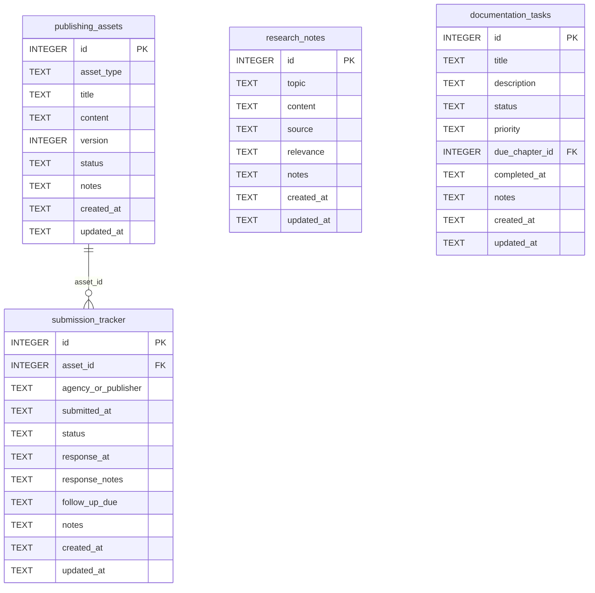

[← Documentation Index](../README.md)

# Publishing Schema

The Publishing domain tracks publishing assets (query letters, synopses, manuscripts) and submission tracker for agency and publisher submissions. The Utility tables (`research_notes`, `documentation_tasks`) are merged into this domain because publishing.py owns all their MCP tools after Phase 14. Publishing assets and submissions are gate-gated; research and documentation task tools are gate-free.

> **Cross-domain FKs:** `submission_tracker.asset_id → publishing_assets.id` (Publishing — internal). `documentation_tasks.due_chapter_id → chapters.id` (Chapters). Note: `research_notes` and `documentation_tasks` are "Utility" tables from the original schema; they live here because publishing.py owns all their MCP write tools.

## `publishing_assets`

Versioned documents required for submission: query letters, synopses, loglines, first pages. Each asset type can have multiple version rows.

| Field | Type | Description |
|-------|------|-------------|
| `id` | INTEGER PK | Primary key |
| `asset_type` | TEXT | Type: `query_letter`, `synopsis`, `logline`, `first_pages`, `bio` (default: `query_letter`) |
| `title` | TEXT | Asset title or label |
| `content` | TEXT | Full text content of the asset |
| `version` | INTEGER | Version number (default: 1) |
| `status` | TEXT | Status: `draft`, `ready`, `submitted`, `archived` (default: `draft`) |
| `notes` | TEXT | Standard annotation field |
| `created_at` | TEXT | Standard audit timestamp |
| `updated_at` | TEXT | Standard audit timestamp |

**Populated by:** `upsert_publishing_asset` (publishing domain), `delete_publishing_asset` (publishing.py). Gate-enforced write.

---

## `submission_tracker`

Log of individual submissions to agencies or publishers. Each row tracks one submission: what was sent, to whom, when, and the current status. Response information is filled in when it arrives.

| Field | Type | Description |
|-------|------|-------------|
| `id` | INTEGER PK | Primary key |
| `asset_id` | INTEGER FK | References `publishing_assets.id` — which asset was submitted (nullable) |
| `agency_or_publisher` | TEXT | Name of the agency or publisher |
| `submitted_at` | TEXT | Timestamp or date of submission |
| `status` | TEXT | Status: `pending`, `responded`, `rejected`, `partial_request`, `full_request`, `offer` (default: `pending`) |
| `response_at` | TEXT | When a response was received (nullable) |
| `response_notes` | TEXT | Notes on the response content (nullable) |
| `follow_up_due` | TEXT | Date when a follow-up is appropriate (nullable) |
| `notes` | TEXT | Standard annotation field |
| `created_at` | TEXT | Standard audit timestamp |
| `updated_at` | TEXT | Standard audit timestamp |

**Populated by:** `upsert_publishing_asset` creates the asset; `update_submission` (publishing domain), `delete_submission` (publishing.py) updates/removes submissions. Gate-enforced writes.

---

## `research_notes`

Free-form notes on research topics relevant to the novel — historical facts, technical details, cultural information gathered during writing.

| Field | Type | Description |
|-------|------|-------------|
| `id` | INTEGER PK | Primary key |
| `topic` | TEXT | Research topic label |
| `content` | TEXT | The research content |
| `source` | TEXT | Source of the research (nullable) |
| `relevance` | TEXT | How this research relates to the novel (nullable) |
| `notes` | TEXT | Standard annotation field |
| `created_at` | TEXT | Standard audit timestamp |
| `updated_at` | TEXT | Standard audit timestamp |

**Populated by:** `upsert_research_note` (publishing.py), `get_research_notes` (publishing.py), `delete_research_note` (publishing.py). Gate-free — research tools work without gate certification.

---

## `documentation_tasks`

Tracks documentation and continuity tasks that need to be completed at or before a given chapter — notes to update, facts to verify, passages to research.

| Field | Type | Description |
|-------|------|-------------|
| `id` | INTEGER PK | Primary key |
| `title` | TEXT | Task title |
| `description` | TEXT | Task description (nullable) |
| `status` | TEXT | Status: `pending`, `in_progress`, `complete`, `cancelled` (default: `pending`) |
| `priority` | TEXT | Priority: `high`, `normal`, `low` (default: `normal`) |
| `due_chapter_id` | INTEGER FK | References `chapters.id` — chapter by which this must be done (nullable) |
| `completed_at` | TEXT | Timestamp of completion (nullable) |
| `notes` | TEXT | Standard annotation field |
| `created_at` | TEXT | Standard audit timestamp |
| `updated_at` | TEXT | Standard audit timestamp |

**Populated by:** `upsert_documentation_task` (publishing.py), `get_documentation_tasks` (publishing.py), `delete_documentation_task` (publishing.py). Gate-free — documentation task tools work without gate certification.

---
