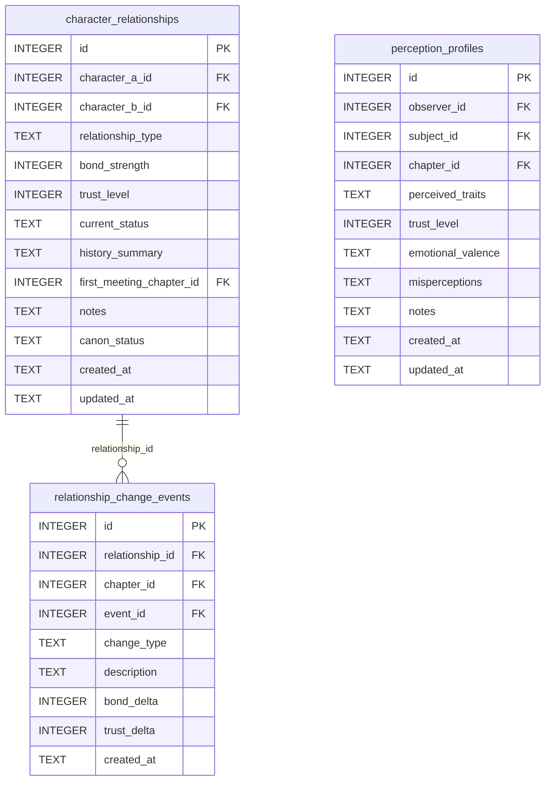

[← Documentation Index](../README.md)

# Relationships Schema

The Relationships domain models the social network between characters: the canonical dyad relationship record, an append-only log of change events, and per-directional perception profiles. This domain answers both "what is the relationship between X and Y?" and "how does X perceive Y?"

> **Cross-domain FKs:** `character_relationships.character_a_id` / `character_b_id → characters.id` (Characters). `character_relationships.first_meeting_chapter_id → chapters.id` (Chapters). `relationship_change_events.chapter_id → chapters.id` (Chapters). `relationship_change_events.event_id → events.id` (Timeline — nullable). `perception_profiles.observer_id` / `subject_id → characters.id` (Characters). `perception_profiles.chapter_id → chapters.id` (Chapters).

## `character_relationships`

The canonical dyad relationship record between two characters. Pairs are stored in canonical order: `min(a,b)` as `character_a_id`, `max(a,b)` as `character_b_id`. The UNIQUE constraint on the pair prevents duplicate dyad rows. The `get_relationship` tool queries both orderings so callers never need to know canonical order.

| Field | Type | Description |
|-------|------|-------------|
| `id` | INTEGER PK | Primary key |
| `character_a_id` | INTEGER FK | References `characters.id` — lower-ID character in the pair |
| `character_b_id` | INTEGER FK | References `characters.id` — higher-ID character in the pair |
| `relationship_type` | TEXT | Type label: `ally`, `rival`, `enemy`, `acquaintance`, etc. (default: `acquaintance`) |
| `bond_strength` | INTEGER | Bond intensity (positive = strong bond, negative = animosity; default: 0) |
| `trust_level` | INTEGER | Trust score (positive = high trust; default: 0) |
| `current_status` | TEXT | Current state of the relationship (default: `neutral`) |
| `history_summary` | TEXT | Free-text relationship history (nullable) |
| `first_meeting_chapter_id` | INTEGER FK | References `chapters.id` — where they first met (nullable) |
| `notes` | TEXT | Standard annotation field |
| `canon_status` | TEXT | Approval status (default: `draft`) |
| `created_at` | TEXT | Standard audit timestamp |
| `updated_at` | TEXT | Standard audit timestamp |

**Constraints:** `UNIQUE(character_a_id, character_b_id)` — one row per dyad.

**Populated by:** `upsert_relationship` (relationships domain).

---

## `relationship_change_events`

Append-only log of significant changes to a relationship. Each row captures what changed (bond/trust deltas), when it happened (chapter or event), and why. Multiple change events per relationship over the story arc are expected.

| Field | Type | Description |
|-------|------|-------------|
| `id` | INTEGER PK | Primary key |
| `relationship_id` | INTEGER FK | References `character_relationships.id` — the relationship that changed |
| `chapter_id` | INTEGER FK | References `chapters.id` — when the change occurred (nullable) |
| `event_id` | INTEGER FK | References `events.id` — story event that triggered the change (nullable) |
| `change_type` | TEXT | Nature of change: `shift`, `breakthrough`, `rupture`, `reconciliation` (default: `shift`) |
| `description` | TEXT | Human-readable description of what changed |
| `bond_delta` | INTEGER | Change in bond strength (positive = strengthened; default: 0) |
| `trust_delta` | INTEGER | Change in trust level (positive = more trust; default: 0) |
| `created_at` | TEXT | Standard audit timestamp |

**Populated by:** `log_relationship_change` (relationships domain).

---

## `perception_profiles`

Directional perception records: how one character perceives another. Unlike `character_relationships` (which is symmetric), perception profiles are asymmetric — A's view of B is a different row from B's view of A.

| Field | Type | Description |
|-------|------|-------------|
| `id` | INTEGER PK | Primary key |
| `observer_id` | INTEGER FK | References `characters.id` — the character doing the perceiving |
| `subject_id` | INTEGER FK | References `characters.id` — the character being perceived |
| `chapter_id` | INTEGER FK | References `chapters.id` — chapter snapshot this perception applies to (nullable) |
| `perceived_traits` | TEXT | Free-text description of how the observer perceives the subject's traits |
| `trust_level` | INTEGER | Observer's trust of the subject (default: 0) |
| `emotional_valence` | TEXT | Observer's emotional orientation: `neutral`, `trusting`, `wary`, `hostile` (default: `neutral`) |
| `misperceptions` | TEXT | Known misperceptions the observer holds about the subject |
| `notes` | TEXT | Standard annotation field |
| `created_at` | TEXT | Standard audit timestamp |
| `updated_at` | TEXT | Standard audit timestamp |

**Constraints:** `UNIQUE(observer_id, subject_id)` — one perception profile per directed pair.

**Populated by:** `upsert_perception_profile` (relationships domain).

---
