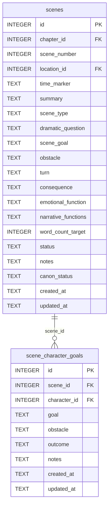

[← Documentation Index](../README.md)

# Scenes Schema

The Scenes domain covers dramatized units within chapters. Scenes use the Scene Structure Model: dramatic question, goal, obstacle, turn, consequence. Per-character goal records track what each character wants in a given scene.

> **Cross-domain FKs:** `scenes.chapter_id → chapters.id` (Chapters). `scenes.location_id → locations.id` (World). `scene_character_goals.character_id → characters.id` (Characters).

## `scenes`

Dramatized units within a chapter. Scenes use the Scene Structure Model: dramatic question, goal, obstacle, turn, consequence. The `narrative_functions` field is a JSON TEXT array listing the narrative roles this scene serves.

| Field | Type | Description |
|-------|------|-------------|
| `id` | INTEGER PK | Primary key |
| `chapter_id` | INTEGER FK | References `chapters.id` — the chapter this scene belongs to |
| `scene_number` | INTEGER | Scene sequence within the chapter |
| `location_id` | INTEGER FK | References `locations.id` — where the scene takes place (nullable) |
| `time_marker` | TEXT | Narrative time label within the chapter |
| `summary` | TEXT | Brief description of scene events |
| `scene_type` | TEXT | Type: `action`, `dialogue`, `transition`, `reflection` (default: `action`) |
| `dramatic_question` | TEXT | The central tension this scene answers |
| `scene_goal` | TEXT | What the POV character wants in this scene |
| `obstacle` | TEXT | What stands in the way of the scene goal |
| `turn` | TEXT | How the scene pivots or resolves |
| `consequence` | TEXT | Aftermath of the scene turn |
| `emotional_function` | TEXT | The emotional beat this scene serves |
| `narrative_functions` | TEXT | JSON TEXT array of narrative roles, e.g. `["setup", "payoff"]` |
| `word_count_target` | INTEGER | Target word count for this scene (nullable) |
| `status` | TEXT | Status: `planned`, `drafted`, `revised` (default: `planned`) |
| `notes` | TEXT | Standard annotation field |
| `canon_status` | TEXT | Approval status (default: `draft`) |
| `created_at` | TEXT | Standard audit timestamp |
| `updated_at` | TEXT | Standard audit timestamp |

**Constraints:** `UNIQUE(chapter_id, scene_number)`.

**Populated by:** `upsert_scene` (scenes domain).

---

## `scene_character_goals`

Per-character goal records for a scene. One row per (scene, character) pair — the UNIQUE constraint prevents duplicates. Tracks what each character wants in a scene, the obstacle they face, and the outcome.

| Field | Type | Description |
|-------|------|-------------|
| `id` | INTEGER PK | Primary key |
| `scene_id` | INTEGER FK | References `scenes.id` — the scene |
| `character_id` | INTEGER FK | References `characters.id` — the character |
| `goal` | TEXT | What this character wants in the scene |
| `obstacle` | TEXT | What prevents achievement of the goal (nullable) |
| `outcome` | TEXT | How the goal attempt resolved (nullable) |
| `notes` | TEXT | Standard annotation field |
| `created_at` | TEXT | Standard audit timestamp |
| `updated_at` | TEXT | Standard audit timestamp |

**Constraints:** `UNIQUE(scene_id, character_id)`.

**Populated by:** `upsert_scene_goal` (scenes domain).

---
