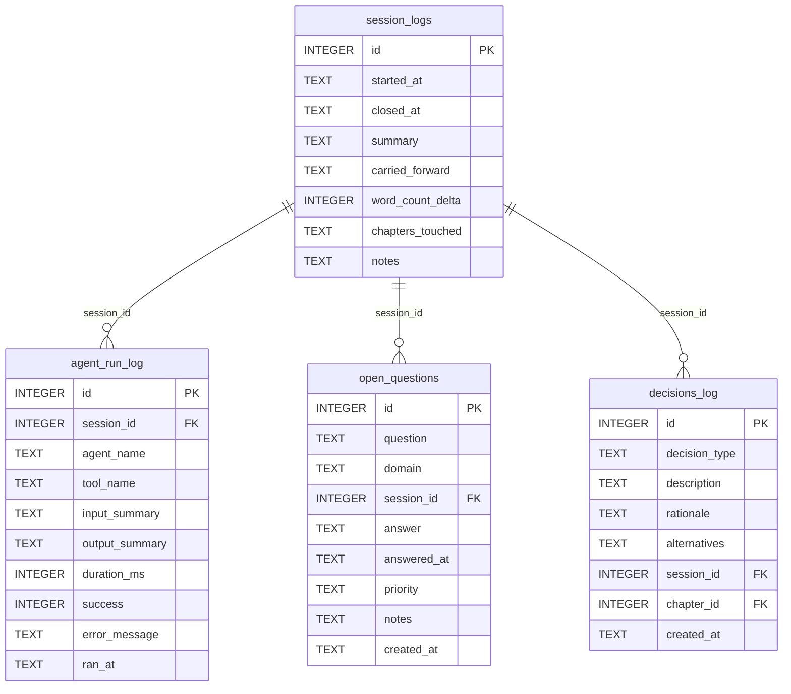

[← Documentation Index](../README.md)

# Session Schema

The Session domain records each writing session, the agent actions within it, open questions raised during it, and decisions made. All session write tools require gate certification. Sessions provide audit trail and continuity between work periods.

> **Cross-domain FKs:** `decisions_log.chapter_id → chapters.id` (Chapters).

> Gate-enforced writes — MCP write tools for session, open questions, and decisions require gate certification.

## `session_logs`

One row per writing session. The `started_at` column auto-populates on INSERT. `closed_at` is NULL for the currently open session. `chapters_touched` is a JSON TEXT array of chapter IDs worked on. `carried_forward` is a JSON TEXT array of unanswered open questions auto-collected at session close.

| Field | Type | Description |
|-------|------|-------------|
| `id` | INTEGER PK | Primary key |
| `started_at` | TEXT | Session start timestamp (auto-populated) |
| `closed_at` | TEXT | Session close timestamp — NULL if session is open (nullable) |
| `summary` | TEXT | Summary of work done this session (nullable) |
| `carried_forward` | TEXT | JSON TEXT array of unanswered questions carried to next session |
| `word_count_delta` | INTEGER | Net word count change this session (default: 0) |
| `chapters_touched` | TEXT | JSON TEXT array of chapter IDs worked on |
| `notes` | TEXT | Standard annotation field |

**Populated by:** `start_session`, `close_session` (session domain). Gate-enforced writes.

---

## `agent_run_log`

Append-only audit trail of individual agent tool calls within a session. Each row records one tool invocation: which agent, which tool, timing, and success/failure.

| Field | Type | Description |
|-------|------|-------------|
| `id` | INTEGER PK | Primary key |
| `session_id` | INTEGER FK | References `session_logs.id` — the session this run belongs to (nullable) |
| `agent_name` | TEXT | Name of the agent that ran (e.g. `planner`, `writer`) |
| `tool_name` | TEXT | Name of the MCP tool called |
| `input_summary` | TEXT | Brief description of the tool input (nullable) |
| `output_summary` | TEXT | Brief description of the tool output (nullable) |
| `duration_ms` | INTEGER | Duration in milliseconds (nullable) |
| `success` | INTEGER | Boolean (0/1) — whether the run succeeded (default: 1) |
| `error_message` | TEXT | Error description if `success=0` (nullable) |
| `ran_at` | TEXT | Timestamp of the run (auto-populated) |

**Populated by:** `log_agent_run` (session domain). Gate-enforced write.

---

## `open_questions`

Log of questions raised during writing sessions that need resolution. Questions are filtered by `answered_at IS NULL` to surface unanswered ones. The `question` column name is the actual migration column (design doc had `question_text` — this is a known drift).

| Field | Type | Description |
|-------|------|-------------|
| `id` | INTEGER PK | Primary key |
| `question` | TEXT | The question text |
| `domain` | TEXT | Domain classification: `plot`, `character`, `world`, `general`, etc. (default: `general`) |
| `session_id` | INTEGER FK | References `session_logs.id` — session where raised (nullable) |
| `answer` | TEXT | The answer when resolved (nullable) |
| `answered_at` | TEXT | Timestamp when answered — NULL if still open (nullable) |
| `priority` | TEXT | Priority level: `high`, `normal`, `low` (default: `normal`) |
| `notes` | TEXT | Standard annotation field |
| `created_at` | TEXT | Standard audit timestamp |

**Populated by:** `log_open_question`, `answer_open_question` (session domain). Gate-enforced writes.

---

## `decisions_log`

Append-only record of decisions made during writing — plot choices, character decisions, world-building choices. Each row is immutable once inserted.

| Field | Type | Description |
|-------|------|-------------|
| `id` | INTEGER PK | Primary key |
| `decision_type` | TEXT | Type: `plot`, `character`, `world`, `structural` (default: `plot`) |
| `description` | TEXT | What was decided |
| `rationale` | TEXT | Why this decision was made (nullable) |
| `alternatives` | TEXT | Other options that were considered (nullable) |
| `session_id` | INTEGER FK | References `session_logs.id` — session where decided (nullable) |
| `chapter_id` | INTEGER FK | References `chapters.id` — chapter this decision affects (nullable) |
| `created_at` | TEXT | Standard audit timestamp |

**Populated by:** `log_decision` (canon domain). Gate-enforced write.

---
