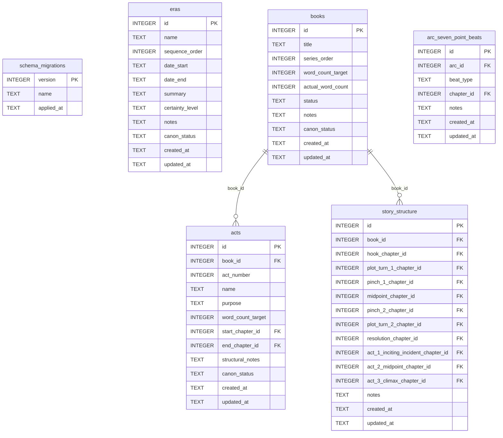

[← Documentation Index](../README.md)

# Structure Schema

The Structure domain contains the bootstrap and narrative skeleton tables. Foundation tables (`eras`, `books`, `schema_migrations`) have no FK dependencies on other domains and serve as anchors for everything else. The structural tables (`acts`, `story_structure`, `arc_seven_point_beats`) map the high-level three-act framework and 7-point beat assignments onto books and character arcs.

> **Cross-domain FKs:** `acts.book_id → books.id` (Structure — internal). `acts.start_chapter_id` / `acts.end_chapter_id → chapters.id` (Chapters — nullable, populated after chapters exist). `story_structure.book_id → books.id` (Structure — internal). All `story_structure.*_chapter_id → chapters.id` (Chapters). `arc_seven_point_beats.arc_id → character_arcs.id` (Arcs). `arc_seven_point_beats.chapter_id → chapters.id` (Chapters).

## `schema_migrations`

Tracks which SQL migrations have been applied. The migration runner inserts one row per migration file on first run; subsequent runs skip already-applied versions.

| Field | Type | Description |
|-------|------|-------------|
| `version` | INTEGER PK | Migration number (e.g. 1, 2, 3) — also the primary key |
| `name` | TEXT | Migration filename without extension (e.g. `001_schema_tracking`) |
| `applied_at` | TEXT | ISO timestamp when this migration was applied |

**Read-only:** Managed exclusively by the migration runner (`novel db migrate`). Writing outside the runner corrupts migration state and could cause destructive re-runs or skipped migrations. No MCP read or write tool is exposed for this table.

---

## `eras`

Named historical periods that provide temporal grounding for characters, factions, and artifacts. An era can span millennia or a single decade.

| Field | Type | Description |
|-------|------|-------------|
| `id` | INTEGER PK | Primary key |
| `name` | TEXT | Era name (e.g. "The Age of Silence") |
| `sequence_order` | INTEGER | Numeric ordering among eras (optional) |
| `date_start` | TEXT | In-world start date (free-form string) |
| `date_end` | TEXT | In-world end date (free-form string) |
| `summary` | TEXT | Brief narrative description of the era |
| `certainty_level` | TEXT | Epistemic status: `established`, `legendary`, `mythical` (default: `established`) |
| `notes` | TEXT | Standard annotation field |
| `canon_status` | TEXT | Approval status: `draft` or `approved` (default: `draft`) |
| `created_at` | TEXT | Standard audit timestamp |
| `updated_at` | TEXT | Standard audit timestamp |

**Populated by:** `upsert_era` (world.py), `delete_era` (world.py).

---

## `books`

Top-level containers for the narrative. Each book gets its own chapters, acts, and structural plan. The system supports multi-book series.

| Field | Type | Description |
|-------|------|-------------|
| `id` | INTEGER PK | Primary key |
| `title` | TEXT | Book title |
| `series_order` | INTEGER | Position in series (1 = first book) |
| `word_count_target` | INTEGER | Target word count for the book |
| `actual_word_count` | INTEGER | Running total of actual words written (default: 0) |
| `status` | TEXT | Workflow status: `planning`, `drafting`, `revising`, `complete` (default: `planning`) |
| `notes` | TEXT | Standard annotation field |
| `canon_status` | TEXT | Approval status (default: `draft`) |
| `created_at` | TEXT | Standard audit timestamp |
| `updated_at` | TEXT | Standard audit timestamp |

**Populated by:** `upsert_book` (world.py), `delete_book` (world.py).

---

## `acts`

Defines the three-act structure for a book. Each act can optionally mark its boundary chapters via nullable FKs — these are left NULL during planning and filled in once chapters exist (avoids circular FK dependency at migration time).

| Field | Type | Description |
|-------|------|-------------|
| `id` | INTEGER PK | Primary key |
| `book_id` | INTEGER FK | References `books.id` — the book this act belongs to |
| `act_number` | INTEGER | Act sequence (1, 2, or 3) |
| `name` | TEXT | Optional act label (e.g. "Setup") |
| `purpose` | TEXT | Narrative purpose of this act |
| `word_count_target` | INTEGER | Target word count for this act |
| `start_chapter_id` | INTEGER FK | References `chapters.id` — first chapter of this act (nullable) |
| `end_chapter_id` | INTEGER FK | References `chapters.id` — last chapter of this act (nullable) |
| `structural_notes` | TEXT | Free-form structural planning notes |
| `canon_status` | TEXT | Approval status (default: `draft`) |
| `created_at` | TEXT | Standard audit timestamp |
| `updated_at` | TEXT | Standard audit timestamp |

**Constraints:** `UNIQUE(book_id, act_number)` — one row per act number per book.

**Populated by:** `upsert_act` (world.py), `delete_act` (world.py).

---

## `story_structure`

Stores the 7-point story structure beat assignments for a book plus the three act-level structural beat chapter references. One row per book — the UNIQUE constraint enforces this.

| Field | Type | Description |
|-------|------|-------------|
| `id` | INTEGER PK | Primary key |
| `book_id` | INTEGER FK | References `books.id` — one row per book |
| `hook_chapter_id` | INTEGER FK | References `chapters.id` — chapter containing the story hook |
| `plot_turn_1_chapter_id` | INTEGER FK | References `chapters.id` — first major plot turn |
| `pinch_1_chapter_id` | INTEGER FK | References `chapters.id` — first pinch point |
| `midpoint_chapter_id` | INTEGER FK | References `chapters.id` — story midpoint |
| `pinch_2_chapter_id` | INTEGER FK | References `chapters.id` — second pinch point |
| `plot_turn_2_chapter_id` | INTEGER FK | References `chapters.id` — second major plot turn |
| `resolution_chapter_id` | INTEGER FK | References `chapters.id` — resolution chapter |
| `act_1_inciting_incident_chapter_id` | INTEGER FK | References `chapters.id` — Act 1 inciting incident |
| `act_2_midpoint_chapter_id` | INTEGER FK | References `chapters.id` — Act 2 midpoint |
| `act_3_climax_chapter_id` | INTEGER FK | References `chapters.id` — Act 3 climax |
| `notes` | TEXT | Standard annotation field |
| `created_at` | TEXT | Standard audit timestamp |
| `updated_at` | TEXT | Standard audit timestamp |

**Constraints:** `UNIQUE(book_id)` — exactly one story structure record per book.

**Populated by:** `upsert_story_structure` (structure domain).

---

## `arc_seven_point_beats`

Maps the 7-point story structure beats to individual character arcs. Each beat type gets exactly one row per arc — the UNIQUE constraint prevents duplicates. Beat types are plain TEXT validated by Python-side enum logic.

| Field | Type | Description |
|-------|------|-------------|
| `id` | INTEGER PK | Primary key |
| `arc_id` | INTEGER FK | References `character_arcs.id` — the arc this beat belongs to |
| `beat_type` | TEXT | Beat label: `hook`, `plot_turn_1`, `pinch_1`, `midpoint`, `pinch_2`, `plot_turn_2`, `resolution` |
| `chapter_id` | INTEGER FK | References `chapters.id` — chapter where this beat occurs (nullable) |
| `notes` | TEXT | Standard annotation field |
| `created_at` | TEXT | Standard audit timestamp |
| `updated_at` | TEXT | Standard audit timestamp |

**Constraints:** `UNIQUE(arc_id, beat_type)` — one beat of each type per arc.

**Populated by:** `upsert_arc_beat` (structure domain).

---
