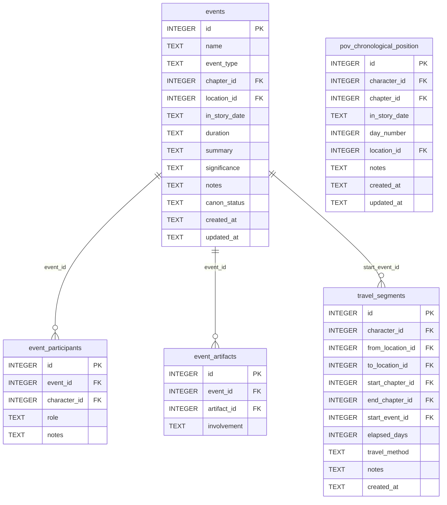

[← Documentation Index](../README.md)

# Timeline Schema

The Timeline & Events domain tracks story events, character participation in events, artifact involvement, character travel between locations, and POV character chronological positions. Most write tools in this domain require gate certification; junction and delete tools are gate-free.

> **Cross-domain FKs:** `events.chapter_id → chapters.id` (Chapters). `events.location_id → locations.id` (World). `event_participants.character_id → characters.id` (Characters). `event_artifacts.artifact_id → artifacts.id` (World). `travel_segments.character_id → characters.id` (Characters). `travel_segments.from_location_id` / `to_location_id → locations.id` (World). `travel_segments.start_chapter_id` / `end_chapter_id → chapters.id` (Chapters). `pov_chronological_position.character_id → characters.id` (Characters). `pov_chronological_position.chapter_id → chapters.id` (Chapters). `pov_chronological_position.location_id → locations.id` (World).

> Gate-enforced writes — `upsert_event`, `upsert_pov_position`, and related write tools require gate certification. Junction tools (`add_event_participant`, `add_event_artifact`) and delete tools are gate-free.

## `events`

Named story events with type, location, in-story date, and narrative significance. Events are referenced by relationship change events and canon facts to anchor them in the narrative timeline.

| Field | Type | Description |
|-------|------|-------------|
| `id` | INTEGER PK | Primary key |
| `name` | TEXT | Event name |
| `event_type` | TEXT | Type: `plot`, `conflict`, `revelation`, `travel`, `social` (default: `plot`) |
| `chapter_id` | INTEGER FK | References `chapters.id` — chapter where this event occurs (nullable) |
| `location_id` | INTEGER FK | References `locations.id` — where this event takes place (nullable) |
| `in_story_date` | TEXT | In-world date string (free-form) |
| `duration` | TEXT | How long the event lasts (e.g. "3 days") |
| `summary` | TEXT | Brief description of what happens |
| `significance` | TEXT | Narrative importance notes |
| `notes` | TEXT | Standard annotation field |
| `canon_status` | TEXT | Approval status (default: `draft`) |
| `created_at` | TEXT | Standard audit timestamp |
| `updated_at` | TEXT | Standard audit timestamp |

**Populated by:** `upsert_event` (timeline domain), `delete_event` (timeline.py). Gate-enforced write for upsert.

---

## `event_participants`

Junction table linking characters to events with a role description. The UNIQUE constraint on `(event_id, character_id)` ensures each character appears once per event.

| Field | Type | Description |
|-------|------|-------------|
| `id` | INTEGER PK | Primary key |
| `event_id` | INTEGER FK | References `events.id` |
| `character_id` | INTEGER FK | References `characters.id` — participating character |
| `role` | TEXT | Character's role in the event: `participant`, `observer`, `instigator` (default: `participant`) |
| `notes` | TEXT | Standard annotation field |

**Constraints:** `UNIQUE(event_id, character_id)`.

**Populated by:** `add_event_participant` (timeline.py), `remove_event_participant` (timeline.py). Read via `get_event_participants`.

---

## `event_artifacts`

Junction table linking artifacts to events. Records which artifacts were involved in which events.

| Field | Type | Description |
|-------|------|-------------|
| `id` | INTEGER PK | Primary key |
| `event_id` | INTEGER FK | References `events.id` |
| `artifact_id` | INTEGER FK | References `artifacts.id` — artifact involved in the event |
| `involvement` | TEXT | Description of how the artifact was involved (nullable) |

**Constraints:** `UNIQUE(event_id, artifact_id)`.

**Populated by:** `add_event_artifact` (timeline.py), `remove_event_artifact` (timeline.py). Read via `get_event_artifacts`.

---

## `travel_segments`

Records individual travel legs between locations. Each segment captures the character, origin, destination, timing (chapters and elapsed story-days), and travel method. Used by `validate_travel_realism` to check temporal plausibility.

| Field | Type | Description |
|-------|------|-------------|
| `id` | INTEGER PK | Primary key |
| `character_id` | INTEGER FK | References `characters.id` — the traveling character |
| `from_location_id` | INTEGER FK | References `locations.id` — departure location (nullable) |
| `to_location_id` | INTEGER FK | References `locations.id` — arrival location (nullable) |
| `start_chapter_id` | INTEGER FK | References `chapters.id` — chapter travel began (nullable) |
| `end_chapter_id` | INTEGER FK | References `chapters.id` — chapter travel ended (nullable) |
| `start_event_id` | INTEGER FK | References `events.id` — event that triggered the travel (nullable) |
| `elapsed_days` | INTEGER | In-story days the journey took (nullable) |
| `travel_method` | TEXT | How the character traveled: `walking`, `horse`, `ship`, etc. (nullable) |
| `notes` | TEXT | Standard annotation field |
| `created_at` | TEXT | Standard audit timestamp |

**Populated by:** `log_travel_segment` (timeline.py), `delete_travel_segment` (timeline.py). Read via `get_travel_segments`.

---

## `pov_chronological_position`

Records where each POV character is in the story timeline at each chapter — their in-story date and day number. The UNIQUE constraint on `(character_id, chapter_id)` means only one position record per character per chapter.

| Field | Type | Description |
|-------|------|-------------|
| `id` | INTEGER PK | Primary key |
| `character_id` | INTEGER FK | References `characters.id` — the POV character |
| `chapter_id` | INTEGER FK | References `chapters.id` — the chapter |
| `in_story_date` | TEXT | In-world date at this chapter (free-form) |
| `day_number` | INTEGER | Absolute story-day number (nullable) |
| `location_id` | INTEGER FK | References `locations.id` — where the character is at this chapter (nullable) |
| `notes` | TEXT | Standard annotation field |
| `created_at` | TEXT | Standard audit timestamp |
| `updated_at` | TEXT | Standard audit timestamp |

**Constraints:** `UNIQUE(character_id, chapter_id)`.

**Populated by:** `upsert_pov_position` (timeline domain), `delete_pov_position` (timeline.py). Gate-enforced write for upsert.

---
