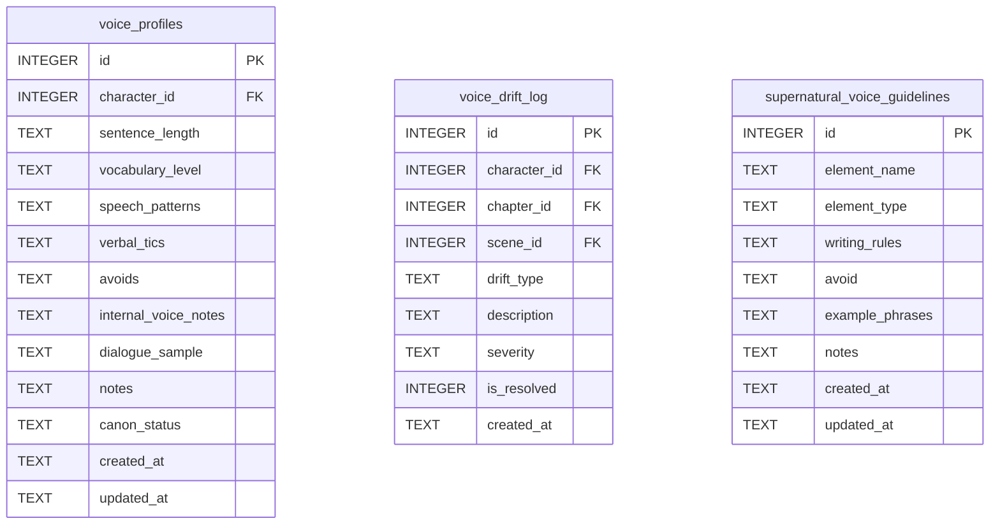

[← Documentation Index](../README.md)

# Voice Schema

The Voice domain manages character voice consistency and writing guidelines for supernatural entities. Voice profiles store distinctive speech characteristics; drift events are logged when a character's voice strays off-profile. All voice write tools require gate certification.

> **Cross-domain FKs:** `voice_profiles.character_id → characters.id` (Characters). `voice_drift_log.character_id → characters.id` (Characters). `voice_drift_log.chapter_id → chapters.id` (Chapters). `voice_drift_log.scene_id → scenes.id` (Chapters).

> Gate-enforced writes — all MCP write tools in this domain require gate certification.

## `voice_profiles`

One voice profile per character — the UNIQUE constraint on `character_id` enforces this. Stores the characteristic speech attributes used to keep a character's voice consistent across chapters.

| Field | Type | Description |
|-------|------|-------------|
| `id` | INTEGER PK | Primary key |
| `character_id` | INTEGER FK | References `characters.id` — one profile per character (UNIQUE) |
| `sentence_length` | TEXT | Typical sentence length pattern: `short`, `varied`, `long` (nullable) |
| `vocabulary_level` | TEXT | Vocabulary register: `simple`, `educated`, `archaic`, etc. (nullable) |
| `speech_patterns` | TEXT | Distinctive patterns: rhetorical questions, sentence fragments, etc. (nullable) |
| `verbal_tics` | TEXT | Recurring words, phrases, or habits (nullable) |
| `avoids` | TEXT | Words or constructions this character never uses (nullable) |
| `internal_voice_notes` | TEXT | Notes on internal monologue style (nullable) |
| `dialogue_sample` | TEXT | Sample of characteristic dialogue (nullable) |
| `notes` | TEXT | Standard annotation field |
| `canon_status` | TEXT | Approval status (default: `draft`) |
| `created_at` | TEXT | Standard audit timestamp |
| `updated_at` | TEXT | Standard audit timestamp |

**Constraints:** `UNIQUE(character_id)` — one voice profile per character.

**Populated by:** `upsert_voice_profile` (voice domain). Gate-enforced write.

---

## `voice_drift_log`

Append-only log of voice drift events — instances where a character's writing strayed from their established voice profile. Each row records the drift type, severity, and whether it has been corrected.

| Field | Type | Description |
|-------|------|-------------|
| `id` | INTEGER PK | Primary key |
| `character_id` | INTEGER FK | References `characters.id` — the character whose voice drifted |
| `chapter_id` | INTEGER FK | References `chapters.id` — chapter where drift occurred (nullable) |
| `scene_id` | INTEGER FK | References `scenes.id` — scene where drift occurred (nullable) |
| `drift_type` | TEXT | Type of drift: `vocabulary`, `rhythm`, `tone`, `tic_missing` (default: `vocabulary`) |
| `description` | TEXT | Description of the drift |
| `severity` | TEXT | Severity: `minor`, `moderate`, `severe` (default: `minor`) |
| `is_resolved` | INTEGER | Boolean (0/1) — whether this drift has been corrected (default: 0) |
| `created_at` | TEXT | Standard audit timestamp |

**Populated by:** `log_voice_drift` (voice domain). Gate-enforced write.

---

## `supernatural_voice_guidelines`

Writing guidelines for supernatural entities — creatures, spirits, and phenomena that require special handling in prose. The `element_name` is UNIQUE (one guideline set per supernatural type).

| Field | Type | Description |
|-------|------|-------------|
| `id` | INTEGER PK | Primary key |
| `element_name` | TEXT | Name of the supernatural element — UNIQUE |
| `element_type` | TEXT | Type: `creature`, `spirit`, `phenomenon` (default: `creature`) |
| `writing_rules` | TEXT | Required rules for writing about this element |
| `avoid` | TEXT | What to avoid when writing about this element (nullable) |
| `example_phrases` | TEXT | Example phrases or passages that capture the correct style (nullable) |
| `notes` | TEXT | Standard annotation field |
| `created_at` | TEXT | Standard audit timestamp |
| `updated_at` | TEXT | Standard audit timestamp |

**Constraints:** `UNIQUE(element_name)`.

**Populated by:** `upsert_supernatural_voice_guideline` (voice.py), `delete_supernatural_voice_guideline` (voice.py). Gate-enforced writes.

---
