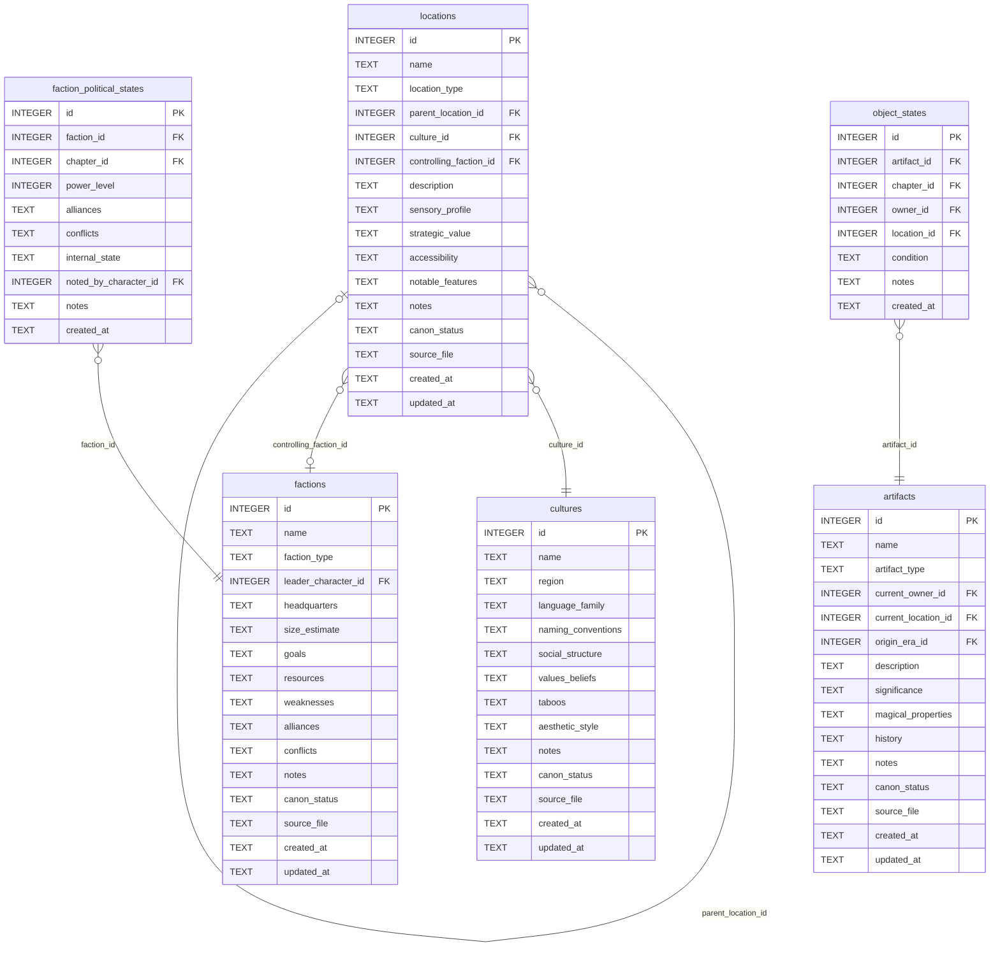

[← Documentation Index](../README.md)

# World Schema

The World domain covers the setting: cultures, factions, locations, physical artifacts, and the state-change logs for political and object states over story time. Note: magic system tables (`magic_system_elements`, `practitioner_abilities`, `supernatural_elements`) are documented in [magic.md](magic.md) because the magic.py module owns all their MCP tools.

> **Cross-domain FKs:** `factions.leader_character_id → characters.id` (Characters — nullable). `artifacts.current_owner_id → characters.id` (Characters). `artifacts.current_location_id → locations.id` (World — internal). `artifacts.origin_era_id → eras.id` (Structure). `cultures.id` is referenced by `characters.culture_id` (Characters). `faction_political_states.chapter_id → chapters.id` (Chapters). `faction_political_states.noted_by_character_id → characters.id` (Characters). `object_states.chapter_id → chapters.id` (Chapters). `object_states.owner_id → characters.id` (Characters). `object_states.location_id → locations.id` (World — internal).

## `cultures`

Named cultural groups that define naming conventions, aesthetics, and social norms. Characters and locations can be associated with a culture.

| Field | Type | Description |
|-------|------|-------------|
| `id` | INTEGER PK | Primary key |
| `name` | TEXT | Culture name — UNIQUE constraint |
| `region` | TEXT | Geographic region associated with this culture |
| `language_family` | TEXT | Linguistic family or language notes |
| `naming_conventions` | TEXT | How names are structured in this culture |
| `social_structure` | TEXT | Hierarchy, roles, class system |
| `values_beliefs` | TEXT | Core values and belief systems |
| `taboos` | TEXT | Prohibited behaviors or subjects |
| `aesthetic_style` | TEXT | Visual and artistic aesthetic |
| `notes` | TEXT | Standard annotation field |
| `canon_status` | TEXT | Approval status (default: `draft`) |
| `source_file` | TEXT | Standard annotation field |
| `created_at` | TEXT | Standard audit timestamp |
| `updated_at` | TEXT | Standard audit timestamp |

**Constraints:** `UNIQUE(name)`.

**Populated by:** `upsert_culture` (world.py), `delete_culture` (world.py).

---

## `factions`

Political, military, or social organizations that characters belong to. The `leader_character_id` is nullable because characters are defined in a later migration.

| Field | Type | Description |
|-------|------|-------------|
| `id` | INTEGER PK | Primary key |
| `name` | TEXT | Faction name — UNIQUE constraint |
| `faction_type` | TEXT | Category: `political`, `military`, `religious`, etc. |
| `leader_character_id` | INTEGER FK | References `characters.id` — current leader (nullable) |
| `headquarters` | TEXT | Description of the faction's base of operations |
| `size_estimate` | TEXT | Estimated membership or scale |
| `goals` | TEXT | What the faction is trying to achieve |
| `resources` | TEXT | Assets and capabilities |
| `weaknesses` | TEXT | Known vulnerabilities |
| `alliances` | TEXT | Current alliance relationships (free-form) |
| `conflicts` | TEXT | Current conflict relationships (free-form) |
| `notes` | TEXT | Standard annotation field |
| `canon_status` | TEXT | Approval status (default: `draft`) |
| `source_file` | TEXT | Standard annotation field |
| `created_at` | TEXT | Standard audit timestamp |
| `updated_at` | TEXT | Standard audit timestamp |

**Constraints:** `UNIQUE(name)`.

**Populated by:** `upsert_faction` (world domain).

---

## `locations`

Physical places in the story world. Supports hierarchical nesting via `parent_location_id` (e.g. a room inside a building inside a city). The `sensory_profile` field stores a JSON object with sensory details.

| Field | Type | Description |
|-------|------|-------------|
| `id` | INTEGER PK | Primary key |
| `name` | TEXT | Location name |
| `location_type` | TEXT | Category: `city`, `wilderness`, `building`, `room`, etc. |
| `parent_location_id` | INTEGER FK | References `locations.id` — parent container location (nullable self-ref) |
| `culture_id` | INTEGER FK | References `cultures.id` — dominant culture at this location (nullable) |
| `controlling_faction_id` | INTEGER FK | References `factions.id` — faction that controls this location (nullable) |
| `description` | TEXT | Narrative description |
| `sensory_profile` | TEXT | JSON object: `{sight, sound, smell, touch, taste}` — sensory atmosphere notes |
| `strategic_value` | TEXT | Why this location matters strategically |
| `accessibility` | TEXT | How easy or difficult it is to reach |
| `notable_features` | TEXT | Distinctive features |
| `notes` | TEXT | Standard annotation field |
| `canon_status` | TEXT | Approval status (default: `draft`) |
| `source_file` | TEXT | Standard annotation field |
| `created_at` | TEXT | Standard audit timestamp |
| `updated_at` | TEXT | Standard audit timestamp |

**Populated by:** `upsert_location` (world domain).

---

## `artifacts`

Physical objects with narrative significance — weapons, relics, MacGuffins, etc. Current ownership and location are tracked at the artifact row level; historical state changes are tracked in `object_states`.

| Field | Type | Description |
|-------|------|-------------|
| `id` | INTEGER PK | Primary key |
| `name` | TEXT | Artifact name |
| `artifact_type` | TEXT | Category: `weapon`, `relic`, `document`, etc. |
| `current_owner_id` | INTEGER FK | References `characters.id` — who currently holds it (nullable) |
| `current_location_id` | INTEGER FK | References `locations.id` — where it currently is (nullable) |
| `origin_era_id` | INTEGER FK | References `eras.id` — when it was created (nullable) |
| `description` | TEXT | Physical description |
| `significance` | TEXT | Narrative importance |
| `magical_properties` | TEXT | Any magical or supernatural attributes |
| `history` | TEXT | Provenance and history |
| `notes` | TEXT | Standard annotation field |
| `canon_status` | TEXT | Approval status (default: `draft`) |
| `source_file` | TEXT | Standard annotation field |
| `created_at` | TEXT | Standard audit timestamp |
| `updated_at` | TEXT | Standard audit timestamp |

**Populated by:** `upsert_artifact` (world.py), `delete_artifact` (world.py).

---

## `faction_political_states`

Time-stamped log of a faction's political state at a specific chapter. Append-oriented: each chapter can have one record per faction (`UNIQUE(faction_id, chapter_id)`).

| Field | Type | Description |
|-------|------|-------------|
| `id` | INTEGER PK | Primary key |
| `faction_id` | INTEGER FK | References `factions.id` — the faction being described |
| `chapter_id` | INTEGER FK | References `chapters.id` — the chapter at which this state applies |
| `power_level` | INTEGER | Relative power on a numeric scale (default: 5) |
| `alliances` | TEXT | Current alliance relationships at this point in the story |
| `conflicts` | TEXT | Active conflicts at this chapter |
| `internal_state` | TEXT | Internal faction dynamics |
| `noted_by_character_id` | INTEGER FK | References `characters.id` — character who observed this state (nullable) |
| `notes` | TEXT | Standard annotation field |
| `created_at` | TEXT | Standard audit timestamp |

**Constraints:** `UNIQUE(faction_id, chapter_id)` — one political state record per faction per chapter.

**Populated by:** `log_faction_political_state` (world.py), `delete_faction_political_state` (world.py). Read via `get_faction_political_state`.

---

## `object_states`

Time-stamped log of an artifact's state at a specific chapter. Tracks ownership and location changes over story time.

| Field | Type | Description |
|-------|------|-------------|
| `id` | INTEGER PK | Primary key |
| `artifact_id` | INTEGER FK | References `artifacts.id` — the artifact being tracked |
| `chapter_id` | INTEGER FK | References `chapters.id` — the chapter at which this state applies |
| `owner_id` | INTEGER FK | References `characters.id` — who owns it at this chapter (nullable) |
| `location_id` | INTEGER FK | References `locations.id` — where it is at this chapter (nullable) |
| `condition` | TEXT | Physical condition: `intact`, `damaged`, `destroyed`, etc. (default: `intact`) |
| `notes` | TEXT | Standard annotation field |
| `created_at` | TEXT | Standard audit timestamp |

**Constraints:** `UNIQUE(artifact_id, chapter_id)` — one object state record per artifact per chapter.

**Populated by:** `log_object_state` (world.py), `delete_object_state` (world.py).

---
